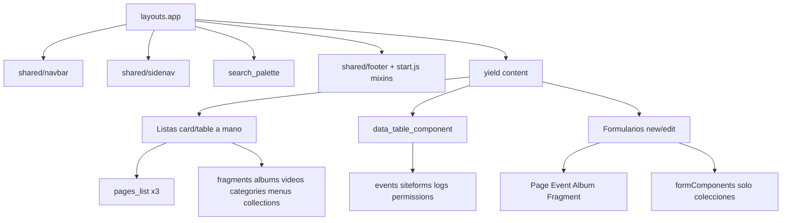

# Auditoría de vistas admin (Blade + Vue 2)

**Rama de este doc:** `docs/admin-views-audit`  
**Worktree:** `/home/gervis/.cursor/worktrees/startCodeIgniter-CSM/admin-views-audit`  
**Checkout principal:** `/home/gervis/personal/startCodeIgniter-CSM` (`ci_php56`, `:8081` — no tocarlo)

PHP 7.4 + CodeIgniter 3.1. Sin PHP 8+. No Cloud Agents. No `docker compose`. No edites `master`.

Guía de producto: [DESIGN.md](DESIGN.md). Este archivo es el inventario de **2026-08-31**. Algunos P0 de DESIGN.md **ya no aplican** (sección 5).

Corte de implementación de bugs: leer también [ADMIN_VIEWS_BUGFIX_PROMPT.md](ADMIN_VIEWS_BUGFIX_PROMPT.md).

---

## 1. Arquitectura

El sitio público (`themes/` + `application/views/site/templates/`) es fino. Casi toda la deuda está en el **admin**: Blade pinta el cascarón; Vue en `resources/components/` habla con `/api/v1`.

Dos familias de listas:

- **Card/table a mano:** páginas, fragmentos, álbumes, videos, categorías, menús, colecciones. Comparten `admin.components.page_navbar` y `admin.components.entity_card_badges`.
- **Tabla genérica:** eventos, siteforms, logs, permisos vía `admin.components.data_table_component`.

JS: `mixins` + `listMixin` / `formMixin` en `resources/js/start.js`. Events / SiteForms / Notifications **no** usan `listMixin`.

Referencia visual más sana: `application/views/admin/fragments/fragments_list.blade.php` (chips `lang()`, FAB `st-accent`, empty con CTA, pagination).  
La peor: `application/views/admin/pages/pages_list.blade.php` (~530 líneas, Results / Pages / Blogs triplicados).

---

## 2. Qué ya está extraído (no reinventar)

- Shell: `application/views/admin/layouts/app.blade.php` (navbar, sidenav, `BASEURL`, Materialize).
- Búsqueda de lista + “sin resultados”: `page_navbar`.
- Pills status/visibilidad: `entity_card_badges` (en **cards**; las **tablas** lo reimplementan).
- Paginación Blade: `pagination.blade.php` — falta en álbumes, videos, menús, lista de colecciones.
- Confirmación: `<confirm-modal>` global.
- Campos de colección: `custommodels/forms_fields.blade.php` + `resources/components/formComponents/*.js`. **No** los usan Page / Event / Album / Fragment.

`widget/PageCardComponent` **no** sirve para listas (solo dashboard).

---

## 3. Bugs reales (siguen rotos)

### P0 — comportamiento incorrecto

1. **Href de título de card (menús y categorías).**  
   `:href="base_url(menu.name)"` / `base_url(categorie.name)` inventa una URL pública. El dropdown ya tiene “ver en sitio” con `path`.  
   - `application/views/admin/menu/menu_list.blade.php` (~86)  
   - `application/views/admin/categories/categories_list.blade.php` (~86)  
   **Fix:** el título apunta a editar (`admin/menus/editar/{id}`, `admin/categories/editar/{id}`), no a `name`.

2. **Miniaturas de álbumes duplican BASEURL.**  
   `file_front_path` ya es root-absolute (`/uploads/...`). El mixin en `start.js` lo usa **sin** `BASEURL`.  
   - `resources/components/AlbumsLists.js` (~37)  
   - `resources/components/AlbumsItemsLists.js` (~38)  
   **Fix:** igual que el mixin: `item.file.file_front_path` (y default sin concatenar mal).

3. **Filtro de status en ítems de colección es solo cliente.**  
   `serverPagination: true` pero `statusFilter` filtra la página actual.  
   - `resources/components/CustomModelItemsList.js` (~18–23, `setStatusFilter`)  
   **Fix:** mandar `status` en el query al API (`listQuery` / `GET /api/v1/models/data?custom_model_id=&status=`), resetear página a 1, dejar de filtrar la página en cliente.

4. **Tooltips Vue `lang()` no conocen las claves PHP.**  
   `window.ADMIN_LANG` (footer) solo tiene toasts/notificaciones. `:data-tooltip="lang('…')"` muestra el **nombre de la clave**.  
   - `videos_list.blade.php` (~68–70)  
   - `categories_list.blade.php` (~42–43, ~138)  
   - `events/create_event.blade.php` (~92)  
   **Fix:** tooltips Blade con PHP `lang()` / `<?php echo lang(...) ?>`, no el `lang()` JS. No inflar `ADMIN_LANG` con todo el diccionario.

5. **Dark mode del dashboard no aplica.**  
   CSS con `body.dark-mode`; el switch pone `html.dark-mode`.  
   - `application/views/admin/dashboard.blade.php` (`<style>` ~7+ y `body.dark-mode` ~182+)  
   **Fix:** selectores `html.dark-mode` + tokens `var(--st-*)`. Mover reglas a SCSS (`resources/scss/admin/`), no dejar `<style>` en Blade.

6. **Login HTML inválido + copy hardcodeado.**  
   `</a>` extra; labels Username / Password / botón Login en inglés fijo.  
   - `application/views/admin/login.blade.php` (~49–78)  
   **Fix:** quitar el `</a>` suelto; `lang('username')`, `lang('password')`, `lang('login')` (ya existen en `common_lang.php`). Submit ya es `type="submit"` — no tocarlo.

7. **`html lang="en"` fijo.**  
   - `application/views/admin/layouts/app.blade.php`  
   - `application/views/admin/layouts/login.blade.php`  
   **Fix:** idioma de sesión/config CI (`english` → `en`, `spanish` → `es`). No hardcodear `"en"`.

8. **`UserNewForm.js` ReferenceError en error de GET.**  
   El handler usa `response.error_message` pero el parámetro es `error`.  
   - `resources/components/UserNewForm.js` (~196)  
   **Fix:** `this.toastError(error)` / `this.toast('toast_error')`. No `response`.

9. **`PagesLists.js` `getcontentText` explota si `content` es null.**  
   - `resources/components/PagesLists.js` (~46)  
   **Fix:** `if (!page || !page.content) return "";` antes del `.replace`.

10. **`data_table_component` carga Vue Router desde unpkg.**  
    `https://unpkg.com/vue-router@2.0.0/dist/vue-router.js` en cada include.  
    **Sigue haciendo falta** en vistas con `new VueRouter` / `<router-view>`:  
    `SiteFormSubmitList.js`, `LoggerDataComponent.js`, `ApiLoggerDataComponent.js`, `PermissionsDataComponent.js`, `UserTrackingLoggerDataComponent.js`.  
    **Fix:** no unpkg. Vendor local (`public/vendors/vue/vue-router.js`, misma major 2.x) **o** script solo en los Blade que usan router. No romper submissions / logs / permissions.

### P1 — engañoso o frágil

11. Navbar admin: “Settings / View site / Logout” en inglés fijo. Avatares `alt=""`.  
    `application/views/admin/shared/navbar.blade.php` (~18, ~87, ~100–103).  
    Usar `lang('menu_settings')`, `lang('view_in_site')` o clave “View site” nueva si el sentido es distinto, `lang('logout')`. `alt` con el username.

12. `pages_list`: copy EN hardcoded, chips `
`, FAB `red`, empty “No pages found”, badges de tabla duplicados. Tres bloques de acciones **divergentes**. Esto es DRY grande — **fuera del corte de bugs** salvo i18n mínimo si se toca el archivo por otro bug.

13. `menu_list`: ES/EN mezclados. i18n del copy visible (headers, empty, confirm, FAB). No extraer partials en el mismo PR.

14. `MenuNewForm.js` / `SiteFormNewForm.js`: `form: {}` y `save()` no valida. **Fuera del corte de bugs** (es contrato de formulario, no un crash de vista).

15. File explorer Recents: `<a href="#!">` muerto. Ocultar el ítem (no implementar Recents).  
    `application/views/admin/files/file_explorer.blade.php` (~37, ~74).

16. `VideosNewForm.js` lee el DOM, sin mixins, toast ES hardcodeado; lista usa `video.nam` (typo, fallback a `nombre` ya está). Toast → `this.toast('toast_error')`. No reescribir el form entero.

17. `content_list.blade.php` / `data_list.blade.php`: huérfanas (`docs/COLLECTIONS.md` §5.6). **No borrar. No invertir.** `data_list` carga `DataFormModule.js` sobre `#root` — documentado, no “arreglar” montando otro Vue.

18. Album / Category `serverValidation` pega a `admin/users/ajax_check_field`. No usarlo para unicidad de álbum/categoría en este corte, o dejar de llamar ese endpoint si es dead code.

19. `.catch((response) => response.error_message)` en `fetch`: el catch es un `Error`. Usar `this.toastError` / `toast_error`.

---

## 4. Código repetido (componentizar **después**, no en el PR de bugs)

| Pieza | Hoy | Extraer cuando se toque UI |
|---|---|---|
| `pages_list` Results/Pages/Blogs | 3 tablas + 3 grids | Un `v-for` + agrupación en JS |
| Status chips | Copiados; páginas EN / `
` | Partial `status_filters` (`<button>`, `lang()`) |
| FAB + `style="bottom:45px;right:24px"` | ~10 vistas; mix `red` / `st-accent` | Partial `create_fab` + clase SCSS |
| Empty state | `<h4>` vs icono+CTA | Partial `list_empty_state` |
| Dropdown + segundo `more_vert` | Casi todas las cards | Un menú por ítem (DESIGN) |
| Badges en `<td>` | Reimplementados | Reusar `entity_card_badges` |
| `data_table` Edit/Delete/Archive | EN + fallbacks ES | Props `lang()` |
| Image picker | `copyCallcack` + FileExplorer | Ya existe `formImageSelector` (solo colecciones) |
| TinyMCE | init/`setTimeout` por form | mixin único |
| Front admin bar | ~677 líneas + `<style>` | No mezclar con `admin/shared/navbar` |

---

## 5. Ya corregido respecto a DESIGN.md (no reabrir)

- Archive de páginas usa modal `#archiveModal`; “ver en sitio” es otra acción.
- Tabs del editor: `#basic` / `#seo`, un `.active`.
- IDs `page_title` / `page_subtitle` (no `id="title"` duplicado).
- Login submit es `type="submit"`.
- Sidenav fragments duplicado y hover-peek: hechos.

---

## 6. Formularios (deuda, no bugs de este corte)

Cascarón repetido: `container.form` + `h3.page-header` + preloader + textarea `#id_cazary` + FileExplorer.

- `pages/new.blade.php`: el más completo. Save no sticky; Font Awesome + `page-new.min.css`.
- `gallery/new_form.blade.php`: copy ES hardcodeado.
- Page / Videos / User **no** usan `formMixin`.

---

## 7. Sitio público (menor)

11 plantillas en `application/views/site/templates/`. Poco duplicado.  
`application/views/shared/admin_navbar.blade.php` es otra UI (barra tipo WP). No unificarla con el navbar del panel.

---

## 8. Orden recomendado de PRs futuros

1. **Bugs P0/P1 de este doc** (prompt en `ADMIN_VIEWS_BUGFIX_PROMPT.md`).
2. Colapsar `pages_list` + i18n + FAB accent.
3. Partials de lista (chips, FAB, empty).
4. Forms: `formMixin` en Page/Videos/User; validar Menu/SiteForm.

Fuera de un primer PR: temas públicos, Graphify, migrar events/siteforms a cards, borrar vistas huérfanas.
