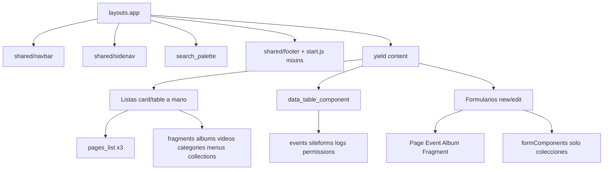

# Auditoría de vistas admin (Blade + Vue 2)

**Rama de este doc:** `docs/admin-views-audit` (nivelada con `origin/master` el 2026-09-01, incluye PR #38)  
**Implementación P0/P1:** `fix/admin-views-p0` (worktree `admin-views-audit`; WIP de bugs en stash, no commiteado)  
**Worktree de este doc:** `/home/gervis/.cursor/worktrees/startCodeIgniter-CSM/docs-admin-views-audit`  
**Checkout principal:** `/home/gervis/personal/startCodeIgniter-CSM` (`ci_php56`, `:8081` — no tocarlo)

PHP 7.4 + CodeIgniter 3.1. Sin PHP 8+. No Cloud Agents. No `docker compose`. No edites `master`.

Guía de producto: [DESIGN.md](DESIGN.md). Inventario original **2026-08-31**; **re-evaluación 2026-09-01** tras product-copy, login harden, compact fragments, users-cards, perf y **page-intro en el resto de listas (PR #38)**. Algunos P0 de DESIGN.md **ya no aplican** (sección 5). Lo que master ya cerró está en §5b — no reimplementar.

Corte de implementación de bugs: leer también [ADMIN_VIEWS_BUGFIX_PROMPT.md](ADMIN_VIEWS_BUGFIX_PROMPT.md). Riesgos de ese corte: sección 9.

---

## 1. Arquitectura

El sitio público (`themes/` + `application/views/site/templates/`) es fino. Casi toda la deuda está en el **admin**: Blade pinta el cascarón; Vue en `resources/components/` habla con `/api/v1`.

Dos familias de listas:

- **Card/table a mano:** páginas, fragmentos, álbumes, videos, categorías, menús, colecciones. Comparten `admin.components.page_navbar` y `admin.components.entity_card_badges`.
- **Tabla genérica:** eventos, siteforms, logs, permisos vía `admin.components.data_table_component`.

JS: `mixins` + `listMixin` / `formMixin` en `resources/js/start.js`. Events / SiteForms / Notifications **no** usan `listMixin`.

`page-intro` (`admin.components.page_intro`, `$titleKey` / `$ledeKey`) ya está en las listas admin (páginas, fragmentos, siteforms, colecciones, menús, categorías, álbumes, videos, eventos, users, calendar, file explorer). **No** tocarlo en el PR de bugs.

Referencia visual más sana: `application/views/admin/fragments/fragments_list.blade.php` — chips `lang()`, un `more_vert`, `.fragment-card` en `.fragments-grid` (sin `min-height: 410px` ni card-reveal), `page-intro`, pagination.  
La peor sigue siendo `pages_list.blade.php` (~540 líneas, Results / Pages / Blogs triplicados). Product-copy i18nizó chips, empty+CTA y FAB accent; **no** colapsó los tres bloques ni los thead EN del modo tabla.

---

## 2. Qué ya está extraído (no reinventar)

- Shell: `application/views/admin/layouts/app.blade.php` (navbar, sidenav, `BASEURL`, Materialize).
- Búsqueda de lista + “sin resultados”: `page_navbar`.
- Pills status/visibilidad: `entity_card_badges` (en **cards**; las **tablas** lo reimplementan).
- Intro de lista: `admin.components.page_intro` (listas admin; PR #38 cubrió el resto).
- Paginación Blade: `pagination.blade.php` — falta en álbumes, videos, menús, lista de colecciones.
- Confirmación: `<confirm-modal>` global.
- Campos de colección: `custommodels/forms_fields.blade.php` + `resources/components/formComponents/*.js`. **No** los usan Page / Event / Album / Fragment.

`widget/PageCardComponent` **no** sirve para listas (solo dashboard).

---

## 3. Bugs reales (siguen rotos tras master 2026-09-01)

Estado verificado contra `origin/master` (2026-09-01, post PR #38). El WIP de bugs **no** está en HEAD de esta rama; está en stash de `fix/admin-views-p0`.

### P0 — comportamiento incorrecto

1. **Href de título de card (menús y categorías).** Sigue.  
   `:href="base_url(menu.name)"` / `base_url(categorie.name)` inventa una URL pública. El dropdown ya tiene “ver en sitio” con `path`.  
   - `application/views/admin/menu/menu_list.blade.php` (~86)  
   - `application/views/admin/categories/categories_list.blade.php` (~86)  
   **Fix:** el título apunta a editar (`admin/menus/editar/{id}`, `admin/categories/editar/{id}`), no a `name`.

2. **Miniaturas de álbumes duplican BASEURL.** Sigue.  
   `file_front_path` ya es root-absolute (`/uploads/...`). El mixin en `start.js` lo usa **sin** `BASEURL`.  
   - `resources/components/AlbumsLists.js` (~37)  
   - `resources/components/AlbumsItemsLists.js` (~38)  
   **Fix:** igual que el mixin: `item.file.file_front_path`. Default: `BASEURL + "public/img/default.jpg"` (`BASEURL` ya trae `/` final). No `BASEURL + "/public/..."`.

3. **Filtro de status en ítems de colección es solo cliente.** Sigue.  
   `serverPagination: true` pero `statusFilter` filtra la página actual.  
   - `resources/components/CustomModelItemsList.js` (`filterItems`, `setStatusFilter`)  
   - API hoy: `GET /api/v1/models/data?custom_model_id=` con `status_in => [1,2,3]` (`ModelsController::data_get`).  
   **Fix:** `listQuery({ custom_model_id, status })`, `getItems(1)` al cambiar chip, dejar de filtrar en cliente. En el API, **whitelist** `status` ∈ {0,1,2,3}; si no viene, conservar `status_in`. `MY_Model::apply_list_filters` ya acepta `status` exacto vía `$this->db->where($filters)`. Ver riesgos §9.

4. **Tooltips Vue `lang()` no conocen las claves PHP.** Sigue.  
   `window.ADMIN_LANG` (footer) solo tiene toasts/notificaciones. `:data-tooltip="lang('…')"` muestra el **nombre de la clave**.  
   - `videos_list.blade.php` (~68–70) — published/draft siguen `:data-tooltip="lang(...)"`; archived/deleted ya son PHP.  
   - `categories_list.blade.php` (~42–43, FAB ~138)  
   - `events/create_event.blade.php` (~92)  
   **Fix:** tooltips Blade con PHP `lang()`. No inflar `ADMIN_LANG`.

5. **Dark mode del dashboard no aplica.** Sigue.  
   El `<style>` de `dashboard.blade.php` usa `body.dark-mode`; el switch pone `html.dark-mode`. `resources/scss/admin/dashboard.scss` en master **no** tiene reglas dark-mode (el WIP las añadía).  
   **Fix:** selectores `html.dark-mode` + `var(--st-*)`. Mover el `<style>` a SCSS. No duplicar reglas que ya existen en el SCSS (KPI grid, charts). No dejar hex `#26a69a` nuevos.

6. **Login: `</a>` extra.** Recortado.  
   Labels/botón **ya** son `lang('username'|'password'|'login')` y marca `ADMIN_BRAND_NAME` / `login_tagline` (product-copy). Submit sigue `type="submit"`.  
   El `</a>` suelto (~49) está en el bloque `v-if="userdata"` de “remember user”. Tras `loginForm.js` harden, `this.userdata` queda **siempre null** (solo se guarda `{ username }` en localStorage) — el HTML inválido es dead code, pero Vue lo parsea igual.  
   **Fix:** quitar el `</a>` extra. **No** volver a tocar labels/botón. `alt=""` del avatar remember: mismo bloque muerto; opcional.

7. **`html lang="en"` fijo.** Sigue.  
   - `application/views/admin/layouts/app.blade.php`  
   - `application/views/admin/layouts/login.blade.php`  
   **Fix:** helper `html_lang()` (CI `english` → `en`, `spanish` → `es`). El idioma del login es config CI, no hace falta sesión.

8. **`UserNewForm.js` ReferenceError en error de GET.** Sigue.  
   El handler usa `response.error_message` pero el parámetro es `error` (~196). El error de save (~90) tiene el mismo patrón.  
   **Fix:** `mixins: [mixins]` si no está, `this.toastError(error)`. `toastError(xhr)` lee `xhr.responseJSON.error_message`; un `Error` de fetch cae a `toast_error`.

9. **`PagesLists.js` `getcontentText` explota si `content` es null.** Sigue.  
   **Fix:** `if (!page || !page.content) return "";` antes del `.replace`.

10. **`data_table_component` carga Vue Router desde unpkg.** Sigue. **Mayor riesgo del corte.**  
    `https://unpkg.com/vue-router@2.0.0/dist/vue-router.js` al final del partial. Lo necesitan:  
    `SiteFormSubmitList`, `LoggerDataComponent`, `ApiLoggerDataComponent`, `PermissionsDataComponent`, `UserTrackingLoggerDataComponent`.  
    **Fix:** vendor **commiteado** `public/vendors/vue/vue-router.js` (Vue Router 2.x, misma major que `vue.js`) + partial `admin.components.vue_router` **solo** en esos Blade. Quitar unpkg del data-table. No borrar `public/vendors/vue/vue.js`. Ver §9.

### P1 — engañoso o frágil

11. Navbar admin: “Settings / View site / Logout” en inglés fijo. Avatares `alt=""`. Sigue.  
    `application/views/admin/shared/navbar.blade.php` (~18, ~87, ~100–103).  
    Claves **ya existentes** (no crear): `menu_settings` (`admin_lang.php`), `view_site` y `logout` (`common_lang.php`). No uses `view_in_site` (“View in site”) para el ítem del menú. `alt` con el username.

12. `pages_list`: **parcialmente cerrado por product-copy.** Chips ya son `<button>` + `lang()`; empty tiene icono+CTA; FAB es `st-accent`; hay `page-intro`. **Sigue:** thead EN (Preview / Page Title / …) ×3, card-reveal EN (“Category”, “Published”, …), tres bloques Results/Pages/Blogs divergentes, 9× `more_vert`. DRY grande — **fuera del corte de bugs**. No reabrir i18n de chips/FAB/empty.

13. `menu_list`: ES/EN mezclados. Sigue (thead EN, empty/FAB/confirm en ES). i18n del copy visible. No extraer partials. `page-intro` ya está (PR #38); no tocarlo.

14. `MenuNewForm.js` / `SiteFormNewForm.js`: `form: {}` y `save()` no valida. **Fuera del corte de bugs.**

15. File explorer Recents: `<a href="#!">` muerto **sin** `@click`. Sigue (~73–74). Hay otro “Recently Accessed Files” (~161) que es heading, no el nav muerto. Ocultar el ítem Recents (no implementar Recents).

16. `VideosNewForm.js` toast ES/`Error saving` hardcodeado. Sigue. Toast → `this.toast('toast_error')` + `mixins`. No reescribir el form.

17. `content_list.blade.php` / `data_list.blade.php`: huérfanas. **No borrar. No invertir.**

18. Album / Category `serverValidation` → `admin/users/ajax_check_field`. Fuera o dead-code only.

19. `.catch` de `fetch` que espera `response.error_message`. Sigue en `EventNewForm.js` (~284) y varios jQuery `error: function (response)`. En este corte: **solo el `fetch().catch`** (EventNewForm). No recorrer todos los forms.

---

## 4. Código repetido (componentizar **después**, no en el PR de bugs)

| Pieza | Hoy | Extraer cuando se toque UI |
|---|---|---|
| `pages_list` Results/Pages/Blogs | 3 tablas + 3 grids (chips/empty/FAB ya i18n) | Un `v-for` + agrupación en JS |
| Status chips | Copiados; páginas ya `<button>`+`lang()` | Partial `status_filters` en el resto |
| FAB + `style="bottom:45px;right:24px"` | ~10 vistas; mix `red` / `st-accent` | Partial `create_fab` + clase SCSS |
| Empty state | `<h4>` vs icono+CTA | Partial `list_empty_state` |
| Dropdown + segundo `more_vert` | Casi todas las cards | Un menú por ítem (DESIGN) |
| Badges en `<td>` | Reimplementados | Reusar `entity_card_badges` |
| `data_table` Edit/Delete/Archive | EN + fallbacks ES | Props `lang()` |
| Image picker | `copyCallcack` + FileExplorer | Ya existe `formImageSelector` (solo colecciones) |
| TinyMCE | init/`setTimeout` por form | mixin único |
| Front admin bar | ~677 líneas + `<style>` | No mezclar con `admin/shared/navbar` |

---

## 5. Ya corregido respecto a DESIGN.md (no reabrir)

- Archive de páginas usa modal `#archiveModal`; “ver en sitio” es otra acción.
- Tabs del editor: `#basic` / `#seo`, un `.active`.
- IDs `page_title` / `page_subtitle` (no `id="title"` duplicado).
- Login submit es `type="submit"`.
- Sidenav fragments duplicado y hover-peek: hechos.

**DESIGN.md sigue desactualizado** en esos puntos (Archive abre el sitio, `id="title"`, login `type="button"`). No reabrirlos en código; no “arreglar” DESIGN.md en el PR de bugs salvo que se toque el doc a propósito.

### 5b. Ya corregido en master (2026-09-01) — no reimplementar

Product-copy + login harden + compact fragments, ahora en esta rama:

- Login labels/botón `lang()`; marca `ADMIN_BRAND_NAME`; tagline `login_tagline`.
- `loginForm.js`: remember-user no hidrata `User` (solo username); `sanitizeRedirect`.
- `page-intro` en las listas admin (PR #38: menús, categorías, álbumes, videos, eventos, users, calendar, file explorer, más las que ya lo tenían).
- `pages_list`: chips `<button>`+`lang()`, empty+CTA, FAB accent, confirms `lang()`.
- Fragmentos: `.fragment-card`, un `more_vert`, sin card-reveal.
- Clave `view_site` (“View site”) ya en `common_lang.php`.

---

## 6. Formularios (deuda, no bugs de este corte)

Cascarón repetido: `container.form` + `h3.page-header` + preloader + textarea `#id_cazary` + FileExplorer.

- `pages/new.blade.php`: el más completo. Save no sticky; Font Awesome + `page-new.min.css`.
- `gallery/new_form.blade.php`: copy ES hardcodeado.
- Page / Videos / User **no** usan `formMixin`.

---

## 7. Sitio público (menor)

11 plantillas en `application/views/site/templates/`. Poco duplicado.  
`application/views/shared/admin_navbar.blade.php` es otra UI (barra tipo WP). No unificarla con el navbar del panel.

---

## 8. Orden recomendado de PRs futuros

1. **Bugs P0/P1 de este doc** (prompt en `ADMIN_VIEWS_BUGFIX_PROMPT.md`). Aplicar el stash con cuidado: login/lang ya divergieron (§9).
2. Colapsar `pages_list` (thead + card-reveal i18n + un `v-for`). Chips/FAB/empty ya no son el trabajo.
3. Partials de lista (chips, FAB, empty). `page-intro` ya está en esas listas.
4. Forms: `formMixin` en Page/Videos/User; validar Menu/SiteForm.

Fuera de un primer PR: temas públicos, Graphify, migrar events/siteforms a cards, borrar vistas huérfanas.

---

## 9. Riesgos de implementación (WIP en stash, 2026-09-01)

Había un corte P0/P1 sin commit en el worktree. Se stashó (`stash@{0}` en `fix/admin-views-p0`) **antes** de mergear master. Reaplicar a ciegas **rompe** login/lang (master ya los cambió).

| Ítem | Riesgo | Qué hacer |
|---|---|---|
| **#10 vue-router** | **Alto.** Quitar unpkg sin un `vue-router.js` **trackeado** deja logs/permisos/submissions en blanco. El WIP tenía `vue_router.blade.php` + un archivo untracked en `public/vendors/vue/`. `public/vendors/` en este worktree a menudo figura borrado en `git status` (copia incompleta): no `git add -u` ese árbol. | Commitear el vendor 2.x junto al partial. Include **solo** en los 5 Blade con `<router-view>`. Verificar que no haya petición a unpkg. |
| **#3 status API** | **Medio.** `data_get` es el listado de ítems de colección. Si `status` llega sin whitelist, un cliente puede pedir `status=0` (eliminados) o basura. Sustituir `status_in` entero está bien **solo** cuando el chip está activo. `unfiltered => true` ya está: no lo saques (si no, `all()` fuerza `status=1`). `listQuery` ignora `""`/`null` — no mandar status vacío. `getItems(1)` al cambiar chip. Empty `isStatusEmpty` debe seguir usando la lista ya filtrada por server (`filterItems` sin filtro cliente de status). | Whitelist `{0,1,2,3}`. No tocar `form_data_get` ni otros controllers. |
| **#5 dashboard SCSS** | **Medio.** El Blade mete ~200 líneas (KPI, quick-actions, dark-mode). Gran parte **ya** vive en `dashboard.scss`. Pegar el `<style>` entero duplica. Dark-mode con hex (`#2d2d2d`) ignora tokens. Hace falta `npm run build` en el worktree. | Mover **solo** lo que no está en SCSS + cambiar `body.dark-mode` → `html.dark-mode` + `var(--st-*)`. |
| **#6 login** | **Bajo ahora.** El stash reescribe labels que master ya i18nizó → conflicto / diff ruidoso. El `</a>` extra sigue. | Aplicar a mano: borrar `</a>`. No restampar labels. |
| **#8 / #16 mixins** | **Bajo.** `mixins: [mixins]` está bien (no es `Vue.mixin` global). `toastError(err)` con un `Error` de fetch no lee `responseJSON` y cae a `toast_error` — correcto. No añadir `listMixin` a estos forms. | |
| **#7 `html_lang()`** | **Bajo.** Helper en `general_helper.php` está bien (CI language, no sesión). Login layout no tiene userdata y no la necesita. | |
| **#2 default image** | **Bajo.** `BASEURL + "public/img/default.jpg"` (sin `/` extra). Confirmar `APP_BASE_URL` con slash final (`.env` / preview). | |
| **Lang keys del stash** | **Bajo.** `view_site` ya está en master. Sí hacen falta `tooltip_new_menu`, `menus_empty`, `menus_confirm_delete` (EN+ES) para #13. No re-añadir `view_site`. | |
| **#1 / #4 / #9 / #11 / #15** | **Bajo.** Diffs locales, no pisan master. #11 usa claves ya existentes. | |
| **#19 scope creep** | **Medio si se amplía.** Hay ~15 `response.error_message` en forms jQuery. El corte es el `fetch().catch` de EventNewForm. | No “arreglar” PageNewForm/Album/etc. en el mismo PR. |

**Cómo retomar el WIP:** no `git stash pop` entero. Cherry-pick por archivo. `login.blade.php` y `application/language/*/admin/*.php` a mano. Después `npm run build` si se tocó SCSS. Preview: Apache del worktree (8082–8099), nunca `:8081`.
