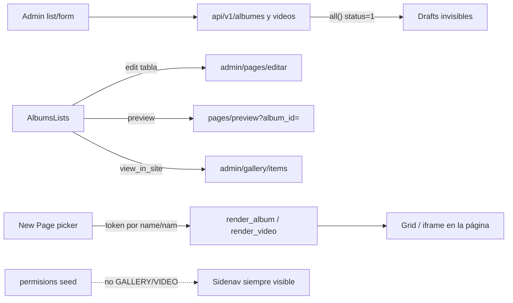
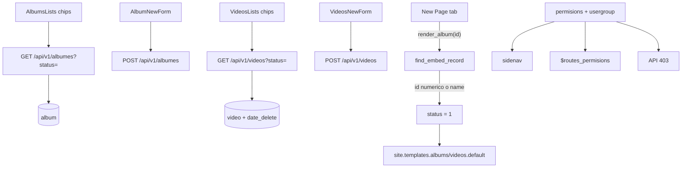

# Álbumes + Videos — Corte A: honestidad del loop

Hacer que Álbumes (Gallery) y Videos dejen de mentirle al editor: borradores visibles, links que existen, permisos reales, embeds por id, copy i18n. **Embed-first.** Sin destinos públicos `/galeria` ni `/videos`. Sin Media Library unificada.

**Rama:** `feat/albums-videos-cut-a`  
**Worktree:** `/home/gervis/.cursor/worktrees/startCodeIgniter-CSM/albums-videos-cut-a`  
**Base:** `master` (`8464f0d`)  
**Checkout principal:** `/home/gervis/personal/startCodeIgniter-CSM` (Docker `ci_php56`, puerto **8081**)

PHP 7.4 + CodeIgniter 3.1. No uses PHP 8+ (`match`, union types, named arguments, nullsafe `?->`, enums). Lee `AGENTS.md`, `docs/DESIGN.md` y `.cursor/rules/` antes de editar.

**Leer este archivo entero. No ampliar alcance.** Este corte es el único trabajo de este chat/worktree.

---

## 1. Objetivo (job mínimo)

1. El editor ve **publicados y borradores** en `admin/gallery` y `admin/videos` (chips de status). Un draft creado desde el dashboard no desaparece.
2. Cada acción del menú `more_vert` apunta a una URL **que existe**. No hay “preview” de Pages ni “ver en el sitio” hacia una ruta pública inexistente.
3. Un admin sin permiso de galería/videos **no** ve el sidenav ni entra por URL. La API responde 403. La barra del sitio (`SELECT_GALLERY`) empieza a funcionar porque el permiso está en seed.
4. Insertar álbum/video en una página usa `{{render_album(12)}}` / `{{render_video(7)}}` (id). Los tokens viejos por **nombre** siguen resolviendo.
5. En el form de video: miniatura se hidrata al editar; categorías zombie **ocultas**; `payinfo` **no** es required (campo fuera del form). Status alineado a `1` publicado / `2` borrador.
6. Copy visible pasa por `lang()`. Empty state con icono + texto + CTA. Muertos: `Gallery.php`, `debugger;` en `AlbumNewForm`.

Si un paso no aporta a esto, no va en este corte.

---

## 2. Fuera de alcance (Corte B / C)

- `sort_order`, drag & drop, cover `file_id`, lightbox, plantillas de tema.
- oEmbed YouTube (auto thumb/duración), Vimeo, upload mp4, `user_id` en `video`.
- Cablear `video-categoria` a `categories`. Productizar `payinfo`.
- URLs públicas `/galeria/{slug}`, `/videos/{slug}`, SEO, sitemap, schema.
- Unificar Files + Álbumes + Videos en una Media Library.
- Reescribir file explorer, DataTable, Materialize.
- `docker compose`, `composer install` en el host, Cloud Agents, editar `master` o el checkout principal.
- “Corregir” typos históricos: `permisions`, `categorie`, `albumes`, `nam`, `patern`.
- Editar `vendor/`, `public/vendors/`, `graphify-out/`, `public/css/admin/*.min.css`.
- Filtrar items no publicados en el embed público (Corte B).
- Widget dashboard de videos / creator rail (Corte B).

---

## 3. Cómo está hoy



| Pieza | Hecho | Problema |
|---|---|---|
| `album` + `album_items` | CRUD, file_id, soft-delete álbum | Lista API `all()` = solo publicados. `date_create` se pisa en cada POST. Delete item por GET. |
| `video` | YouTube URL, preview string | `status` 0/1 choca con soft-delete (`0`). Sin `date_delete`. Categorías stub. `payinfo` required. |
| Admin gallery | List + items + form Vue | Edit tabla → Pages. Preview roto. Cancel → categories. `debugger;`. Empty sin CTA. |
| Admin videos | List + form + `ver` legado | Chips de status en JS pero no en Blade; API no `unfiltered`. Thumb no hidrata. `videos/ver` público no existe. |
| Permisos | Navbar espera `SELECT_GALLERY` | No hay filas en `permisions`. Controllers sin `$routes_permisions`. Sidenav sin `@if`. |
| Embeds | Helpers + templates existen | Token por nombre. Docs `PAGE_EMBEDS.md` aún dice “crear”. |
| Muerto | `Gallery.php` | Carga `Admin/Album` que no existe. |

Status canónico del CMS: `0` deleted · `1` published · `2` draft · `3` archived.

Contrato público (no cambiar): embed solo si `status = 1`. El picker de New Page ya filtra con `isEmbedPublished` — tras `unfiltered` eso **sigue** siendo el filtro del picker.

---

## 4. Arquitectura objetivo



El visitante **sigue** viendo álbum/video solo dentro de una página. No hay rutas públicas nuevas.

---

## 5. Schema + migración

Archivo: `application/database/migrations/009_albums_videos_cut_a.sql`.

Si al mergear ya existiera un `009_*`, renumerar al siguiente libre. No reescribir dumps enormes de `start.sql`. **Sí** añadir `date_delete` al `CREATE TABLE video` canónico en `start.sql` (el `CREATE` es corto). Insertar los permisos nuevos en el seed de `permisions` / `usergroup_permisions` **solo si** se puede hacer con `INSERT ... SELECT ... WHERE NOT EXISTS` al final de `start.sql` sin reformatear el dump; si el dump de permisos es un INSERT masivo ilegible, deja el seed de permisos **solo** en la migración `009`.

```sql
-- date_delete en video (soft delete real)
-- Idempotente como 007_events_core.sql

-- Backfill: status 0 que no es delete → draft 2
UPDATE `video` SET `status` = 2 WHERE `status` = 0 AND `date_delete` IS NULL;
```

Permisos (typo histórico `permisions`):

| permision_name | label | module |
|---|---|---|
| `SELECT_GALLERY` | View albums | gallery |
| `CREATE_GALLERY` | Add album | gallery |
| `UPDATE_GALLERY` | Update album | gallery |
| `DELETE_GALLERY` | Delete album | gallery |
| `SELECT_VIDEOS` | View videos | videos |
| `CREATE_VIDEO` | Add video | videos |
| `UPDATE_VIDEO` | Update video | videos |
| `DELETE_VIDEO` | Delete video | videos |

`SELECT_GALLERY` (no `SELECT_ALBUMS`): ya lo referencia `application/views/shared/admin_navbar.blade.php`.

Asignar a los mismos `usergroup_id` que tienen `SELECT_PAGES` (mismo patrón que `007_events_core.sql`).

Aplicar a mano contra MySQL de esta máquina. Credenciales de `.env`. No commitear `.env`.

```bash
# cwd = este worktree. Ajustar user/pass/db del .env
docker exec -i ci_php56 mysql -h host.docker.internal -u start_cms_user -pstart_cms_pass start_cms_db \
  < application/database/migrations/009_albums_videos_cut_a.sql
```

La DB es **compartida** con `:8081`. Esta migración es aditiva (`ADD COLUMN`, `INSERT` permisos, `UPDATE status` de videos `0→2`). No `DROP`. Si la columna ya existe, el bloque idempotente no debe fallar.

---

## 6. API

Patrón a copiar: [`application/controllers/api/v1/EventsController.php`](application/controllers/api/v1/EventsController.php) (`index_get` con `unfiltered` + `status`, `require_event_permision`).

### `AlbumesController`

- `index_get`: si hay id, `find` (cualquier status, 404 si no). Lista: `respond_index_list($album, $where, array(), $options)` con `unfiltered => true`. Si `?status=` viene, filtrar esa columna y se puede dejar de usar unfiltered (igual que Events).
- `index_post`: `CREATE_GALLERY` / `UPDATE_GALLERY`. **No** pisar `date_create` en update (solo setearlo en create). `system_logger('albumes', $album->album_id, created|updated, ...)`.
- `index_delete`: `DELETE_GALLERY` + logger.
- `delete_album_item_get`: dejar el método (no romper Vue) **y** añadir `delete_album_item_delete($id)` (REST correcto). Ambos `UPDATE_GALLERY` o `DELETE_GALLERY`. No cambiar la URL histórica `albumes`.
- Helper privado `require_gallery_permision($name)` idéntico al de Events (403 + `lang` si hay clave; si no, el mismo string EN que Events).

### `VideosController` (API)

- `index_get`: igual, `unfiltered` + `?status=`. Permiso `SELECT_VIDEOS`.
- `index_post`: `CREATE_VIDEO` / `UPDATE_VIDEO`. Default de status **2** si falta (no 0). Aceptar `1` o `2`. Mapear `nombre`→`nam`, `youtubeid`→`youtube_id` como hoy. **Ignorar** `categorias[]`. `payinfo` opcional (string vacío OK).
- `index_delete`: `DELETE_VIDEO`. Soft-delete via `VideoModel::delete()` — tras la migración, `date_delete` se llena.
- Logger ya existe; no lo saques.

No implementes `index_put` (sigue 404). No añadas duplicate/archive.

---

## 7. Admin controllers

### `GalleryController`

Añadir `$routes_permisions` + `$this->check_permisions()` en el constructor. Patrones URI (typo `patern`):

- `index` / `items`: `SELECT_GALLERY` — `/admin\/gallery/` cubre list; añade también `/admin\/gallery\/items/`.
- `nuevo`: `CREATE_GALLERY` — `/admin\/gallery\/(new|nuevo)/`
- `editar`: `UPDATE_GALLERY` — `/admin\/gallery\/(edit|editar)\/(\d+)/`

Títulos/h1: `lang('menu_albums')`, `lang('albums_all')`, `lang('albums_new')`, `lang('albums_edit')`, `lang('albums_not_found')`. Hoy hay strings hardcodeados “Galería”.

### `VideosController` (admin)

Mismo esquema:

- `index` / `ver`: `SELECT_VIDEOS`
- `nuevo`: `CREATE_VIDEO` — `/admin\/videos\/(new|nuevo)/`
- `editar`: `UPDATE_VIDEO` — `/admin\/videos\/(edit|editar)\/(\d+)/`

En `ver()`: **quitar** el link `base_url('videos/ver/' . $video_id)` (ruta pública inexistente). El detalle admin puede quedarse; “View” del menú interno no debe abrir una 404 del sitio.

`lang('videos_all')`, `lang('videos_new')`, `lang('videos_edit')` — **definirlas** (hoy se usan y no existen).

### Borrar

`application/controllers/admin/Gallery.php` (muerto; no está en `routes.php`).

---

## 8. Listas admin

Copiar chips de [`application/views/admin/pages/pages_list.blade.php`](application/views/admin/pages/pages_list.blade.php) (All / published / draft / archived / trash). Para este corte: **All, published (1), draft (2), archived (3), deleted (0)**. VideosLists **ya** tiene `currentStatus` + `listExtraQuery`; falta pintarlo en Blade y que la API respete `unfiltered`.

### Álbumes — [`albums_list.blade.php`](application/views/admin/gallery/albums_list.blade.php) + [`AlbumsLists.js`](resources/components/AlbumsLists.js)

- Chips + `currentStatus` + `listExtraQuery` como VideosLists.
- Navbar `refreshMethod` → `getAlbums(currentStatus)` (como pages).
- Tabla **y** cards: Edit → `admin/gallery/editar/{album_id}` (nunca `admin/pages/editar`).
- **Eliminar** ítems Preview (`pages/preview?album_id=`) y View in site. El título de la card sigue yendo a `admin/gallery/items/{id}` (browse admin).
- Empty: icono `perm_media` + `lang('albums_empty')` + CTA `admin/gallery/new` `lang('albums_empty_cta')`. Ver empty de Events.
- FAB: clase accent del design system (no `btn-large red` nuevo; si el FAB ya es red, alinealo a `var(--st-accent)` / patrón Events/Pages cuando toques el archivo).

### Videos — [`videos_list.blade.php`](application/views/admin/videos/videos_list.blade.php)

- Pintar los chips (el JS ya está).
- `videos_view` → `admin/videos/ver/{id}` **sin** `target="_blank"` (es admin, no sitio).
- Empty: mismo patrón + CTA `admin/videos/nuevo`.
- Columna autor puede seguir en `-` (no hay `user_id`; Corte B).

### Items álbum — [`albums_items.blade.php`](application/views/admin/gallery/albums_items.blade.php)

- Quitar `v-if="album.path"` / view_in_site (no hay `path`).
- Edit ya apunta a gallery; dejarlo.

---

## 9. Forms

### Álbum — [`new_form.blade.php`](application/views/admin/gallery/new_form.blade.php) + [`AlbumNewForm.js`](resources/components/AlbumNewForm.js)

- Cancel → `admin/gallery/` (hoy `admin/categories/`).
- Quitar `debugger;` en `copyCallcack` (el typo del nombre del método **se queda**).
- Status sigue `1|2` (ya está bien en el POST Vue).

### Video — [`create.blade.php`](application/views/admin/videos/create.blade.php) + [`VideosNewForm.js`](resources/components/VideosNewForm.js)

- Hidratar `this.preview` en `mounted` desde `#imagen` / `element('preview', $video)` (el Blade ya pinta el hidden; Vue arranca `preview: ''` y tapa la imagen).
- Status checkbox: checked → `'1'`, unchecked → `'2'` (no `'0'`).
- **Ocultar** el `<select name="categorias[]">` entero. No borrar tabla `video-categoria`.
- **Ocultar** el input `#paypal`. Dejar de enviar `required`. El POST puede omitir `paypal` o mandar `''`.
- Duration y YouTube siguen required.
- Tras save, redirect a `admin/videos/ver/{id}` está OK (es admin).

No reescribir el form a `formMixin` en este corte (deuda, no el job).

---

## 10. Embeds por id

### Helpers — [`general_helper.php`](application/helpers/general_helper.php)

Extender `find_embed_record` **o** `render_album` / `render_video`:

1. Si `$arg` es solo dígitos (`ctype_digit`), `find_with(array($pk => (int) $arg, 'status' => 1))`.
2. Si no hay hit, lookup por nombre como hoy (`name` / `nam`).
3. Publicado únicamente (`status = 1`). Token de un draft → string vacío (igual que ahora).

Si un álbum se llama `"12"` y existe `album_id = 12`, **gana el id**. Documentalo en `PAGE_EMBEDS.md`.

No cambies `render_form` / `fragment` / `render_menu` / `render_event` / `get_collection` salvo que el cambio en `find_embed_record` sea genérico y no rompa el lookup por nombre (events seed tiene espacio inicial; no toques ese fallback).

### Picker — [`pages/new.blade.php`](application/views/admin/pages/new.blade.php)

```
insertEmbedToken('render_album', item.album_id)
insertEmbedToken('render_video', item.video_id)
```

La etiqueta visible sigue siendo `item.name` / `item.nam`.

Opcional y deseable: envolver tabs Álbum / Video con `has_permisions('SELECT_GALLERY')` / `SELECT_VIDEOS`. Si el usuario no tiene el permiso, no mostrar la pestaña. No rompas las otras pestañas.

### Docs

Actualizar [`docs/PAGE_EMBEDS.md`](docs/PAGE_EMBEDS.md):

- Helpers álbum/video: estado **existe**, no “crear”.
- Token canónico nuevo: `{{render_album(12)}}`. Fallback nombre.
- Test plan: insertar por id, página con token viejo por nombre sigue pintando.

---

## 11. Permisos en UI

- [`sidenav.blade.php`](application/views/admin/shared/sidenav.blade.php): wrap del `<li>` gallery con `SELECT_GALLERY`; videos con `SELECT_VIDEOS`. Subitem “nuevo” con `CREATE_*`.
- [`admin_navbar.blade.php`](application/views/shared/admin_navbar.blade.php): ya usa `SELECT_GALLERY`; no hace falta Videos en la barra del sitio en este corte.
- No gates extra en el file explorer.

---

## 12. i18n

Añadir claves **en EN y ES**:

`application/language/english/admin/admin_lang.php`  
`application/language/spanish/admin/admin_lang.php`

(y `common_lang.php` si el módulo ya pone empty/CTA ahí — sé consistente con Events/siteforms).

Mínimo:

- `albums_empty`, `albums_empty_cta`, `albums_all` (EN ya tiene bloque `albums_*`; ES casi no: copiar el bloque EN).
- `menu_new_album`, `menu_create_video` en ES.
- `videos_all`, `videos_new`, `videos_edit`, `videos_empty`, `videos_empty_cta`.
- Títulos de GalleryController que hoy están hardcodeados.

Un idioma por pantalla (`DESIGN.md`). No mezclar ES/EN en `albums_items` si tocás ese Blade (“Create by”, “Fecha de publicacion” → `lang()`).

Dashboard widget `AlbumsWidgetComponent` copy EN hardcodeado: **fuera de alcance** (no es el loop de list/form).

---

## 13. Cómo verificar

Preview del worktree: `.cursor/rules/worktree-preview.mdc` (`docker run`, puerto **8082–8099**, nunca `ci_php56` / `:8081`). Login `gerber` / `admin123`.

1. Aplicar `009_*.sql`. Confirmar `SELECT permision_name FROM permisions WHERE module IN ('gallery','videos');` y `date_delete` en `video`.
2. `admin/gallery`: crear álbum draft (switch off). Volver a la lista → aparece en Drafts, no solo en Published.
3. Tabla: Edit abre `admin/gallery/editar/{id}`, no Pages. No hay Preview ni View in site.
4. Cancel del form → lista de álbumes.
5. `admin/videos`: crear sin PayPal ni categorías. Guardar. Editar de nuevo: la miniatura sigue ahí. Status draft (2) aparece en chips Draft.
6. Soft-delete un video → chip Deleted; no se mezcla con Draft.
7. New Page → tab Álbum inserta `{{render_album(1)}}` (id numérico). Página pública pinta el grid. Una página **vieja** con `{{render_album(Diseñando apps...)}}` (nombre del seed) sigue pintando.
8. Usuario de un grupo **sin** `SELECT_GALLERY`: sidenav sin Álbumes; `/admin/gallery` error de permisos; `GET /api/v1/albumes` 403.
9. Barra del sitio (logueado en el front): Galería visible para el admin que sí tiene `SELECT_GALLERY`.
10. `Gallery.php` no existe. No hay `debugger;` en `AlbumNewForm.js`.
11. Empty de lista (borrar/ocultar datos de prueba o filtro imposible): CTA visible, no un `<h4>` solo.

Si no hay browser MCP: `curl -I` a la preview + los GET/POST de API con cookie/JWT de sesión. Decilo en el resumen.

---

## 14. Entrega

- Commit **en esta rama** (`feat/albums-videos-cut-a`), no en `master`.
- PR desde el worktree cuando el usuario lo pida.
- No `compose down`. No borrar `start_cms_db`.
- Tras merge, el principal sigue en `http://localhost:8081`.

---

## 15. Archivos que se espera tocar

| Archivo | Qué |
|---|---|
| `application/database/migrations/009_albums_videos_cut_a.sql` | **nuevo** |
| `application/database/start.sql` | `video.date_delete`; permisos si no rompe el dump |
| `application/controllers/api/v1/AlbumesController.php` | unfiltered, perms, logger, date_create |
| `application/controllers/api/v1/VideosController.php` | unfiltered, perms, status 1/2 |
| `application/controllers/admin/GalleryController.php` | `$routes_permisions`, lang |
| `application/controllers/admin/VideosController.php` | `$routes_permisions`, quitar link público |
| `application/controllers/admin/Gallery.php` | **borrar** |
| `application/helpers/general_helper.php` | lookup id + name |
| `application/views/admin/gallery/albums_list.blade.php` | chips, links, empty |
| `application/views/admin/gallery/albums_items.blade.php` | sin view_in_site |
| `application/views/admin/gallery/new_form.blade.php` | cancel |
| `application/views/admin/videos/videos_list.blade.php` | chips, empty, view |
| `application/views/admin/videos/create.blade.php` | hide cats/payinfo, status 1/2 |
| `application/views/admin/shared/sidenav.blade.php` | `@if` permisos |
| `application/views/admin/pages/new.blade.php` | token id + tabs permisos |
| `resources/components/AlbumsLists.js` | status query |
| `resources/components/AlbumNewForm.js` | quitar debugger |
| `resources/components/VideosLists.js` | ya casi listo |
| `resources/components/VideosNewForm.js` | hydrate preview, status 2 |
| `resources/components/PageNewForm.js` | solo si el Blade no basta |
| `application/language/english/admin/*.php` | claves |
| `application/language/spanish/admin/*.php` | claves (ES hoy flaco) |
| `docs/PAGE_EMBEDS.md` | id + “existe” |

`VideoModel`: solo si hace falta default status / `date_delete` en el map de `set_video`. No cablear categorías.
