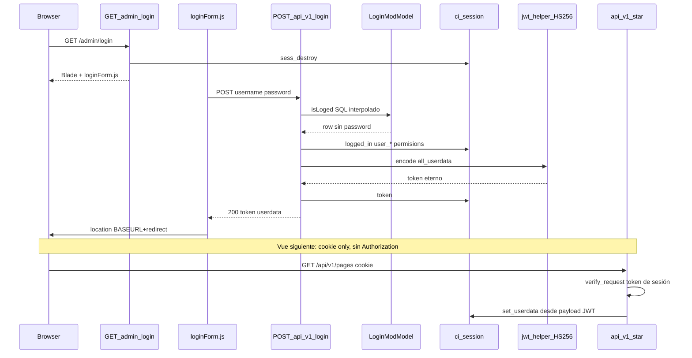
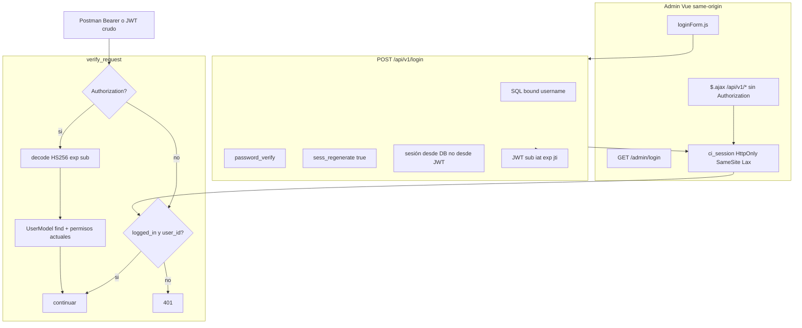

# Auth admin + API — endurecer el híbrido sesión/JWT

Cerrar agujeros de login (SQLi, secreto hardcodeado, JWT inmortal, sesión dentro del token, CSRF por cookie, authz incompleta) **sin** migrar el admin Vue a Bearer ni a Sanctum. El panel ya autentica por cookie same-origin; el JWT queda para clientes externos (Postman, scripts) con claims RFC 7519.

**Rama:** `feat/auth-login-jwt-harden`  
**Worktree:** `/home/gervis/.cursor/worktrees/startCodeIgniter-CSM/auth-login-jwt-harden`  
**Base:** `origin/master` (`d30ba6d` — Merge PR #33 `feat/page-new-ux`)  
**Checkout principal:** `/home/gervis/personal/startCodeIgniter-CSM` (Docker `ci_php56`, puerto **8081**, DB `start_cms_db`)

PHP **7.4** + CodeIgniter **3.1**. No PHP 8+ (`match`, union types, named arguments, nullsafe `?->`, enums). Leer `AGENTS.md`, `.cursor/rules/rest-api.mdc`, `.cursor/rules/php-models.mdc`, `.cursor/rules/worktree-preview.mdc` antes de editar.

**Leer este archivo entero. No ampliar alcance.** Este corte es el único trabajo de este chat/worktree.

Prompt listo para pegar en un chat nuevo: [AUTH_LOGIN_JWT_HARDEN_PROMPT.md](AUTH_LOGIN_JWT_HARDEN_PROMPT.md).

---

## 0. Por qué este corte (no Sanctum, no Bearer-first)

| Opción | Esfuerzo | Riesgo de romper el admin | Beneficio extra vs endurecer |
|---|---|---|---|
| Sanctum (cookie + `X-XSRF-TOKEN` en cada POST Vue) | Alto: `start.js` + todos los `$.ajax` | Alto | CSRF más correcto en browsers viejos; SameSite=Lax cubre el 90 % |
| JWT RFC + `Authorization: Bearer` desde Vue | Alto: header en cada llamada | Alto | El Vue **no usa** el header hoy |
| **Híbrido endurecido (este plan)** | Medio | Bajo si se sigue el contrato de sesión | Cierra SQLi, forge JWT, tokens eternos, leak de passwords |

`resources/js/start.js` y los componentes **no** mandan `Authorization`. `verify_request()` cae a `userdata('token')` si hay `logged_in`. Eso es lo que hay que preservar.

Compatibilidad Laravel / `firebase/php-jwt` / `jose`: se gana en **payload** (`sub`, `iat`, `exp`, `jti`) y en aceptar `Bearer`, no reescribiendo el SPA.

---

## 1. Objetivo (job mínimo)

1. Login no interpola SQL. Usuario sin filas en `user_data` puede entrar.
2. El secreto JWT sale de `JWT_SECRET_KEY` (`.env`). Placeholder / vacío = no arrancar auth (fail-hard en config o en encode/decode).
3. JWT flaco: `{sub, iat, exp, jti}` (+ `iss` opcional). **Prohibido** meter `all_userdata()`, permisos, password, PII.
4. `verify_request()`:
   - Header `Authorization` (crudo **o** `Bearer <jwt>`) → validar firma HS256 + `exp` → hidratar sesión **desde DB**.
   - Sin header, con cookie `logged_in` + `user_id` → autenticado **sin** exigir que el JWT de sesión siga siendo válido (rotar el secret no debe echar al admin a mitad de sesión).
5. Cookies: HttpOnly + SameSite=Lax. No activar `$config['csrf_protection']`.
6. `response_error()` y `changePassword_post` no devuelven `$_POST`.
7. Users / Config / Files: permisos en mutaciones (GET de files queda autenticado-only por el file picker).
8. Rate limit en `POST /api/v1/login`. CORS no es `*` por defecto.
9. Logout GET sigue funcionando (navbar admin y barra pública).

Si un paso no aporta a esto, no va en este corte.

---

## 2. Fuera de alcance

- Sanctum / CSRF token en Vue / `ajaxSetup` con header X-XSRF.
- Obligar Bearer en el admin. Refresh tokens rotativos, blacklist Redis/`jti` table.
- Passport / OAuth2 / PHP 8 / `firebase/php-jwt` v6.
- `composer install` en el **host**. Cloud Agents. `docker compose` desde el worktree. Editar `master` o el checkout principal.
- Authz en Categories, Fragments, Menus, Models, Search, Siteforms, Notifications (follow-up).
- “Corregir” typos: `permisions`, `patern`, `categorie`.
- Editar `vendor/`, `public/vendors/`, `graphify-out/`, `public/css/admin/*.min.css`.
- Migraciones `DROP`/`ALTER` contra `start_cms_db` compartida.
- Quitar `rbdwllr/reallysimplejwt` del composer (ya está; usarlo o no, no borrar el lock).
- Cambiar credenciales seed `gerber` / `admin123`.

---

## 3. Cómo está hoy



### 3.1 Piezas

| Pieza | Path | Contrato actual | Problema |
|---|---|---|---|
| Pantalla login | `application/controllers/admin/LoginController.php` | GET pinta Blade; `sess_destroy()` siempre | Es el logout del navbar admin (`admin/shared/navbar.blade.php` → `/admin/login/`). No hay POST. |
| Form Vue | `resources/components/loginForm.js` | POST `api/v1/login/` form-urlencoded | `remember_user` guarda `userdata[0]` en `localStorage`. `redirect` query se concatena a `BASEURL`. |
| Login API | `application/controllers/api/v1/LoginController.php` | No llama `verify_request`. Clase homónima distinta (REST). | `if (post('username') && post('username'))` no exige password. JWT = `all_userdata()`. |
| Query login | `application/models/Admin/LoginModModel.php` | `password_verify`. `INNER JOIN` subquery `user_data`. | `"WHERE u.username = '$username'"` SQLi. Sin EAV → no login. |
| JWT lib | `application/helpers/jwt_helper.php` | Draft IETF ~2011, HS256/384/512. Clase `JWT`. | `alg` del header del atacante. `$sig !=`. Sin `exp`. `verify=true` por defecto. |
| Auth wrapper | `application/helpers/authorization_helper.php` | `generateToken` / `validateToken` / `validateTimestamp` | `validateTimestamp` **nunca se llama**. `token_timeout` no está en `jwt.php`. |
| Secret | `application/config/jwt.php` + autoload `jwt` | `$config['jwt_key'] = 'MY_SECRET_KEY'` | `.env` `JWT_SECRET_KEY` no se lee. Docs `DOCKER.md` mienten. |
| Gate API | `REST_Controller::verify_request()` L580–605 | Header `Authorization` o `userdata('token')` | Case-sensitive. No strip `Bearer`. Si decode OK, **pisa** sesión con el blob. |
| Gate HTML | `MY_Controller::__construct` | `logged_in` o redirect `admin/login/?redirect=` | `urlencode(uri_string())`. Refresh permisos solo si faltan `SELECT_SITEFORMS` y `SELECT_GALLERY`. |
| Permisos | `has_permisions()` en `general_helper.php` | `in_array` estricto sobre sesión | API Users/Config/Files no llama esto. |
| Sesión CI | `application/config/config.php` | files driver, 7200s, `application/cache/sessions`, mkdir 0777 | Sin `cookie_httponly` / `cookie_samesite`. `cookie_secure=false`. `encryption_key='roughly'`. `csrf_protection=false`. |
| CORS | `application/config/rest.php` | `check_cors=TRUE`, `allow_any_cors_domain=TRUE` | `allowed_cors_headers` **sin** `Authorization`. `Access-Control-Allow-Origin: *`. |
| REST auth built-in | `rest_auth=FALSE` | No se usa Basic/Digest de la lib | Auth es 100 % `verify_request` ad-hoc. |
| Logout API | `LoginController::logout_get` | `sess_destroy` + `response_ok(true)` JSON | Barra pública navega aquí (`admin_navbar.blade.php`) y ve JSON. |
| Logout admin | GET `/admin/login/` | `sess_destroy` + form | No tocar este side-effect sin cambiar el href del navbar. |
| Postman | `docs/api/postman-collection.json` | Header `Authorization` = JWT **crudo** (sin Bearer) | Payload de ejemplo incluye permisos, teléfono, avatar. |
| Composer | `rbdwllr/reallysimplejwt` `dev-master` | Autoload PSR-4 `ReallySimpleJWT\` | **Ningún PHP de application/ lo usa.** `jwt_helper` es una copia vieja de firebase/php-jwt. |
| Analytics público | `AnalyticsController` | POST event/conversion sin JWT | Rate limit `get_cached` — Dashboard sí hace `load->driver('cache')`; Analytics **no**. No copiar ese bug. |

### 3.2 Payload JWT actual (ejemplo Postman)

Claims de primer nivel: `userdata` (objeto enorme), `rand_key` (alnum 16, no se valida nunca).

Dentro de `userdata` (sesión serializada): `logged_in`, `user_id`, `username`, `email`, `lastseen`, `usergroup_id`, `status`, `nombre`, `apellido`, `direccion`, `telefono`, `avatar`, `role`, `level`, `usergroup_permisions[]`, `__ci_last_regenerate`, `token` (JWT embebido en sí mismo → token gigante).

Rotar permisos en DB **no** afecta a un cliente que mande ese JWT: `verify_request` reinstala el array viejo.

### 3.3 Cadena de confianza rota

1. Conocer `MY_SECRET_KEY` (está en git) → forjar `{userdata:{logged_in:true,user_id:1,usergroup_permisions:[...]}}`.
2. `POST /api/v1/users` sin `CREATE_USER` porque UsersController solo chequea JWT.
3. CSRF: página atacante hace POST same-site-cookie a `/api/v1/pages` (SameSite no está Lax).

### 3.4 Lo que está bien (no romper)

- `password_hash(..., PASSWORD_DEFAULT)` / `password_verify` en create user y login.
- `UserModel::$protectedFields = array('password')` en el modelo (el JSON de login API igual mete PII; el create user docs muestran password en claro en el ejemplo — no es runtime si `protectedFields` filtra `save` output; **sí** runtime en `changePassword_post` que echo `$_POST`).
- Admin HTML exige sesión. API exige `verify_request` salvo Login y analytics public POST.
- Pages/Events/Videos/Albumes ya tienen `require_*_permision` → 403. Copiar ese patrón, no inventar otro.
- Seed user bcrypt (columna DEFAULT `'1234'` en schema es deuda, no tocar `start.sql` en este corte).

---

## 4. Arquitectura objetivo



### 4.1 Contratos

**A. Sesión (SPA)**  
Fuente de verdad para el admin. Campos mínimos tras login / JWT hydrate:

- `logged_in` = true  
- `user_id`, `username`, `email`, `usergroup_id`, `status`, `role`, `level`  
- EAV aplanado como hoy (`nombre`, `apellido`, …) para no romper Blade/`userdata('nombre')`  
- `usergroup_permisions` = array de strings desde `UsergroupModel::usergroup_permisions()` **ahora**  
- `token` = JWT flaco (opcional; clientes que lo copian del JSON de login). **No** usarlo como único gate si la cookie ya es válida.

**B. JWT (máquina)**  
HS256. Secret ≥ 32 bytes random. Payload **solo**:

```json
{
  "iss": "start-cms",
  "sub": "1",
  "iat": 1730000000,
  "exp": 1730007200,
  "jti": "hex 16 bytes"
}
```

`exp` = `time() + sess_expiration` (7200). Aceptar header:

1. `Authorization: Bearer eyJ...`
2. `Authorization: eyJ...` (Postman actual)
3. Header case-insensitive (`Authorization` / `authorization` / `HTTP_AUTHORIZATION`)

Tokens viejos (blob `userdata`, firmados con `MY_SECRET_KEY`) → 401. Aceptable: se rota el secret.

**C. No dual-write de permisos en el token.** Siempre DB.

---

## 5. Implementación por archivo

PHP 7.4: `array()`, no typed properties nuevas si el archivo no las tiene, no `str_contains` si se puede evitar (`strpos !== false`). `random_bytes` sí (7.0+).

### 5.1 `application/config/jwt.php`

```php
defined('BASEPATH') OR exit('No direct script access allowed');

$key = getenv('JWT_SECRET_KEY');
if ($key === false || $key === '' || $key === 'CHANGE_THIS_TO_A_RANDOM_STRING_IN_PRODUCTION' || $key === 'MY_SECRET_KEY') {
    // Development: allow a long derived key so local .env.example still boots,
    // but never the literal MY_SECRET_KEY as HMAC secret.
    $fallback = getenv('APP_BASE_URL');
    $key = hash('sha256', 'start-cms-dev-only|' . ($fallback ? $fallback : 'local'));
}
$config['jwt_key'] = $key;
$config['jwt_iss'] = 'start-cms';
$config['jwt_alg'] = 'HS256';
$config['token_timeout'] = 120; // minutes; keep in sync with sess_expiration (7200s)
```

Regla de producción: si `APP_ENV=production` y el secret es placeholder → `log_message('error', ...)` y `jwt_key` vacío de forma que encode/decode fallen (no firmar con el hash de desarrollo).

Leer `APP_ENV` igual que `index.php`.

Actualizar `.env.example` comentario: mínimo 32 chars, `openssl rand -hex 32`.

### 5.2 Librería JWT — **no añadir paquetes Composer**

Prohibido `composer require` en el host (PHP 8 rompe el lock). `firebase/php-jwt` v6 pide PHP 8. `reallysimplejwt` ya está en vendor copiado al worktree; su API (`Token::create($id, $secret, $exp, $iss)`) mete claims propios y `dev-master` es frágil.

**Hacer:** endurecer `application/helpers/jwt_helper.php` (mismo nombre de clase `JWT` para no romper el helper load):

1. `decode()`: ignorar `$header->alg` del token. Firmar/verificar **siempre** con `HS256` (`hash_hmac('sha256', ...)`).
2. Comparar MAC con `hash_equals($expected, $sig)`.
3. Si el payload tiene `exp` y `(int)$payload->exp < time()` → `return false` o throw (verify_request ya captura Exception; preferir `return false` para no filtrar mensajes).
4. Si tiene `nbf` y es futuro → false.
5. `encode($payload, $key, $algo = 'HS256')`: forzar HS256, ignorar otros `$algo`.
6. No implementar `alg=none`.

`authorization_helper.php`:

```php
public static function generateToken($data)
{
    $CI =& get_instance();
    if (!isset($data['iat'])) {
        $data['iat'] = time();
    }
    if (!isset($data['exp'])) {
        $timeout = (int) $CI->config->item('token_timeout');
        if ($timeout < 1) {
            $timeout = 120;
        }
        $data['exp'] = time() + ($timeout * 60);
    }
    if (!isset($data['iss'])) {
        $data['iss'] = $CI->config->item('jwt_iss');
    }
    return JWT::encode($data, $CI->config->item('jwt_key'), 'HS256');
}

public static function validateToken($token)
{
    $CI =& get_instance();
    if (!is_string($token) || $token === '') {
        return false;
    }
    $token = self::stripBearer($token);
    return JWT::decode($token, $CI->config->item('jwt_key'));
}

public static function stripBearer($token)
{
    if (stripos($token, 'Bearer ') === 0) {
        return trim(substr($token, 7));
    }
    return trim($token);
}
```

Dejar `validateTimestamp` como wrapper de `validateToken` (ya chequea `exp` en decode) o deprecarlo sin callers.

### 5.3 Extraer hidratación de sesión (evitar duplicar)

Nuevo método **protegido** en `REST_Controller` (o helper `auth_helper.php` si se quiere usar desde admin LoginController; admin no hidrata, solo destruye). Preferir métodos en `REST_Controller` porque Login API ya lo extiende:

`hydrate_admin_session($user)` donde `$user` es `UserModel` ya `find`:

1. `logged_in` true  
2. Copiar columnas: `user_id`, `username`, `email`, `lastseen`, `usergroup_id`, `status`  
3. Si `$user->user_data` es objeto/array, foreach a session (mismo loop que login actual)  
4. `UsergroupModel` → `usergroup_permisions()`  
5. `role` / `level` desde el grupo si están en el modelo  

`clear_login_rate_limit()` / `hit_login_rate_limit($username)` — ver 5.8.

### 5.4 `application/controllers/api/v1/LoginController.php`

**`index_post`**

1. Rate limit **antes** de tocar DB (5.8). Si excedido → 401 con el **mismo** `error_message` que password malo (`lang('username_or_password_invalid')`, `error_code` 2). No distinguir “no encontrado” vs “malo” vs “rate limit” en el JSON (el código 3 actual enumera usuarios). Unificar a error_code 2.
2. `$username = trim((string) $this->input->post('username'));` `$password = (string) $this->input->post('password');` Si username === '' **o** password === '' → 401 unificado (no `sess_destroy` de una sesión ajena si alguien POSTea vacío estando logueado: solo destroy si el intento iba en serio y falló; más simple: no destroy en 401, solo no setear logged_in).
3. `isLoged($username, $password)` con bind.
4. Éxito:
   - `$this->session->sess_regenerate(true);` **después** de tener el user, **antes** o **después** de set_userdata: CI3 `sess_regenerate` llama `session_regenerate_id($destroy)` y conserva `$_SESSION` actual. Orden seguro: hidratar, luego regenerate, luego generar JWT y `set_userdata('token')`.
   - `hydrate_admin_session($user)`.
   - `$user->lastseen = date('Y-m-d H:i:s'); $user->save();` (ya existe).
   - `$token = AUTHORIZATION::generateToken(array('sub' => (string) $user->user_id, 'jti' => bin2hex(random_bytes(16))));`
   - `set_userdata('token', $token)`.
   - Response **compatible Vue**: `status` 200, `userdata` (array como hoy, **sin** password), `token`, `auth` => `valid`, `redirect` => `admin`. No meter permisos de más en `userdata` si ya venían; no ampliar.
5. No loguear password. `system_logger` opcional `'users', $id, 'login', ...'` — sí, útil, no es alcance extra grande.

**`logout_get`**

- `sess_destroy()`.
- Si el request acepta HTML / no es AJAX (`!$this->input->is_ajax_request()`): `redirect('admin/login')` para la barra pública.
- Si AJAX: `response_ok(true)` como ahora.

No hace falta `logout_post` en este corte (nadie lo llama).

**`index_get` / put / delete** siguen 405.

### 5.5 `LoginModModel::isLoged`

Reescribir el SQL:

- Bind: `$this->db->query($sql, array($username));` único `?` en `u.username = ? AND u.status = 1`.
- `LEFT JOIN` (no INNER) del subquery `user_data` para no exigir EAV.
- Seguir `password_verify`; si no hay fila o hash inválido → `false` (mismo tiempo razonable; no early-return distinto por “no user” vs “bad password” a nivel de API — el modelo puede return false en ambos).
- `unset($data[0]['password'])` antes de return.
- Username: no correr `escape` + bind a la vez (doble escape). Solo bind.
- No cambiar el `GROUP_CONCAT` JSON frágil en este corte (valores con comillas siguen rotos; fuera de alcance).

No usar `$this->input->post` dentro del modelo.

### 5.6 `REST_Controller::verify_request()`

Reemplazar el cuerpo. Pseudocódigo PHP 7.4:

```php
public function verify_request()
{
    $token = $this->get_authorization_token();
    if ($token) {
        try {
            $data = AUTHORIZATION::validateToken($token);
        } catch (Exception $e) {
            return false;
        }
        if (!$data || empty($data->sub)) {
            return false;
        }
        $this->load->model('Admin/UserModel');
        $user = new UserModel();
        if (!$user->find((int) $data->sub) || (int) $user->status !== 1) {
            return false;
        }
        $this->hydrate_admin_session($user);
        return $data;
    }
    if (userdata('logged_in') && userdata('user_id')) {
        return true;
    }
    return false;
}

protected function get_authorization_token()
{
    $headers = $this->input->request_headers(true);
    if (!is_array($headers)) {
        $headers = array();
    }
    $raw = '';
    foreach ($headers as $name => $value) {
        if (strtolower($name) === 'authorization') {
            $raw = $value;
            break;
        }
    }
    if ($raw === '' && isset($_SERVER['HTTP_AUTHORIZATION'])) {
        $raw = $_SERVER['HTTP_AUTHORIZATION'];
    }
    if ($raw === '' && isset($_SERVER['REDIRECT_HTTP_AUTHORIZATION'])) {
        $raw = $_SERVER['REDIRECT_HTTP_AUTHORIZATION'];
    }
    $raw = AUTHORIZATION::stripBearer($raw);
    return ($raw !== '') ? $raw : null;
}
```

Añadir `require_permision($permision)` (typo histórico **permision**):

```php
protected function require_permision($permision)
{
    if (!function_exists('has_permisions') || !has_permisions($permision)) {
        $this->response(array(
            'code' => REST_Controller::HTTP_FORBIDDEN,
            'error_message' => function_exists('lang') ? lang('not_have_permissions') : 'Forbidden',
            'data' => array(),
        ), REST_Controller::HTTP_FORBIDDEN);
        return false;
    }
    return true;
}
```

Pages usa HTTP 200 + `code: 403` en algunos errores (`pages_error`). **Este corte:** 403 HTTP real en Users/Config/Files, más honesto. Vue que no mire el status HTTP y sí `response.code` sigue viendo 403. Si un componente Users asume 200 siempre, no romper listados GET (sí tienen permiso). Probar Users list con gerber.

**`response_error`:** quitar `'requets_data' => $_POST`. No sustituir por un dump. Extra explícito sigue permitido vía `$extradata`.

### 5.7 Cookies — `application/config/config.php`

Después de `cookie_secure`:

```php
$config['cookie_httponly'] = true;
$config['cookie_samesite'] = 'Lax';
```

`cookie_secure`: `true` si `APP_ENV === 'production'` o `stripos(getenv('APP_BASE_URL'), 'https://') === 0`; si no, `false` (localhost:8081/8082 HTTP).

Grep `system/libraries/Session/Session.php` (y `Session_driver`) por `samesite` / `httponly`. Si esta 3.1 no los aplica:

- Documentar en el plan de test que se verificó.
- Fallback aceptable: no inventar un hook enorme; CI 3.1.11+ sí los tiene. Si el archivo Session no los lee, setear vía `ini_set('session.cookie_httponly', '1')` y `ini_set('session.cookie_samesite', 'Lax')` al inicio de `index.php` **después** del DotEnv, solo si Session.php no soporta las keys. Preferir config CI.

No cambiar `sess_driver`, `sess_save_path`, `sess_expiration`, `SESS_COOKIE_NAME` (worktree preview). No bajar `mkdir` 0777 en este corte (sesión ya se peleó en `fix/session-save-path`).

**No** activar `csrf_protection`. Rompería POST JSON del admin.

### 5.8 Rate limit login

En `LoginController::__construct` (después de parent):

```php
$this->load->driver('cache', array('adapter' => 'file'));
```

Clave: `'login_rl_' . md5($this->input->ip_address() . '|' . strtolower($username))`.  
Umbral: **10** hits. TTL: **900** s.  
`get_cached` / `set_cached` **solo** si el driver está cargado (Dashboard lo hace bien; Analytics public no — no copiar). Si `cache->get` no existe, `$this->cache->get`.

No usar `X-Forwarded-For` (spoof). `ip_address()` de CI basta.

Incrementar en **fallo** de credenciales y en usuario vacío. Éxito: `delete` de esa key (opcional, bueno).

### 5.9 CORS — `application/config/rest.php`

- `$config['allow_any_cors_domain'] = FALSE;`
- `$config['allowed_cors_origins'] = array();` (vacío = nadie cross-origin; same-origin no manda Origin o el browser no exige CORS).
- Añadir `'Authorization'` a `allowed_cors_headers`.

El admin Vue es same-origin: no necesita `*`.

### 5.10 Admin `LoginController` (HTML)

**No quitar** `sess_destroy()` del GET: `application/views/admin/shared/navbar.blade.php` logout = `href=admin/login/`. Si se quita destroy, Logout deja de funcionar.

Sí se puede: si hay query `?redirect=` y **no** se quiere filtrar, el allowlist vive en **loginForm.js** (5.12). PHP no necesita validar el GET del form.

### 5.11 Authz API — mapa exacto

Clave `lang('not_have_permissions')` ya existe en admin lang. Cargar `admin/admin` o `admin/common` si el REST no la tiene; si `lang()` devuelve la key, hardcodear el string del lang file.

**UsersController** (`application/controllers/api/v1/UsersController.php`):

| Método | Permiso | Notas |
|---|---|---|
| `index_get` | `SELECT_USERS` | |
| `index_post` sin `user_id` | `CREATE_USER` | |
| `index_post` con `user_id` | `UPDATE_USER` | |
| `index_delete` | `DELETE_USER` | |
| `usergroups_get` | `SELECT_USERS` | Mantener filtro `level` / `parent_id` existente **además** |
| `usergroups_post` | `UPDATE_USERS` | Asigna permisos; es el agujero de escalada |
| `permissions_get` | autenticado (sesión) | Lista las del **propio** grupo; no abrir a todos |
| `allpermissions_get` | `UPDATE_USERS` | Catálogo para el form de grupos |
| `timeline_get` | `SELECT_USERS` **o** `userdata('user_id') == $user_id` | Perfil propio |
| `avatar_post` | `UPDATE_USER` **o** self | |
| `changePassword_post` | self (`user_id` post === session) **o** `UPDATE_USER` | Sigue exigiendo `currentPassword` + `isLoged`. **Quitar `'data' => $_POST`**. Responder `{code, data: true}` o user sin password. |

**ConfigController:**

| Método | Permiso |
|---|---|
| `index_get` | `SELECT_CONFIG` |
| `index_post` | `site_config_id` → `UPDATE_CONFIG`, else `CREATE_CONFIG` |
| `backup_database_get`, `export_data_get`, `generate_export_file_post`, `import_file_post`, `cleanup_logs_post`, `download_update_get`, `download_install_theme_post`, `install_downloaded_update_get` | `UPDATE_CONFIG` |
| `themes_get`, `check_update_get`, `system_info_get` | `SELECT_CONFIG` |
| `systemlogger_get`, `apilogger_get`, `usertrackinglogger_get` | `SELECT_CONFIG` |

Si algún Vue de dashboard llama `api/v1/configuration` sin `SELECT_CONFIG`, el GET 403 es correcto (settings no es dashboard). Grep `api/v1/configuration` antes de merge; `UserGroupsComponent.js` pega a configuration por id — usuarios con grupos pueden no tener SELECT_CONFIG. **Si ese GET es necesario para el form de grupos, dejar `index_get` autenticado-only** y documentarlo en el PR. Prioridad: no romper User Groups. Verificar en browser.

**FilesController** — el picker de páginas (`FileExplorerSelector.js`, `DataSelector.js`) usa GET/filter/`make_dir` con editores que **pueden no tener** `CREATE_FILE`.

| Método | Permiso |
|---|---|
| `index_get`, `filter_files_get`, `get_file_content_get` | solo `verify_request` (sin perm extra) |
| `make_dir_post` | solo `verify_request` (picker) |
| `delete_post` | `DELETE_FILE` |
| `move_file_post`, `copy_file_post`, `rename_file_post`, `featured_file_post`, `reload_file_explorer_post` | `UPDATE_FILE` |

`index_post` ya es 405.

Llamar `require_permision` al **inicio** del método, no en el constructor (GET files no debe 403).

### 5.12 `resources/components/loginForm.js`

1. `redirect`: solo path interno. Tras `getUrlParameter('redirect')`:
   - decodeURIComponent
   - rechazar si contiene `://`, empieza por `//`, contiene `\`, o no matchea `/^admin(\/[-a-zA-Z0-9_\/]*)?$/` (vacío permitido).
   - Si inválido, `redirect = ''` → cae a `response.redirect` (`admin`).
2. Remember me: guardar **solo** `{ username }` (y avatar URL si ya está y es same-origin; si complica, solo username). No el objeto user completo.
3. `getRememberUserdata`: hidratar username; no instanciar `User` si faltan campos (guardar `userdata` null salvo username).
4. No tocar SCSS.

Fuente: `resources/components/loginForm.js` (no `public/js/components/`).

### 5.13 Docs de contrato

- `docs/api/postman-collection.json`: un header de ejemplo `Bearer {{token}}` **y** nota de que el crudo sigue válido. No dejar JWTs reales de usuarios (el actual es un leak de PII). Variable `{{token}}`.
- `AGENTS.md` línea API: “JWT flaco `sub`+`exp` en `Authorization` (Bearer opcional) **o** sesión cookie”.
- `.cursor/rules/rest-api.mdc`: misma frase.
- No reescribir `DOCKER.md` entero; una línea que el secret **sí** se lee de `.env`.

### 5.14 `.htaccess`

Apache CGI a veces no pasa `Authorization`. Añadir **solo si** el test Bearer falla en el contenedor:

```
RewriteCond %{HTTP:Authorization} .
RewriteRule .* - [E=HTTP_AUTHORIZATION:%{HTTP:Authorization}]
```

antes del rewrite a `index.php`. No añadirlo “por las dudas” si `$_SERVER['HTTP_AUTHORIZATION']` ya llega (mod_php). Probar con curl contra el preview.

---

## 6. Orden de trabajo

1. `jwt.php` + helper JWT + `AUTHORIZATION` (secret, HS256 fijo, exp, Bearer strip).  
2. `hydrate_admin_session` + `verify_request` + `get_authorization_token` + `require_permision` + `response_error` sin POST.  
3. `LoginModModel` bind + LEFT JOIN.  
4. `LoginController` API: rate limit, regenerate, JWT flaco, logout redirect.  
5. Cookies config. CORS.  
6. Permisos Users → Config (con grep Vue) → Files.  
7. `changePassword_post` sin `$_POST`.  
8. `loginForm.js`.  
9. Postman + AGENTS.md + rest-api.mdc.  
10. Preview worktree (no `:8081`) y checklist §8.

Commit cuando el usuario lo pida. Mensajes tipo `fix: ...` / `docs: ...`. No mezclar SCSS.

---

## 7. Compatibilidad hacia Laravel / libs modernas (qué queda listo)

Tras este corte, un cliente `jsonwebtoken` / `jose` / `firebase/php-jwt` 5.x puede:

- Firmar HS256 con el mismo secret.
- Meter `sub`, `exp`, `iat`.
- Mandar `Authorization: Bearer`.

No es Sanctum (no hay CSRF cookie `XSRF-TOKEN`). No es Passport. El SPA sigue siendo cookie session = el modelo Sanctum **SPA mode** sin el middleware CSRF de Laravel.

Fase 2 (otro worktree): CSRF SameSite ya Lax; si se necesita CSRF token, meta tag + `ajaxSetup`. No hacerlo ahora.

---

## 8. Verificación

Worktree preview: `.cursor/rules/worktree-preview.mdc`. Puerto **8082–8099**. Nunca `docker compose`. Nunca `:8081`. Misma `start_cms_db`. `SESS_COOKIE_NAME=ci_session_<slug>`. Credenciales `gerber` / `admin123`.

Si no hay browser MCP: `curl` + cookie jar.

Checklist:

1. `POST /api/v1/login/` username `gerber` password `admin123` → 200, `token` con 3 segmentos. Decodificar payload (base64): **solo** `sub`/`iat`/`exp`/`jti`/`iss`, no `usergroup_permisions`.
2. Login Vue → dashboard, listar páginas (cookie, sin header).
3. `GET /api/v1/pages` con cookie de (2) → 200.
4. `GET /api/v1/pages` con `Authorization: Bearer <token>` y **sin** cookie → 200.
5. Mismo GET con JWT crudo (sin Bearer) → 200.
6. Token firmado con `MY_SECRET_KEY` o payload viejo `userdata` → 401.
7. Token con `exp` pasado → 401.
8. `POST /api/v1/login` username `gerber' OR '1'='1` → 401, no 500, no SQL en body.
9. 11 logins fallidos seguidos → 401 (rate limit), mismo mensaje.
10. Usuario editor **sin** `CREATE_USER`: `POST /api/v1/users` → 403. `gerber` (admin) sigue creando (si el grupo tiene el perm).
11. File picker en New Page: listar archivos sigue funcionando (GET files sin SELECT_FILES).
12. Logout navbar admin (`/admin/login/`) destruye sesión. Barra pública `api/v1/login/logout` redirige al form, no JSON crudo (request no AJAX).
13. `changePassword` error no incluye `password` en JSON.
14. Preview no desloguea `:8081` (cookie name distinto).

No correr migraciones. No `graphify --update` salvo que se toquen muchos PHP y el usuario lo pida.

---

## 9. Riesgos residuales (aceptados)

- JWT robado vale hasta `exp` (2 h). Logout no lo revoca. Sin tabla `jti`.
- CSRF en browsers que ignoran SameSite (muy viejos).
- Authz Categories/Fragments/… sigue abierta a cualquier autenticado.
- `encryption_key = 'roughly'` sigue.
- Header Authorization en FastCGI sin rewrite (probar; §5.14).
- Rotar `JWT_SECRET_KEY` invalida tokens de Postman; sesiones cookie siguen hasta `sess_expiration` (§4.1.A).
