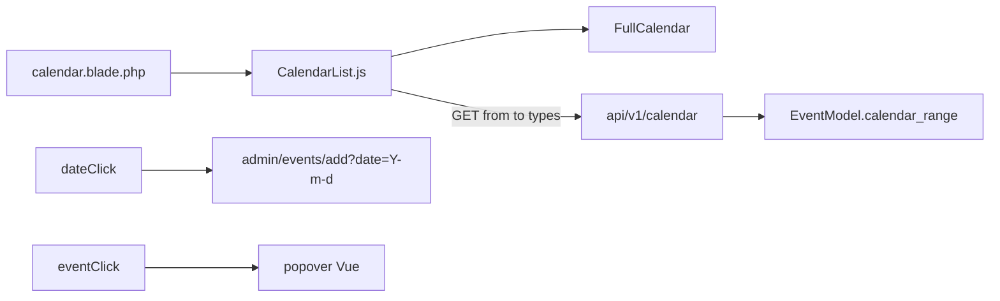

# CALENDAR_ADMIN_PLAN — spec de implementación

Agente: leé este archivo entero **y** las reglas del worktree **antes** de tocar código.

- [`AGENTS.md`](../AGENTS.md)
- [`.cursor/rules/worktrees.mdc`](../.cursor/rules/worktrees.mdc)
- [`.cursor/rules/worktree-preview.mdc`](../.cursor/rules/worktree-preview.mdc)
- [`.cursor/rules/project.mdc`](../.cursor/rules/project.mdc)
- [`.cursor/rules/admin-ux.mdc`](../.cursor/rules/admin-ux.mdc)
- [`docs/DESIGN.md`](DESIGN.md)
- [`docs/EVENTS_CORE_PLAN.md`](EVENTS_CORE_PLAN.md) (contrato de Events; no reimplementar Events)

**Worktree:** `/home/gervis/.cursor/worktrees/startCodeIgniter-CSM/admin-calendar`  
**Rama:** `feat/admin-calendar`  
**Stack:** PHP 7.4, CodeIgniter 3.1, BladeOne, Vue 2 global, Materialize, FullCalendar (vendor ya en `public/vendors/fullcalendar/`). Sin PHP 8+ (`match`, `?->`, union types, named arguments, typed properties).

Trabajá **solo** en este checkout. No edites `master` ni el checkout principal. No Cloud Agents. No `docker compose up|down|restart`. No pares `ci_php56`. No uses `:8081` para verificar (ese volume es otro árbol). Preview: Apache propio puerto `8082–8099`, misma `start_cms_db`, cookie `SESS_COOKIE_NAME=ci_session_<slug>`. Receta en `worktree-preview.mdc`.

Tras JS/Blade recargar basta. Tras SCSS: `npm run build` **en este worktree**.

---

## 1. Objetivo (job de este corte)

Convertir `/admin/calendar` de un dump de altas del CMS (vía `GET /api/v1/search/?q=1`) en una **agenda de happenings**:

1. Pintar filas de `events` por `date_start` / `date_end` / `all_day` (no por `date_create`).
2. Click en un día vacío → alta de evento con esa fecha. Click en un evento → popover (no navegar y perder el mes).
3. Permisos: `SELECT_CALENDAR` abre la vista; `SELECT_EVENTS` / `CREATE_EVENT` / `UPDATE_EVENT` recortan el feed y las acciones.
4. UI alineada a `DESIGN.md`: `page-intro`, chips List/Calendar, hint vacío **dentro** del mes (no empty de lista encima del grid), FAB accent, tokens, dark mode, `lang()`.
5. IA: el calendario **no** es un módulo hermano. Es una vista de Events (`/admin/events/calendar`). `/admin/calendar` redirige. Sidenav: Events → All / Calendar / New.


**No** fusionar FullCalendar en `events_list` (la tabla sigue siendo el CRUD). **No** empty state de lista (icono + NEW EVENT) encima del mes: el grid es el contenido.

Search (`Ctrl+K`) **no se toca**. Sigue siendo el buscador global.



---

## 2. Fuera de alcance (no implementar)

- Drag / resize / PATCH de fechas.
- ICS, webcal, “Add to calendar”, mes público, `{{render_calendar()}}`.
- Recurrencia, timezone por evento, RSVP, tickets.
- Overlay de menús, users, álbumes, categorías, siteforms, colecciones, files, form_contents.
- Reescribir `SearchController` (el calendario deja de llamarlo; el LIKE `q=1` se queda para la paleta).
- Editar `vendor/`, `public/vendors/fullcalendar`, `public/css/admin/*.min.css` a mano, `graphify-out/`.
- “Corregir” typos históricos: `permisions`, `categorie`, `albumes`, `patern`.

Visión de producto (drag, ICS, público, recurrencia) queda documentada al final. Otro worktree.

---

## 3. Diagnóstico (bugs confirmados en código)

Fuente: [`resources/components/CalendarList.js`](../resources/components/CalendarList.js) + [`application/controllers/api/v1/SearchController.php`](../application/controllers/api/v1/SearchController.php) + [`MY_Model::search()`](../application/core/MY_Model.php).

| ID | Bug | Detalle |
|---|---|---|
| B1 | Fuente incorrecta | `GET api/v1/search/?q=1` corre `or_like` en **todas** las columnas de 11 tablas. No es “traer todo”: omite filas sin el dígito `1` e incluye drafts/deleted si algún datetime contiene `1`. Hidrata `filter_results` (N+1). |
| B2 | `all_day` ignorado | Events persiste `all_day=1` y `date_end` `Y-m-d 23:59:59`. El JS no setea `allDay`. FullCalendar trata el evento como timed; en week/day el `23:59:59` puede **pasar al día siguiente** (end exclusivo vs instante). |
| B3 | Crash `users.map` | `response.data.users.map(...)` corre *antes* de mapear events. Si `users` no es array, la página queda en loader eterno. |
| B4 | Permisos | `SELECT_CALENDAR` abre HTML. El search JWT no exige `SELECT_EVENTS` / `SELECT_PAGES` / `SELECT_USERS`. Leak de PII (users) y de módulos gated. |
| B5 | i18n | `locale: 'es'` fijo. Filtros con emoji y copy hardcodeado (`Categorías`, `Menús`). Título PHP `'Calendario'`. Toast `"Ocurrió un error inesperado"`. |
| B6 | UX vs DESIGN | Intro ya está en Blade (`calendar_lede`) pero los filtros siguen siendo checkboxes en una card. Sin empty, sin FAB, click navega (`window.location`). Filtros JS `files` / `form_contents` / `siteform_submits` no tienen UI (default off = muerto). |
| B7 | Dark mode | CSS vendor FullCalendar (fondo blanco, texto oscuro). No hay override `html.dark-mode`. |
| B8 | Controller muerto | [`application/controllers/admin/Calendar.php`](../application/controllers/admin/Calendar.php) duplica la vista **sin** `$routes_permisions`. Ruta canónica: `CalendarController`. Borrar el archivo. |
| B9 | Cache-bust | `EventsList.js?v=ADMIN_VERSION`; `CalendarList.js` no. |
| B10 | Parse de fechas | `parseDateTime` solo acepta `Y-m-d H:i:s`. `Y-m-d` o ISO con `T` → `null` → el happening no pinta. |
| B11 | URLs | Pages van a `admin/pages/view/` (preview), no `edit`. Overlay editorial debe ir a `admin/pages/edit/{id}`. |

---

## 4. Contrato de API

### 4.1 Ruta

En [`application/config/routes.php`](../application/config/routes.php), junto al resto de `api/v1`:

```php
$route['api/v1/calendar/(.+)'] = 'api/v1/CalendarController/$1';
$route['api/v1/calendar'] = 'api/v1/CalendarController';
```

Archivo nuevo: `application/controllers/api/v1/CalendarController.php`. Extiende `REST_Controller`.

Constructor (mismo patrón que `EventsController` / `NotificationsController`):

- `enable_profiler(false)`
- `$this->lang->load('rest_lang', 'english');`
- `verify_request()` → 401 y `exit`
- `load->database()` / helper `general` (para `has_permisions`, `base_url`)

No hay POST/PUT/DELETE en este corte. `index_post` / `index_put` / `index_delete` → 404 (como Search).

### 4.2 `GET /api/v1/calendar`

Query:

| Param | Tipo | Default | Notas |
|---|---|---|---|
| `from` | datetime o `Y-m-d` | primer día del mes actual `00:00:00` | Inclusive. |
| `to` | datetime o `Y-m-d` | `from` + 1 mes, o exclusive end que manda FullCalendar | **Exclusivo** si viene de FullCalendar `datesSet.end`. Normalizar a `Y-m-d H:i:s`. |
| `types` | csv | `events` | Solo `events`. Otros (incl. `pages`) se ignoran. Vacío/`none` = ningún tipo. Omitido = `events`. |

Auth:

1. JWT o sesión (ya en `verify_request`).
2. `has_permisions('SELECT_CALENDAR')` o 403 `response_error(..., HTTP_FORBIDDEN, HTTP_FORBIDDEN)`.
3. Tipo `events` se incluye **solo** si `has_permisions('SELECT_EVENTS')`.
4. Si el cliente pide `events` sin permiso, **no** 403 del feed: omitir ese tipo.

Validación de rango:

- Parsear `from`/`to`. Si `Y-m-d` solo: `from` → `00:00:00`, `to` → `00:00:00` del día (FullCalendar `end` ya es exclusivo a medianoche). Si el cliente manda `Y-m-d` para `to` pensado como inclusivo, el JS debe mandar el exclusive end de FullCalendar (`info.end` ISO).
- Si `from >= to` → 400.
- Si span > **400 días**, recortar `to = from + 400 days`. No dump de toda la tabla.
- PHP 7.4: `DateTime` OK. No `DateTimeImmutable` estrictamente necesario; `date()` / `strtotime` bastan.

Éxito: `$this->response_ok($payload)` → `{ code: 200, data: ... }`.

```json
{
  "code": 200,
  "data": {
    "from": "2026-08-30 00:00:00",
    "to": "2026-10-11 00:00:00",
    "items": [
      {
        "id": "event_12",
        "type": "events",
        "title": "Town hall",
        "start": "2026-09-04 00:00:00",
        "end": "2026-09-04 23:59:59",
        "allDay": true,
        "status": 1,
        "visibility": 1,
        "place": "Main square",
        "editUrl": "http://localhost:8082/admin/events/edit/12",
        "publicUrl": "http://localhost:8082/events/town-hall"
      }
    ]
  }
}
```

Reglas de cada item:

**Events** (`EventModel::calendar_range($from, $to)`):

- `SELECT event_id, name, slug, date_start, date_end, all_day, status, visibility, address, location_type, online_url FROM events`
- `status != 0`
- `date_start IS NOT NULL`
- Overlap con el rango visible:

```sql
date_start < {to}
AND COALESCE(date_end, date_start) >= {from}
```

En Query Builder (PHP 7.4), **no** pasar `COALESCE(...)` como primer argumento de `where()` (CI lo cita como columna). Usar:

```php
$this->db->where('date_start <', $to);
$this->db->where('COALESCE(date_end, date_start) >= ' . $this->db->escape($from), null, false);
```

- **No** llamar `filter_results` / `loadRelations`. El popover no necesita HTML ni user ni file.
- `allDay`: `(int) $row->all_day === 1`
- `end`: si `date_end` vacío, usar `date_start`
- `place`: si `location_type` es `online` o `hybrid` y hay `online_url`, se puede mandar `online_url`; si no, `address`. El JS muestra `place` plano.
- `editUrl`: `base_url('admin/events/edit/' . $id)` **solo** si `UPDATE_EVENT`; si no tiene update, igual mandar la URL de edit (el HTML 403/redirect lo resuelve el admin) **o** omitir y el popover esconde Editar. Preferir: mandar `editUrl` siempre; el Blade ya pasa `canUpdate` al JS para ocultar el botón.
- `publicUrl`: `base_url('events/' . $slug)` **solo** si `status == 1` **y** `visibility == 1` **y** slug no vacío. Si no, `null`.
- `id`: prefijo `event_` + `event_id` (string) para no chocar con pages.

Colores **no** van en el API (el JS aplica tokens). Status sí, para atenuar drafts.

---

## 5. Admin HTML

### 5.1 `CalendarController` (admin)

[`application/controllers/admin/CalendarController.php`](../application/controllers/admin/CalendarController.php):

```php
`$routes_permisions` index: patern `/^admin\/(calendar|events\/calendar)\/?$/`, `SELECT_CALENDAR`.
`index()`: si URI es `admin/calendar`, `redirect('admin/events/calendar')`. Si no, `renderAdminView(..., lang('menu_events'), lang('menu_calendar'))`.
Ruta extra **antes** del catch-all de events: `$route['admin/events/calendar'] = 'admin/CalendarController';`
```

`$routes_permisions` de `index` se queda (`SELECT_CALENDAR`).

**Borrar** `application/controllers/admin/Calendar.php`.

### 5.2 Vista [`calendar.blade.php`](../application/views/admin/calendar/calendar.blade.php)

Estructura (un H1: el de `page_intro`; el layout no debe pintar otro `$h1` gordo):

1. `#root` **sin** `.container` estrecho que aplaste FullCalendar. Usar wrapper `.calendar-page` (max-width 96% centrado, como `.page-intro`).
2. `@include('admin.components.page_intro')` con `titleKey=menu_events`, `ledeKey=calendar_lede`.
3. Loader: `<preloader />` con `v-show="loader"` **dentro** de `.calendar-shell`.
4. Toolbar: `.status-filters` con chips `.status-chip` (`<a>` o `<button>`, no checkbox, no emoji):
   - Vista **List** → `/admin/events` (`events_view_list`) si `SELECT_EVENTS`.
   - Vista **Calendar** activa → `/admin/events/calendar` (`menu_calendar`).
4. Empty: **no** bloquear el mes. Una línea `.calendar-hint` dentro del shell (`calendar_empty` + `calendar_empty_hint` si `CREATE_EVENT`). CTA de alta = FAB + `dateClick`.
5. `#calendar` siempre visible bajo el loader overlay (el mes no desaparece cuando no hay ítems).
8. Popover Vue (ver §6.3) **dentro de `#root`**.
9. FAB `btn-floating btn-large st-accent` → `admin/events/add` si `CREATE_EVENT`. Tooltip `tooltip_new_event` + `aria-label`.
10. `window.CALENDAR_PERMS` y `Object.assign(window.ADMIN_LANG, { ... })` para las claves que usa Vue (`lang()`).
11. Locale: `window.CALENDAR_LOCALE` = `'es'` si `$this->config->item('language') === 'spanish'`, si no `'en'`. Hoy el admin carga english; el valor queda cableado para cuando exista switch.
12. Scripts: FullCalendar vendor + `CalendarList.js?v=ADMIN_VERSION`.

Copy `calendar_lede` (reemplazar el actual “month view of published events”, que miente: también hay drafts):

- EN: `See when events happen and open them to edit.`
- ES: `Mirá cuándo ocurren los eventos y abrilos para editar.`

Otras claves (EN + ES en `admin/admin_lang.php`; duplicar en `admin/common_lang.php` **solo** si hace falta para un `lang()` que no cargue admin_lang — el admin ya carga ambos):

| Key | EN | ES |
|---|---|---|
| `calendar_lede` | See when events happen and open them to edit. | Mirá cuándo ocurren los eventos y abrilos para editar. |
| `calendar_empty` | Nothing in this month. | Nada en este mes. |
| `calendar_empty_hint` | Click a day to add an event. | Hacé clic en un día para agregar un evento. |
| `events_view_list` | List | Lista |
| `calendar_view_site` | View on site | Ver en el sitio |
| `calendar_list` | List | Lista |
| `calendar_close` | Close | Cerrar |
| `calendar_when` | When | Cuándo |

Reusar: `menu_events`, `menu_calendar`, `edit`, `published`, `draft`, `archived`, `scheduled`, `tooltip_new_event`, `events_all_day`, `events_location`, `toast_error` / `search_error`.

---

## 6. `CalendarList.js`

Reescribir. No reutilizar el mapeo de search. Sin `new User()`. Sin emoji en `title`. Sin global `var calendar` (guardar en `this.fc`).

### 6.1 Data

```javascript
{
  loader: true,
  types: { events: true, pages: false },
  items: [],
  rangeFrom: null,
  rangeTo: null,
  selected: null,
  fc: null
}
```

`canCreate` / `canUpdate` / `selectEvents` / `selectPages` desde `window.CALENDAR_PERMS`.

Si `!selectEvents`, `types.events = false` al created.

### 6.2 FullCalendar

`init()` una sola vez (`mounted` → `$nextTick` → `init`). Opciones:

- `initialView: 'dayGridMonth'`
- `schedulerLicenseKey: 'GPL-My-Project-Is-Open-Source'` (ya está)
- `headerToolbar`: `left: 'prev,next today'`, `center: 'title'`, `right: 'dayGridMonth,timeGridWeek,timeGridDay,listMonth'`
- `views.listMonth.buttonText`: `lang('calendar_list')`
- `locale`: `window.CALENDAR_LOCALE || 'en'`
- `eventTimeFormat`: 24h `hour: '2-digit', minute: '2-digit', hour12: false`
- `events: []` al inicio
- `datesSet`: guardar `info.start` / `info.end` (Date) formateados a `Y-m-d H:i:s` en local, llamar `loadFeed`. **Ojo:** `datesSet` dispara en el primer `render`. Ahí se hace el primer GET. No llamar `loadFeed` también en `mounted` (doble request).
- `eventClick`: `info.jsEvent.preventDefault()`; `this.selected = info.event.extendedProps.payload` (el objeto API). No `window.location`.
- `dateClick`: si `canCreate`, `window.location = base_url('admin/events/add?date=' + ymd(info.date))`. `ymd` = primeros 10 chars de `info.dateStr`.
- No `editable` / `eventDrop` en este corte.

Tras cada `loadFeed` exitoso: `this.fc.removeAllEvents(); this.fc.addEventSource(this.toFcEvents(this.items));`

`loadFeed`:

```
GET BASEURL + 'api/v1/calendar?from=' + encodeURIComponent(from) + '&to=' + encodeURIComponent(to) + '&types=' + typesCsv
```

`typesCsv` = keys de `this.types` que están true, unidas por coma. Si ninguna (usuario apagó events y no tiene pages), `types=` vacío → API default `events` que el server puede devolver vacío si el chip está off: **el cliente debe mandar al menos un token o `types=none`**. Contrato: si el usuario desactiva todos los chips, mandar `types=` y el API interpreta vacío como **ningún tipo** (no default events). Así el mes queda vacío a propósito.

Ajuste API §4.2: **si `types` está presente y es string vacío o `none`, devolver `items: []`**. Default `events` **solo** cuando el param **no** viene.

jQuery `$.ajax` GET, `dataType: json`, éxito `response.code == 200`. Error: `this.toast('toast_error')` (mixin). `loader = true` en el primer load; en navegación de mes se puede dejar el calendario visible y no full-page spinner (evitar flash). `loader` solo hasta el primer `datesSet` + respuesta.

### 6.3 Mapeo a FullCalendar (all-day exclusivo)

`toFcEvents(items)`:

- `allDay === true` (o `1` / `'1'`):
  - `start`: `Y-m-d` de `item.start`
  - `end`: **día siguiente** a la fecha de `item.end` (o `start` si no hay end), formato `Y-m-d`. FullCalendar v5 all-day usa end exclusivo.
- timed:
  - `start` / `end`: `Date` local vía parser robusto
  - `allDay: false`
  - si `end` falta, omitir `end`

Parser (`parseDateTime`):

1. Falsy → `null`
2. Regex `Y-m-d H:i:s`
3. Regex `Y-m-dTH:i:s` (cortar timezone `Z` / `+00:00`)
4. Regex `Y-m-d` → medianoche local
5. `Date` nativo; si `isNaN` → `null`

Color:

- `type === 'pages'` → `#646b7f` (`--st-chrome`)
- events `status == 2` → `#757575` (`--st-neutral`)
- events `status == 3` → `#ff9800` (`--st-warning`)
- else → `#26A69A` (`--st-interactive`)

`classNames`: `calendar-fc-event`, más `calendar-fc-event--draft` si status 2.

`extendedProps.payload`: el item API completo (para el popover).

`url`: no setear (evita navegación nativa). El popover usa `editUrl`.

### 6.4 Popover

Markup en Blade, `v-if="selected"`, overlay `.calendar-popover` (click en backdrop cierra). Card `.calendar-popover__card` con:

- título (`selected.title`)
- cuando: si `allDay` → fecha(s) + `events_all_day`; si no → `Y-m-d H:i`–`H:i`
- lugar si `place`
- pill de status (`published` / `draft` / `archived`)
- `a.btn` Editar si `editUrl && canUpdate` (events) o `selectPages` (pages)
- `a.btn-flat` `calendar_view_site` si `publicUrl` (target `_blank` rel `noopener`)
- botón cerrar (`calendar_close` / icono `close`)

Esc: listener en `mounted` / `beforeDestroy`.

No Materialize Modal (`M.Modal`) — el init de plugins choca con Vue. Overlay propio en SCSS.

---

## 7. EventNewForm: `?date=`

[`resources/components/EventNewForm.js`](../resources/components/EventNewForm.js)

Nuevo método `applyDateFromQuery()`:

- No-op si `editMode === 'edit'` / `event_id` truthy.
- `URLSearchParams(window.location.search).get('date')`
- Debe matchear `/^\d{4}-\d{2}-\d{2}$/`
- Setear `date_start_date`, `all_day = true` (el click del mes no trae hora; all-day es el default honesto)

Llamar **antes** de `initDateTimePickers` (en `mounted`, primero `applyDateFromQuery`, luego `$nextTick` plugins). Tras init del datepicker, copiar `this.date_start_date` al `input#event_date_start` porque Materialize no lee `v-model` al construir.

No hace falta cambiar el Blade de create_event.

---

## 8. Lista Events ↔ calendario

[`application/views/admin/events/events_list.blade.php`](../application/views/admin/events/events_list.blade.php) y sidenav.

Misma pareja de vistas en ambos lados:

- List (`events_view_list`) → `/admin/events` (chip active en la lista).
- Calendar (`menu_calendar`) → `/admin/events/calendar` si `SELECT_CALENDAR`.

Sidenav: quitar el ítem top-level Calendar. Accordion **Events** si `SELECT_EVENTS` **o** `SELECT_CALENDAR`. Hojas: All, Calendar, New (`CREATE_EVENT`).

---

## 9. SCSS

Nuevo [`resources/scss/admin/components/_calendar.scss`](../resources/scss/admin/components/_calendar.scss), importado desde [`start.scss`](../resources/scss/admin/start.scss) (después de `page-intro`).

- `.calendar-page`: `max-width: 96%; margin: 0 auto 4rem;`
- `.calendar-page #calendar`: superficie `var(--st-surface)`, radio `var(--st-radius-md)`, padding, borde `var(--st-border)`
- FullCalendar toolbar / title: `var(--st-text)`, botones sin el azul `#3f51b5` de Material-FC: usar `var(--st-interactive)` para el botón activo y `var(--st-text)` para el resto
- `html.dark-mode`:
  - `.fc`, `.fc-theme-standard td/th`, `.fc-scrollgrid`, `.fc-col-header-cell`, `.fc-daygrid-day`: fondos `var(--st-surface)` / `var(--st-page)`, bordes `var(--st-border)`, texto `var(--st-text)`
  - `.fc-day-today`: `var(--st-canvas)` (no el amarillo default)
  - popover card: `var(--st-surface)`, texto `var(--st-text)`
- `.calendar-fc-event--draft`: `opacity: 0.75`
- `.calendar-popover`: fixed inset 0, flex center, `background: var(--st-overlay)`, z-index alto (p.ej. 20)
- `.calendar-popover__card`: max-width 420px, padding, radius
- FAB: no `style=""`; el `fixed-action-btn` del admin ya existe en otras listas — usar el mismo patrón (`a.btn-floating.btn-large.st-accent` al final de `#root`)

`npm run build` en el worktree (compila `start.min.css`). No editar `public/css/admin/*.min.css` a mano.

---

## 10. Modelos

### `EventModel::calendar_range($from, $to)`

Retorna `array` de `stdClass` (no Collection de modelos hidratados). `array()` si cero filas.

No migración SQL. No índices nuevos (ya hay `idx_events_public` en 007).

---

## 11. Archivos a tocar

| Path | Acción |
|---|---|
| `docs/CALENDAR_ADMIN_PLAN.md` | Este spec |
| `docs/README.md` | Fila en “Planes en curso” |
| `application/controllers/api/v1/CalendarController.php` | Nuevo |
| `application/config/routes.php` | `api/v1/calendar` |
| `application/models/Admin/EventModel.php` | `calendar_range` |
| `application/controllers/admin/CalendarController.php` | `lang()` título |
| `application/controllers/admin/Calendar.php` | **Borrar** |
| `application/views/admin/calendar/calendar.blade.php` | UI |
| `resources/components/CalendarList.js` | Reescribir |
| `resources/components/EventNewForm.js` | `?date=` |
| `application/views/admin/events/events_list.blade.php` | Link |
| `resources/scss/admin/components/_calendar.scss` | Nuevo |
| `resources/scss/admin/start.scss` | Import |
| `application/language/english/admin/admin_lang.php` | Claves |
| `application/language/spanish/admin/admin_lang.php` | Claves |

**No editar:** `SearchController.php`, `public/vendors/**`, `CalendarList` copies en `public/js/components/` (no son fuente).

---

## 12. Verificación

Preview (`.cursor/rules/worktree-preview.mdc`): `docker run` Apache 8082–8099, `.env` del worktree con `APP_BASE_URL` y `SESS_COOKIE_NAME=ci_session_feat_admin_calendar`. No `compose`. No `:8081`.

Login `gerber` / `admin123`.

1. `/admin/calendar` redirige a `/admin/events/calendar`. Esa vista carga sin llamar a `/api/v1/search`. Network: `GET /api/v1/calendar?from=...&to=...&types=events`.
2. Un event con `date_start` aparece ese día; `all_day=1` no muestra `00:00` ni se derrama al día siguiente en week view.
3. El feed **no** incluye páginas. `types=pages` se ignora. Badge Scheduled de pages sigue en `/admin/pages`, no en este mes.
4. Click evento → popover; el mes no se pierde. Editar abre el form. View on site solo si publicado+visible.
5. Click día vacío → `/admin/events/add?date=YYYY-MM-DD` con datepicker y all-day precargados.
6. FAB visible con `CREATE_EVENT`.
7. Dark mode: el grid no queda blanco puro ilegible.
8. Usuario sin `SELECT_EVENTS` (si se puede simular): chip List ausente, feed sin events.
9. Lista `/admin/events`: chips List | Calendar. Sidenav Calendar vive bajo Events, no como módulo aparte.
10. `Calendar.php` ya no existe; `admin/calendar` redirige a `CalendarController` en `/admin/events/calendar`.
11. Mes vacío: hint de una línea **dentro** del grid; no un empty de lista con NEW EVENT encima del calendario.

Si no hay browser: `curl -I http://localhost:<PORT>/admin/calendar` (302 login) y, con cookie de sesión, GET HTML 200 + GET API 200.

---

## 13. Visión (no este PR)

Calendario editorial de **páginas** (go-live `date_publish` futuro) **no** vive en Events. Si se hace, es otra vista bajo Pages, con `date_publish > now()`, no un overlay en esta agenda.


Orden después del merge: (1) drag/resize + color por categoría, (2) ICS + add-to-calendar en ficha pública, (3) mes público / embed, (4) recurrencia simple, (5) widget dashboard + reminder inbox.

No construir: RSVP, cupo, tickets, speakers, check-in, booking, timezone por evento, activity dump de menús/users/álbumes.
