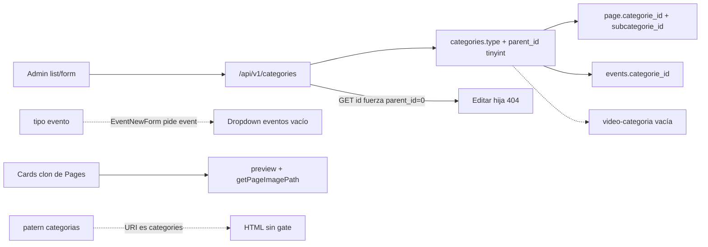
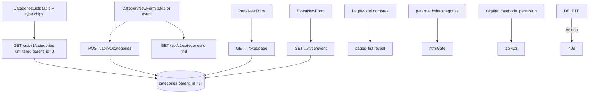

# Categorías — Corte A: honestidad del loop

Hacer que el módulo de categorías deje de mentirle al editor: editar subcategorías funciona, los tipos coinciden con páginas/eventos, la lista no es un clon de Pages, borrar no deja huérfanos silenciosos, permisos de ruta y API coinciden. **No** cablear álbumes, videos, colecciones ni el archivo público.

**Rama:** `feat/categories-cut-a`  
**Worktree:** `/home/gervis/.cursor/worktrees/startCodeIgniter-CSM/categories-cut-a`  
**Base:** `master` (`223c3d4`)  
**Checkout principal:** `/home/gervis/personal/startCodeIgniter-CSM` (Docker `ci_php56`, puerto **8081**)

PHP 7.4 + CodeIgniter 3.1. No uses PHP 8+ (`match`, union types, named arguments, nullsafe `?->`, enums). Lee `AGENTS.md`, `docs/DESIGN.md` y `.cursor/rules/` antes de editar.

**Leer este archivo entero. No ampliar alcance.** Este corte es el único trabajo de este chat/worktree.

---

## 0. Instrucciones al agente ejecutor

1. Cwd = este worktree. No edites `master` ni `/home/gervis/personal/startCodeIgniter-CSM`.
2. No `docker compose up|down|restart`. No toques `ci_php56` ni `:8081`.
3. No `composer install` en el host. No Cloud Agents, `/in-cloud`, `/best-of-n`.
4. Preview UI: `.cursor/rules/worktree-preview.mdc` (`docker run`, puerto **8082–8099**, misma `start_cms_db`). Nunca verifiques en `:8081`.
5. Typos históricos se quedan: `permisions`, `categorie`, `patern`, `albumes`. Copy visible sí: "categoría".
6. No edites `vendor/`, `public/vendors/`, `graphify-out/`, `public/css/admin/*.min.css`. JS admin: `resources/` (no `public/js/` salvo la copia de `npm run build` de `start.js` si lo tocás).
7. Migración `ALTER` de widening (`tinyint` → `INT`) contra la DB compartida: sí. No `DROP` columnas. No clonar `start_cms_db`.
8. Cuando termines: commit en esta rama si el usuario lo pide. No pushees a menos que lo pidan.

Si un paso no aporta al job de la sección 1, no va en este corte.

---

## 1. Objetivo (job mínimo)

1. Editar una subcategoría no da 404. `GET /api/v1/categories/{id}` busca por PK (`find`), **sin** `parent_id = 0`.
2. El picker de tipo solo ofrece **`page`** y **`event`**. Eventos piden `type/event` y encuentran filas (hoy el form de categoría crea `evento`).
3. Lista y form no mienten: sin Preview de pages, sin `getPageImagePath`, sin `categorie.path`, sin `date_publish` (la columna **no existe**), empty + CTA, FAB accent, copy por `lang()`.
4. `$routes_permisions` matchea `admin/categories/...` (hoy el patern es `/admin\/categorias/` y **nunca corre**). API exige `SELECT_CATEGORIES` / `CREATE_CATEGORIE` / `UPDATE_CATEGORIE` / `DELETE_CATEGORIE` como Pages/Events.
5. Borrar una categoría con páginas, eventos o hijas se rechaza (409). `parent_id` pasa a `INT`.
6. Al reabrir una página, se restaura `subcategorie_id` (hoy se escribe `subcategories_id`). El reveal de pages muestra el **nombre** de categoría, no vacío.

---

## 2. Fuera de alcance (Corte B / C)

- Álbumes (`foto`), videos (`video-categoria`), colecciones (`contenido`), fragmentos, menús, files, site forms (`formulario`).
- Widget/archivo público `/blog/categorie/:name`, slug, SEO, temas.
- Árbol de más de 2 niveles, color/icono de categoría, drag-and-drop, unique `(name, type)`.
- Renombrar tabla, rutas, claves `categorie` / `permisions`.
- Productizar stubs PUT / `subcategorie_post|put|delete` (siguen 404).
- Reescribir Events (el form ya pide `type/event`; este corte alinea el otro lado).
- `docker compose`, `composer install` en el host, Cloud Agents, editar `master` o el checkout principal.
- Editar `vendor/`, `public/vendors/`, `graphify-out/`, CSS minificado.

---

## 3. Cómo está hoy



| Pieza | Hecho | Problema |
|---|---|---|
| Tabla `categories` | CRUD, soft-delete, `type`, `parent_id` | `parent_id tinyint(1)` (rompe ids ≥ 128). Sin slug. **Sin `date_publish`**. `type` libre. |
| API GET lista | Raíces `parent_id=0`, `unfiltered` | GET por id también exige `parent_id=0` → hijas 404. |
| API POST | name/description/type/status | Pisa `date_create` en update; asigna `date_publish` inexistente; description required; sin allowlist de type; sin logger. |
| API `filter_get` | — | `where($_GET)`: columnas controladas por el cliente. |
| API `type_get` | Filtra raíces por type | Vacío → 404 (rompe dropdowns). |
| API permisos | Solo JWT/sesión | Cualquier logueado crea/borra. Pages usa `require_page_permision`. |
| Admin HTML | `CategoriesController` | patern `categorias` vs URI `categories`. Legado `Categories.php` + `Admin/Categorie` inexistente. |
| Lista Vue | `listMixin` | Clon de pages: imagen default, Preview, `editar/`, empty `<h4>` EN. Hijas en JSON, no en UI. |
| Form Vue | `formMixin` | Tipos `page,formulario,video,foto,evento,contenido`. TinyMCE + `setTimeout(5000)`. `serverValidation` a users. Nombre sin acentos. |
| Pages | FK padre+hijo | Restore escribe `subcategories_id`. `PageModel` no hidrata nombres. Reveal muestra vacío. |
| Events | FK + UI | Pide `type/event`; el alta de categoría ofrece `evento`. |
| Público | Ruta `blog/categorie/(:any)` | Temas: widget hardcodeado `#`. **No tocar en este corte.** |

Status canónico: `0` deleted · `1` published · `2` draft · `3` archived. Categorías usan `1|2` en el switch del form.

Jerarquía: **2 niveles**. Raíz = `parent_id = 0`. Hija = `parent_id` = id de una raíz. No nietos.

---

## 4. Arquitectura objetivo



Tipos vivos en este corte: **`page`**, **`event`**. El resto de strings en el picker desaparecen (no se borra la tabla `video-categoria`).

---

## 5. Schema + migración

Archivo: `application/database/migrations/010_categories_cut_a.sql`.

Si al mergear ya existiera un `010_*`, renumerar al siguiente libre. MySQL 5.7. Idempotente. Aplicar a mano (CI3 migrations no es el flujo).

**Sí** cambiar el `CREATE TABLE categories` en `application/database/start.sql` (el `CREATE` es corto, L127–139): `parent_id` de `tinyint(1)` a `int(11) NOT NULL DEFAULT '0'`. No reformatees el dump de `INSERT`.

```sql
-- Idempotente. Widening: no DROP.
-- parent_id: tinyint signed max 127; categorie_id es int.
SET @need_mod := (
  SELECT COUNT(*) FROM information_schema.COLUMNS
  WHERE TABLE_SCHEMA = DATABASE()
    AND TABLE_NAME = 'categories'
    AND COLUMN_NAME = 'parent_id'
    AND DATA_TYPE = 'tinyint'
);
SET @sql := IF(@need_mod > 0,
  'ALTER TABLE `categories` MODIFY `parent_id` int(11) NOT NULL DEFAULT 0',
  'SELECT 1');
PREPARE stmt FROM @sql; EXECUTE stmt; DEALLOCATE PREPARE stmt;

UPDATE `categories` SET `type` = 'event' WHERE `type` IN ('evento', 'eventos');
```

No añadas columna `date_publish`. No añadas `slug`.

Aplicar (cwd = este worktree; user/pass/db del `.env` copiado):

```bash
docker exec -i ci_php56 mysql -h host.docker.internal -u start_cms_user -pstart_cms_pass start_cms_db \
  < application/database/migrations/010_categories_cut_a.sql
```

La DB es **compartida** con `:8081`. Este `MODIFY` es compatible. No `DROP`.

---

## 6. API — `application/controllers/api/v1/CategoriesController.php`

Patrón a copiar: `EventsController::require_event_permision` (403 + HTTP 403). Pages: `require_page_permision` + `optional_fk`.

Helper privado `require_categorie_permision($name)`: igual que Events. String EN `'You do not have permission to perform this action'` si no hay clave lang (no inventes un módulo `rest_lang` nuevo).

### Constantes de type

```php
protected $allowed_types = array('page', 'event');
```

### `index_get($categorie_id = null)`

- Permiso: `SELECT_CATEGORIES`.
- Si hay id: `$categorie->find($categorie_id)`. Si no hay fila o status 0 → 404. **No** filtrar `parent_id`. Tras find, devolver el objeto con parent + subcategories + user. Hoy `where(parent_id=0, categorie_id=X)` es el 404 de las hijas.
- Lista: `$this->respond_index_list($categorie, array('parent_id' => '0'), array(), array('unfiltered' => true));` (borradores visibles, igual que ahora).

### `index_post()`

- Si `categorie_id` → `UPDATE_CATEGORIE` y `find`. Si no → `CREATE_CATEGORIE`.
- Validación:
  - `name`: required, min_length 1.
  - `description`: **no** required (string, default `''`).
  - `type`: required + debe estar en `$allowed_types`.
  - `parent_id`: integer, is_natural (0 permitido).
  - `status`: required, integer, 1 o 2.
- `parent_id`: `(int)`; `0` se queda en `0` (columna NOT NULL). **No** uses `optional_fk` aquí (devuelve `null` y rompe NOT NULL).
- Padre distinto de 0: debe existir, `status != 0`, su propio `parent_id` debe ser `0` (solo 2 niveles), y no ser el mismo `categorie_id` (self). Si falla → 400 + `lang('categories_parent_invalid')`.
- Update: **no** asignar `date_create`. Create: `date_create = date('Y-m-d H:i:s')` (o dejar DEFAULT de la tabla).
- **No** asignar `date_publish`.
- `user_id = userdata('user_id')` en create; en update no hace falta pisarlo.
- Tras save: `system_logger('categories', $categorie->categorie_id, $categorie_id ? 'updated' : 'created', ...)`.
- Fallo save → 400 `unexpected_error`.

### `index_delete($categorie_id = null)`

- `DELETE_CATEGORIE`.
- `find`; si no → 404.
- Antes de borrar, contar uso (ver modelo sección 7). Si pages + events + hijas no deleted > 0 → `$this->response_error(lang('categories_in_use'), array('usage' => $usage), REST_Controller::HTTP_CONFLICT, REST_Controller::HTTP_CONFLICT)`.
- Soft-delete via `$categorie->delete()`. Logger `deleted`.

`listMixin.deleteListItem` ya pinta `error_message` en el toast (success `code != 200` **o** jQuery `error` si HTTP 409). No parches `start.js` salvo que el toast no muestre el 409.

### `type_get($type = 0)`

- `SELECT_CATEGORIES`.
- Si `$type` no está en `$allowed_types` → 400.
- `$categorie->where(array('parent_id' => '0', 'type' => $type))` incluyendo drafts (el form de evento necesita verlas). Usar `unfiltered` / `find_list` como el index.
- **Cero filas → `response_ok(array())`**, HTTP 200. Hoy 404 deja `EventNewForm.categories = []`.

### `filter_get()`

- `SELECT_CATEGORIES`.
- Allowlist de keys GET: `parent_id`, `type`, `status`, `categorie_id`, `user_id`. Ignorar el resto (`page`, `per_page`, basura).
- Si `type` viene y no está allowed → 400.
- Nunca `where($_GET)`.
- Vacío → 200 + `[]` (mismo criterio que `type_get`).

### `subcategorie_get`

- `SELECT_CATEGORIES`.
- Dejar el contrato (PageNewForm lo llama). Vacío → 200 + `[]` (hoy 404). No productizar POST/PUT/DELETE de subcategorie (404).

### `index_put`

Sigue 404. No implementes.

---

## 7. Modelo — `application/models/Admin/CategorieModel.php`

### `filter_results`

Hoy: N+1 (`find` padre + `where` hijas **por fila**). Reemplazar por 2 queries batch:

1. Recolectar `parent_id` distinto de 0 y todos los `categorie_id` de la colección.
2. `WHERE categorie_id IN (...)` para padres; `WHERE parent_id IN (...)` para hijas (excluir `status = 0` en hijas).
3. Mapear `->parent` y `->subcategories` (array vacío si no hay).

Seguir usando `loadUsersRelation($collection)`.

### Uso (reemplaza `get_counted()`)

Método tipo `usage_counts($categorie_id)` (un id) y, si es barato, batch para la lista:

- pages: `categorie_id` OR `subcategorie_id`, `status != 0`
- events: `categorie_id`, `status != 0`
- children: `categories.parent_id = id` AND `status != 0`

Adjuntar a cada ítem de lista p.ej. `usage: { pages: N, events: N, children: N }` o un entero `usage_total` para la columna. `get_counted()` actual (SQL raro, solo pages, no se llama) → borrar o redirigir a este método. No dejes el SQL muerto.

`hasOne` user se queda.

---

## 8. Admin HTML

### `application/controllers/admin/CategoriesController.php`

`$routes_permisions` (typo `patern` se queda):

| method | patern | permiso |
|---|---|---|
| index | `/admin\/categories/` | `SELECT_CATEGORIES` |
| nueva | `/admin\/categories\/(new|nueva)/` | `CREATE_CATEGORIE` |
| editar | `/admin\/categories\/(edit|editar)\/(\d+)/` | `UPDATE_CATEGORIE` |

Quitar `"conditions" => ["check_self_permissions"]` (`MY_Controller` **no** ejecuta `conditions`).

Rutas canónicas EN ya existen (`admin/categories/new`, `admin/categories/edit/(:num)`). El catch-all `admin/categories/(.+)` hace andar `nueva`/`editar`; los paterns deben cubrir **ambos**.

### Borrar

`application/controllers/admin/Categories.php` — muerto; carga `Admin/Categorie` que no existe; `routes.php` apunta a `CategoriesController`.

### Sidenav — `application/views/admin/shared/sidenav.blade.php`

El accordion de categorías se pinta siempre; si el user no tiene SELECT ni CREATE queda un header vacío. Envolver el `<li>` de la sección en `@if(has_permisions('SELECT_CATEGORIES') || has_permisions('CREATE_CATEGORIE'))`. Icono: `label` (el search palette ya lo usa; `receipt` no dice taxonomía). No uses `account_tree`.

---

## 9. Lista admin

`application/views/admin/categories/categories_list.blade.php` + `resources/components/CategoriesLists.js`.

**No** clones `pages_list`. `docs/DESIGN.md` lista canónica: loader, `page-navbar`, chips, un `v-for`, empty con CTA, FAB accent, `confirm-modal`.

### Quitar

- Cards con `getPageImagePath(categorie)` / `card-image` / reveal de `subtitle` / `date_publish`.
- Preview (`admin/categories/preview?...`).
- `v-if="categorie.path"` / view_in_site.
- Título que linkea `base_url(categorie.name)`.
- Empty `<h4>No categories found</h4>`.
- FAB `btn-large red` → patrón accent (`var(--st-accent)` / mismo FAB que Events/Pages al tocar el archivo). `href` = `admin/categories/new/` (no `nueva/`).
- Edit href = `admin/categories/edit/` + id (no `editar/`).

### Pintar

- Tabla (vista default razonable para taxonomía). Toggle tabla/cards **opcional**; si dejas cards, **sin** imagen de page. Preferí **solo tabla** para no reintroducir el clon.
- Columnas: nombre (hijas indentadas, p.ej. prefijo `— `), tipo (label lang `categories_type_page` / `categories_type_event`), usos, status (iconos DESIGN: published / draft), `more_vert`.
- Hijas: computed que aplana `categories` + `categorie.subcategories` (el JSON de `filter_results` ya las trae; la UI las ignora).
- Chips filtro tipo: All / page / event. Client-side sobre la lista ya cargada (la lista no es enorme).
- Empty total: icono `label` + `lang('categories_empty')` + CTA `admin/categories/new` `lang('categories_empty_cta')`. Mismo patrón que `application/views/admin/events/events_list.blade.php`.
- Empty de filtro: distinto (`categories_empty_filter`).
- Delete: `@if(has_permisions('DELETE_CATEGORIE'))` como pages. Confirm copy ya está en `site_lang` (`delete_category_title` / `delete_category_confirm`); si `lang()` ya resuelve, no las dupliques.

`CategoriesLists.js`: seguir `mixins: [mixins, listMixin]`, `listEndpoint`, `listKey`, `listPk`. No reescribas `fetchList`.

---

## 10. Form admin

`application/views/admin/categories/new_form.blade.php` + `resources/components/CategoryNewForm.js`.

### Quitar

- TinyMCE (`tinymce.init`, `setTimeout(5000)`, script en `footer_includes`). Description = `<textarea>` Materialize, `v-model="description"`.
- CSS `fileinput` y Font Awesome en `head_includes` (no se usan). Dejar `form.min.css` si el layout de `.form` lo necesita.
- `serverValidation` / `admin/users/ajax_check_field` / `autoSave`.
- `categories_type` zombie: `formulario`, `video`, `foto`, `evento`, `contenido`.
- Sidebar `date_publish`.
- `getSelectedCategorie` si no se usa.
- `initSelects` con `setTimeout(1000)` → `$nextTick` + `M.FormSelect.init`.

### Pintar

- `categories_type: ["page", "event"]`. Labels via `lang('categories_type_page')` etc., no el raw string capitalizado solo.
- Nombre: el `customPattern` `/[a-zA-Z0-9,#.-\s]+/` **rechaza acentos**. Ampliar (letras Unicode + espacios + `.,#-`) o quitar el pattern y dejar required + maxLength 120. VueForm `type: "username"` puede seguir siendo restrictivo: cambialo a un type que acepte "Categoría".
- Parent select: raíces del **mismo type** (`getCategories` ya pega `type/{type}`). Excluir el id actual en edit. Ocultar el select si el registro **tiene hijas** (ya está `v-if="subcategories.length == 0"` — se queda: una raíz con hijas no se convierte en nieto).
- Switch status 1/2. Copy `categories_published` / `categories_not_published`.
- Cancel → `admin/categories/`.
- `getData()`: no envíes `date_publish` / `date_create` / `date_update`. Sí: `categorie_id`, `name`, `description`, `type`, `parent_id`, `status`.
- `checkEditMode`: `GET api/v1/categories/{id}` (tras el fix de find). Hidratar name, description, type, parent_id, status, user, parent, subcategories, timestamps reales. Selects en `$nextTick` cuando llegue `categories`.
- Título: `.page-header`, no `h3` display Materialize.

---

## 11. Páginas (FK ya existe; restore roto)

### `resources/components/PageNewForm.js` ~L797–798

Hoy:

```javascript
self.categorie_id = response.data.page.categorie_id || 0;
self.subcategories_id = response.data.page.subcategories_id || 0;
```

Debe ser `self.subcategorie_id` (la data del form y el Blade usan `subcategorie_id`). Tras setear `categorie_id`, llamar `getSubCategories()` para llenar el segundo select; cuando vuelva, asignar `subcategorie_id` desde `response.data.page.subcategorie_id || 0`.

Mismo bug en `resources/components/PageViewComponent.js` (~L398): `subcategories_id` / `page.subcategories_id`.

### `PageModel::filter_results`

Hidratar nombres en batch (no N+1):

- Recolectar `categorie_id` + `subcategorie_id` distintos de 0/null.
- Un `WHERE categorie_id IN (...)`.
- Setear `$value->categorie` = **string nombre** (el Blade usa `page.categorie` como texto en `pages_list.blade.php`: "Category: @{{page.categorie}}"). Igual `subcategorie`.
- No hace falta cambiar el Blade si el string llega. Vacío / 0 → `''` o dejar que el Blade muestre None en sub.

No añadas relación `hasOne` si el Blade espera un string (un objeto se vería `[object Object]`). String.

No reescribas la lista de pages más que eso.

---

## 12. Eventos, search, calendar

- `EventNewForm.js` ya usa `type: "event"` y `api/v1/categories/type/event`. Con allowlist + `type_get` 200 vacío, listo. **No** reabrir Events Core.
- `resources/components/SearchPalette.js` L174: `admin/categories/edit/` + id (hoy `editar/`; el catch-all anda, el resto del admin usa `edit/`).
- `resources/components/CalendarList.js` L186: igual.
- Dashboard creator `type: "page"` se queda. No renombres `data.dashboards` en DashboardController (fuera de alcance).

---

## 13. i18n

Copiar/completar `categories_*` en `application/language/spanish/admin/admin_lang.php` (hoy casi solo `menu_categories`). Claves nuevas en EN **y** ES:

| key | EN | ES |
|---|---|---|
| `categories_empty` | No categories yet | Todavía no hay categorías |
| `categories_empty_cta` | New category | Nueva categoría |
| `categories_empty_filter` | No categories match this filter | Ninguna categoría coincide con este filtro |
| `categories_in_use` | This category is in use and cannot be deleted | Esta categoría está en uso y no se puede eliminar |
| `categories_parent_invalid` | Invalid parent category | Categoría padre no válida |
| `categories_type_page` | Page | Página |
| `categories_type_event` | Event | Evento |
| `categories_usage` | In use | En uso |
| `categories_filter_all` | All types | Todos los tipos |

Copy visible: "categoría". URLs/API: `categorie`. Toasts: `lang()` / `this.toast(...)`, no HTML hardcodeado EN.

`delete_category_*` ya están en `site_lang`. Si el admin las resuelve, no las dupliques.

---

## 14. Mapa de archivos (tocar solo estos)

| Archivo | Cambio |
|---|---|
| `application/database/migrations/010_categories_cut_a.sql` | Nuevo |
| `application/database/start.sql` | `parent_id` INT en CREATE `categories` |
| `application/controllers/api/v1/CategoriesController.php` | sección 6 |
| `application/models/Admin/CategorieModel.php` | sección 7 |
| `application/models/Admin/PageModel.php` | nombres batch |
| `application/controllers/admin/CategoriesController.php` | paterns |
| `application/controllers/admin/Categories.php` | **borrar** |
| `application/views/admin/shared/sidenav.blade.php` | gate + icono |
| `application/views/admin/categories/categories_list.blade.php` | lista honesta |
| `application/views/admin/categories/new_form.blade.php` | form honesto |
| `resources/components/CategoriesLists.js` | flatten + filtro tipo |
| `resources/components/CategoryNewForm.js` | tipos, textarea, acentos |
| `resources/components/PageNewForm.js` | `subcategorie_id` |
| `resources/components/PageViewComponent.js` | igual |
| `resources/components/SearchPalette.js` | href `edit/` |
| `resources/components/CalendarList.js` | href `edit/` |
| `application/language/english/admin/admin_lang.php` | claves nuevas |
| `application/language/spanish/admin/admin_lang.php` | `categories_*` + nuevas |
| `docs/README.md` | fila "en curso" a este plan |

Si el SCSS de la tabla indentada hace falta: clase en `resources/scss/admin/` + `npm run build` **en el worktree**. No `<style>` en Blade. No hex sueltos.

No toques temas, `PageController::blog_list_categorie`, videos, albums, custommodels `data_list` (el reveal `model.categorie` vacío es de colecciones; Corte B).

---

## 15. Test plan (preview worktree)

Arrancar Apache aislado según `.cursor/rules/worktree-preview.mdc`. Login `gerber` / `admin123`. **No** uses `:8081`.

1. Lista: raíces + hijas indentadas, chips All/page/event, empty + CTA, FAB accent, sin Preview ni imagen de page.
2. Alta tipo `page` y tipo `event`. Alta hija de una raíz del mismo type. Editar la **hija** (regresión 404).
3. Nombre con acentos ("Categoría"). Description vacía → guarda.
4. Intentar padre = self o padre que ya es hija → 400.
5. `/admin/events/add`: dropdown muestra categorías `event` (crear una antes si el seed es todo `page`).
6. Editar una página que tenga categoría + sub: ambos selects restaurados.
7. Pages list reveal: nombre de categoría, no vacío.
8. Delete categoría vacía → ok. Delete con página o evento o hijas → toast `categories_in_use`, la fila sigue.
9. Search palette → `admin/categories/edit/{id}` carga el form.
10. Usuario sin `DELETE_CATEGORIE` (grupo Editor): no ve delete; API DELETE → 403.
11. `GET /api/v1/categories/filter?type=page` 200. `GET .../filter?name=1` **no** debe interpolar `name` como columna (allowlist).

Si no hay browser MCP: `curl` autenticado a `http://localhost:<PORT>/` + decir qué no se clickeó. Aplicar `010_*.sql` antes de probar.

---

## 16. Definition of done

- [ ] GET by id edita hijas.
- [ ] Types `page` | `event` only; eventos ven categorías.
- [ ] Lista/form sin mentiras de Pages; i18n ES.
- [ ] Permisos HTML + API.
- [ ] Delete in-use = 409.
- [ ] `parent_id` INT en migración + `start.sql`.
- [ ] Page subcategory restore + nombres en reveal.
- [ ] `Categories.php` legado borrado.
- [ ] Preview en **este** árbol (8082+), no en 8081.
