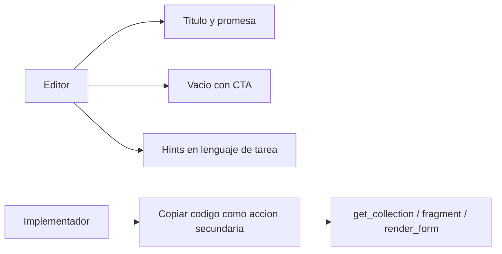

# Copy y branding de producto en el admin

> **Estado:** spec en `feat/cms-product-copy` (worktree aislado de `master` @ `d58eb62`). No shipped. No reordenar sidenav ni tours.

Hacer el admin más amigable para el **editor** sin esconder al **implementador**: voz de producto, una línea de promesa por módulo, hints bajo campos difíciles, y tokens PHP solo como acción secundaria.

PHP 7.4 + CodeIgniter 3.1. No uses PHP 8+. Lee `AGENTS.md`, `docs/DESIGN.md` y `.cursor/rules/` (incluye `worktree-preview.mdc`) antes de editar.

Este archivo es el spec. Ejecutá **Fase 0** en este worktree. Fases 1–4 pueden ser PRs siguientes en la misma rama o cortes nuevos; no mezclarlas en un solo diff gigante si el PR se vuelve inrevisable, pero el agente que toma este plan debe **completar Fase 0** y, si queda tiempo y el diff sigue claro, **Fase 1**.

---

## 0. Cómo ejecutar este worktree

- **Checkout:** `/home/gervis/.cursor/worktrees/startCodeIgniter-CSM/cms-product-copy`
- **Rama:** `feat/cms-product-copy` (parte de `master`, no del working tree sucio del principal)
- **No edites** `master` ni `/home/gervis/personal/startCodeIgniter-CSM`
- **No** `docker compose up|down|restart`. No toques `ci_php56` ni `:8081`
- Preview (solo si el usuario pide probar UI): Apache propio, puerto **8082–8099**, misma DB `start_cms_db`. Receta en `.cursor/rules/worktree-preview.mdc`
- Credenciales admin: `gerber` / `admin123`
- SCSS/JS: editar `resources/`, no `public/css/admin/*.min.css`. Si tocás SCSS: `npm run build` **en el worktree**
- No migraciones. No Cloud Agents. No `composer install` en el host

---

## 1. Qué hay hoy

El panel **ya tiene i18n** (`lang()` + `application/language/english/admin/`) y DESIGN.md pide “un idioma por pantalla”. El problema no es falta de strings: es **voz de implementador**.

- El menú nombra bien la mayoría de módulos (Pages, Forms, Collections). Las **listas no cuentan qué son**: arrancan en `page-navbar` (búsqueda) o en una tabla, sin título ni promesa.
- La ayuda que existe **filtra API**: `Argument of get_collection()`, `Internal slug used as the argument of render_form()`, `Edit schema`, `{{fragment(name)}}`.
- Quedan nombres viejos en copy (`Models`, `Add Data`, `headers includes`) y mucho hardcoded EN/ES en vistas (Files, Pages list, Menus, login).
- El admin **carga inglés fijo** (`MY_Controller`: `$this->lang->load('admin/admin', 'english')`). El ES existe pero está incompleto y no se usa. Esta entrega escribe **inglés activo + espejo ES**; no cambia el locale.

Audiencia: **híbrida** (editor publica, un dev pega embeds). Profundidad: **copy + patrón de ayuda**, no reordenar sidenav ni tours.

---

## 2. Voz (regla corta)

Escribirla en `docs/DESIGN.md` bajo **Copy de producto** para que no sea un one-off:

1. **Primero la tarea** (“Create a collection to show a team or FAQ on the site”), no la API.
2. **Términos de CMS sí** (page, draft, publish, album). **Jerga de código no** en títulos, vacíos ni labels primarios (`slug`, `schema`, `snippet`, `token`, `embed`, nombres de función).
3. **El código queda a un clic**: botón “Copy page code” + helper “For developers: `get_collection('team')`”.
4. **Un idioma por pantalla**; extraer hardcoded a `lang()`.
5. **No “corregir”** `permisions`, `categorie`, `albumes`, rutas `custommodels`, ni claves internas. Solo copy visible.

Ejemplos de reescritura (EN, locale activo):

| Clave | Hoy | Objetivo |
|---|---|---|
| `collections_empty_cta` | Create a collection to render on the site with get_collection(). | Create a collection — team, FAQ, portfolio — then add it to a page. |
| `collections_slug_help` | Argument of get_collection() | Short name used when you insert this collection on a page. Letters, numbers and underscores only. |
| `collections_edit_schema` | Edit schema | Edit fields |
| `siteforms_name_help` | Internal slug used as the argument of render_form(). | Internal name. Use it when you insert this form on a page. |
| `fragments_copy_token` | Copy token | Copy page code |
| `pages_headers_includes` | headers includes | Extra code in the page head |
| `events_slug` | Slug | URL name + hint: Shown in the event link. Keep it short. |

---

## 3. Branding de módulos (nombres, no IA)

**No renombrar el sidenav** (Fragments se queda; Collections ya reemplazó Models). Cada módulo gana un **título + lede de una línea** (beneficio, no definición técnica):

| Módulo | Lede (EN) |
|---|---|
| Pages | Write and publish the pages of your site. |
| Forms | Collect messages from visitors. |
| Fragments | Reusable pieces you can drop into any page. |
| Collections | Structured lists (team, FAQ, portfolio) shown on the site. |
| Files | Images and documents used across the site. |
| Menus | The links visitors see in navigation. |
| Categories | Group pages, events, and more. |
| Events | Dates and details that appear on the calendar. |
| Albums | Photo galleries for the public site. |
| Videos | Video pages and YouTube embeds. |
| Users | Who can sign in and what they can change. |
| Analytics | How people use your site. |
| Settings | Site name, look, SEO, and integrations. |
| Calendar | Month view of upcoming events. |

Login: “The Lightweight CMS” y labels hardcoded (`Username`, `Login`) pasan a `lang()` (`login_tagline`, etc.). Marca sigue `ADMIN_BRAND_NAME` (`application/config/constants.php`). No es un rebrand visual.

---

## 4. Patrón de UI (una sola pieza)

Nuevo include `application/views/admin/components/page_intro.blade.php`:

- `.page-intro` con `h1.page-header` + `p.page-intro__lede`
- Params: `$titleKey`, `$ledeKey` (todo por `lang()`)
- Se coloca **arriba** de `page_navbar` / `data_table` / formularios que hoy solo tienen `$h1`

Estilos mínimos en SCSS del admin (lede con `--st-text-secondary`, sin display Materialize). Documentar el patrón en DESIGN.md junto a Lista/Formulario.

Campo difícil: `span.helper-text` (ya usado en Colecciones). Vacíos: icono + título + una línea + CTA (principio 6 de DESIGN). Distinguir vacío total vs “sin resultados para X”.

Snippets/tokens: mismo patrón en Fragments, Collections y Forms — label de producto + copy + línea “For developers” con el helper entre backticks. No enseñar regex (`[a-z0-9_]+`) al editor; traducir (“letters, numbers and underscores”).

---

## 5. Dónde vive el copy

- Títulos, ledes, hints, vacíos, toasts: `application/language/english/admin/admin_lang.php` y `common_lang.php` (y espejo ES).
- Convención de claves: `{module}_lede`, `{field}_help`, `{module}_empty`, `{module}_empty_cta`. No nuevas claves `custommodels_*` para copy nuevo.
- Extraer hardcoded de: `pages_list.blade.php`, `menu_list.blade.php`, `file_explorer.blade.php`, `login.blade.php`, `navbar.blade.php`, fallbacks de `data_table_component.blade.php`.

---

## 6. Fases

### Fase 0 — Fundación (obligatoria en este worktree)

1. Voice en `docs/DESIGN.md` (sección Copy de producto) + documentar `page-intro`.
2. Crear `page_intro.blade.php` + SCSS mínimo (lede secundario).
3. Reescribir las peores claves ya existentes (Collections, Forms, Fragments) EN + espejo ES.
4. Login tagline y labels a `lang()`.
5. Linkear este spec en `docs/README.md` (sección en curso / diseño).
6. No recorrer los 14 módulos todavía. Montar `page_intro` en las listas de Collections, Fragments y Forms (las que ya tienen copy hostil) para que el patrón no quede huérfano.

### Fase 1 — Contenido (si el diff de Fase 0 queda chico, seguir)

Pages, Fragments, Collections, Forms: intro en todas las listas, hints de path/slug/insert, vacíos reales (Pages hoy dice “No pages found” hardcoded). Extraer hardcoded de `pages_list.blade.php`.

### Fase 2 — Media y agenda

Albums, Videos, Events, Files, Calendar. Files es el más sucio (UI tipo Drive toda en EN).

### Fase 3 — Sitio y equipo

Menus, Categories, Users/Groups. Intro + vacíos + headers de tabla por `lang()`.

### Fase 4 — Settings y Analytics

Ajustar ledes; logs/API pueden seguir más técnicos. Sustituir “Head code (snippet)” por “Tracking code in the page head”.

**Fuera de alcance ahora:** reagrupar sidenav, drawer/tour, activar locale ES, cambiar rutas o permisos, migraciones, “corregir” typos históricos en código.

---

## 7. Archivos a tocar (Fase 0)

| Archivo | Qué |
|---|---|
| `docs/DESIGN.md` | Sección Copy de producto + patrón page-intro |
| `docs/README.md` | Enlace a este spec |
| `application/views/admin/components/page_intro.blade.php` | Nuevo include |
| `resources/scss/admin/` (p.ej. `components/_page-intro.scss` o el partial de layout) | `.page-intro` / `__lede` |
| `application/language/english/admin/admin_lang.php` | Ledes, rewrites Collections/Fragments, login |
| `application/language/english/admin/common_lang.php` | Siteforms help, login keys si viven aquí |
| `application/language/spanish/admin/admin_lang.php` | Espejo |
| `application/language/spanish/admin/common_lang.php` | Espejo |
| `application/views/admin/login.blade.php` | `lang()` para marca/tagline/labels |
| Listas Collections / Fragments / Forms | `@include` de `page_intro` |

---

## 8. Verificación

- Si el usuario pide probar UI: preview `8082+` (no `:8081`). Login + una lista con intro (Collections) + un form con helper-text reescrito + login tagline.
- Sin browser: `curl -I` a la preview y decirlo.
- `npm run build` en el worktree si hubo SCSS.
- No commits en `master`. Commit en `feat/cms-product-copy` cuando el usuario lo pida (o un commit por fase si ya pidió entregar).

## 9. Riesgos

- DB compartida en preview: solo copy/UI, sin migraciones.
- Un intro por pantalla, no un segundo H1 Materialize.
- No editar `vendor/`, `public/vendors/`, `graphify-out/`, `public/css/admin/*.min.css` a mano.
