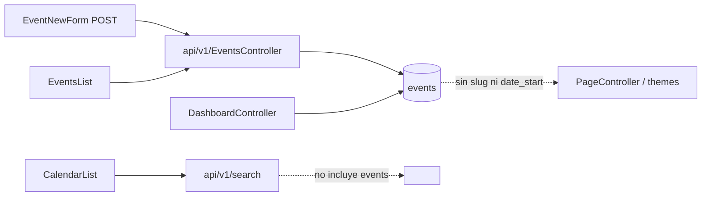
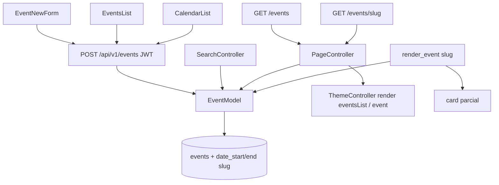

# Events core loop

> **Estado (Start CMS 3.0):** shipped en `master` (`feat: Add events core loop with dates, slug, and public listing`). Rutas públicas `/events` y `/events/{slug}`. Helper `render_event()`. No reimplementar.

Convertir el módulo Events de “página recortada” en un happening operable: **cuándo**, **dónde**, **listado público**, **ficha**, **calendario**. Sin ticketing, RSVP, recurrencia ni cobro.

PHP 7.4 + CodeIgniter 3.1. No uses PHP 8+ (`match`, union types, named arguments, nullsafe `?->`, enums). Lee `AGENTS.md`, `docs/DESIGN.md` y `.cursor/rules/` antes de editar.

Este archivo es el spec del corte. No ampliar alcance sin un corte nuevo.

---

## 1. Objetivo (job mínimo)

1. El editor carga un evento con **fecha de inicio** (y fin opcional), lugar, y lo publica.
2. El visitante ve **próximos** en `/events` y una ficha en `/events/{slug}`.
3. `admin/calendar` pinta esos eventos por `date_start`, no por `date_create`.
4. La lista admin permite filtrar upcoming / past y muestra cuándo y dónde.

Si un paso no aporta a ese loop, no va en este corte.

## 2. Fuera de alcance

- RSVP, cupo, lista de espera, tickets, pagos, mail transaccional.
- Recurrencia, timezone, ICS, speakers, agenda multi-sesión, check-in.
- Picker de embed en New Page (eso es el worktree `feat/page-embeds`). Aquí **sí** se crea el helper `render_event($slug)` para que ese otro corte lo consuma.
- Reescribir DataTable, Materialize o el file explorer.
- `docker compose`, `composer install` en el host, Cloud Agents, editar `master` o el checkout principal.
- “Corregir” typos históricos: `permisions`, `categorie`, `albumes`, `patern`.
- Editar `vendor/`, `public/vendors/`, `graphify-out/`, `public/css/admin/*.min.css`.

## 3. Cómo está hoy



| Pieza | Hecho | Problema |
|---|---|---|
| Tabla `events` | name, subtitle, content, address, visibility, mainImage, categorie_id, status, date_publish | No hay `date_start` / `date_end` / `slug`. name/subtitle `varchar(70)` (seed truncado). Sin `date_delete` pese a `$softDelete = true`. |
| API | GET/POST/DELETE autenticados | POST pisa `date_publish` y `date_create` con `now()`. PUT → 404. Archive = POST full rewrite. Sin `system_logger`. Docs copiados de Categorie. JWT obligatorio (el tema no puede leer). |
| Admin form | Clon de páginas | Datepicker es “publish date” teatro. TinyMCE `setContent` a 5s. `serverValidation` pega a `admin/users/ajax_check_field`. `getSelectedCategorie` compara `event_id`. FA en el Blade. Copy solo EN. |
| Lista | DataTable name/author/created/status | No muestra cuándo ni dónde. No upcoming/past. |
| Calendario | FullCalendar vía `search/?q=1` | No carga events. Pinta altas de páginas, menús, users… |
| Front | — | Cero rutas, cero plantillas, cero slug. |
| Permisos | — | No hay `SELECT_EVENTS` ni `$routes_permisions`. |
| Muerto | `Events.php`, `event.blade.php` | Modelo `Event`, vista `crear_evento`, columnas `ciudad`/`fecha`/`lugar`. |

Status de contenido (igual que el resto del CMS): `0` deleted · `1` published · `2` draft · `3` archived.

Contrato público (no copiar el bug de páginas): un evento sale al sitio **solo** si `status = 1` **y** `visibility = 1`.

---

## 4. Arquitectura objetivo



El front **no** usa la API REST. Igual que el blog: `PageController` carga `EventModel` y pinta Blade del tema (con fallback en `application/views/site/` porque `themes/*` está en `.gitignore`).

---

## 5. Schema + migración

Archivo: `application/database/migrations/007_events_core.sql`.

Si al mergear ya existiera un `005_*` de otra rama, renumerar al siguiente libre. No reescribir dumps de `start.sql`; **sí** actualizar el `CREATE TABLE events` canónico para installs nuevas.

```sql
ALTER TABLE `events`
  MODIFY `name` varchar(250) NOT NULL,
  MODIFY `subtitle` varchar(250) NOT NULL DEFAULT '',
  ADD `slug` varchar(191) NOT NULL DEFAULT '' AFTER `name`,
  ADD `date_start` datetime DEFAULT NULL AFTER `address`,
  ADD `date_end` datetime DEFAULT NULL AFTER `date_start`,
  ADD `all_day` tinyint(1) NOT NULL DEFAULT 0 AFTER `date_end`,
  ADD `location_type` varchar(20) NOT NULL DEFAULT 'physical' AFTER `all_day`,
  ADD `online_url` varchar(500) DEFAULT NULL AFTER `location_type`,
  ADD `date_delete` datetime DEFAULT NULL AFTER `date_update`,
  ADD UNIQUE KEY `uq_events_slug` (`slug`),
  ADD KEY `idx_events_public` (`status`, `visibility`, `date_start`);
```

Backfill del seed / filas existentes:

- `slug`: `url_title()` del `name` + `-{event_id}` si colisiona. Vacío no es válido en publicados.
- `date_start`: si se puede extraer de `date_publish` usarlo; si no, `date_create`. Nunca dejar NULL un evento `status = 1`.
- `location_type`: `'physical'` si `address` no vacío, si no `'physical'` igual (default).
- Permisos (tabla `permisions`, typo histórico):

| permision_name | Descripción | grupo |
|---|---|---|
| `CREATE_EVENT` | Add event | events |
| `UPDATE_EVENT` | Update event | events |
| `DELETE_EVENT` | Delete event | events |
| `SELECT_EVENTS` | View events | events |

Insertar filas en `usergroup_permisions` para el grupo admin (el mismo `usergroup_id` que ya tiene `SELECT_PAGES`). No inventar IDs: `SELECT MAX()` + 1 o insertar sin fijar PK si es AUTO_INCREMENT.

Aplicar a mano contra MySQL de esta máquina (CI3 migrations no es el flujo). Ejemplo:

```bash
docker exec -i ci_php56 mysql -h host.docker.internal -u ... -p... < application/database/migrations/007_events_core.sql
```

Usar credenciales de `.env`. No commitear `.env`.

`location_type` permitido: `physical` | `online` | `hybrid`. Validar en API. No enum PHP.

---

## 6. Modelo

`application/models/Admin/EventModel.php`:

- `$searchable = array('name', 'subtitle', 'address', 'slug');`
- Métodos (nombres explícitos, SQL crudo OK si `all()` no alcanza):
  - `upcoming($limit = null)` — `status = 1`, `visibility = 1`, `date_start >= NOW()`, order `date_start ASC`.
  - `past($limit = null)` — publicados visibles con `date_end < NOW()` o (`date_end` NULL y `date_start < NOW()`).
  - `find_by_slug($slug)` — publicado + visible; 404 si no.
  - `ensure_slug($name, $event_id = null)` — slug único ASCII.
- `filter_results` / `loadRelations` se quedan (user + file).
- `get_all()` se queda para el admin (sin filtrar status).
- No `$hasData`. No columnas extra “por si acaso”.

---

## 7. API admin (`api/v1/EventsController`)

Auth: `verify_request()` se mantiene. El sitio público **no** pasa por aquí.

Permisos (mismo patrón que `PagesController::require_page_permision`):

- GET → `SELECT_EVENTS`
- POST alta → `CREATE_EVENT`; POST update (`event_id` presente) → `UPDATE_EVENT`
- DELETE → `DELETE_EVENT`
- `status_post` → `UPDATE_EVENT`

Cambios concretos:

1. **Dejar de pisar timestamps.** En update: no tocar `date_create`. `date_publish`: si el POST trae `date_publish` no vacío, persistirlo; si viene vacío y el registro no tenía, usar `now()` al pasar a `status = 1`. Nunca `date_publish = date(...)` incondicional.
2. **Campos nuevos** en POST: `slug`, `date_start`, `date_end`, `all_day`, `location_type`, `online_url`.
3. **Validación** (`FormValidator`):
   - `name` required, min 1.
   - `content` required al publicar (`status = 1`); en borrador puede ser el propio name como hoy.
   - `date_start` required si `status = 1`.
   - `date_end` opcional; si viene, `>= date_start`.
   - `location_type` in_list `physical,online,hybrid`.
   - `online_url` required_si `online` o `hybrid` (validar URL laxa: `valid_url` o `prep_url`).
   - `slug` opcional; si vacío, generarlo del name.
4. **GET lista:** query params `status`, `when=upcoming|past|all` (default `all` en admin). Orden default `date_start DESC` (nulls last si MySQL 5.7: `ORDER BY date_start IS NULL, date_start DESC`).
5. **Nuevo** `status_post($event_id)`: body `{ status: 3 }` (o 1/2). Solo cambia status. **EventsList.archiveItem debe usar esto**, no reenviar todo el row.
6. **PUT:** implementar como alias del POST update **o** dejar 404 y documentar que el cliente usa POST. Preferir alias delgado para no mentir.
7. Tras mutar: `system_logger('events', $event->event_id, 'created'|'updated'|'deleted'|'archived', '...')`.
8. Borrar el bloque `@api` de Categorie o reescribirlo para Events (campos reales).
9. Respuestas: `response_ok` / `response_error`; Vue espera `code == 200` y `data`.

No crear `/api/v1/public/events`. El front usa el modelo.

---

## 8. Admin HTML

### 8.1 Controller

`application/controllers/admin/EventsController.php`:

- Añadir `$routes_permisions` + `$this->check_permisions()` en el constructor.
- `patern` (typo histórico) para `admin/events`, `admin/events/add`, `admin/events/edit/(:num)`.
- Permisos: index `SELECT_EVENTS`, agregar `CREATE_EVENT`, editar `UPDATE_EVENT`.
- Eliminar `application/controllers/admin/Events.php` (muerto; `Event` / `crear_evento` no existen).
- Eliminar `application/views/admin/events/event.blade.php` (schema viejo).

Registrar JS en `MY_Controller::getAutoFooterIncludes()` si el mapa vista → archivo existe; si las vistas ya cargan los scripts en `@section('footer_includes')`, no duplicar.

### 8.2 Lista

`resources/components/EventsList.js` + `events_list.blade.php`:

Columnas: Name, Start (`date_start`), Address, Status, Options. Labels vía `lang()`.

- Handler de fecha: formatear `Y-m-d H:i` (o solo fecha si `all_day`).
- Filtro `when` (upcoming / past / all) como query al endpoint, no filtro solo client-side.
- `archiveItem` → `POST api/v1/events/status/{id}` con `{status: 3}`.
- Empty state con CTA “New event” (patrón listas en DESIGN.md).
- Icono sidenav ya es `event`; en dashboard cambiar `assistant` → `event` (`dashboard.blade.php`).

### 8.3 Formulario

`create_event.blade.php` + `EventNewForm.js`:

**Evento (bloque nuevo, arriba o junto a datos básicos):**

- `date_start` + hora (datepicker `yyyy-mm-dd` + timepicker 24h). Si `all_day`, ocultar horas y guardar `00:00:00` / fin `23:59:59` o `date_end` fecha sin hora.
- `date_end` opcional.
- Checkbox `all_day`.
- `location_type` select: Physical / Online / Hybrid (`lang()`).
- `address` visible si physical o hybrid.
- `online_url` visible si online o hybrid.
- `slug` input (auto desde name en alta; editable en edición).

**CMS publish (bloque existente, corregido):**

- “Publish immediately” vs fecha de **publicación en el CMS** (`date_publish`). Debe persistir. No confundir copy con la fecha del evento (`events_start` vs `events_publish_date`).

**Limpieza del form (obligatoria, está en el camino):**

- Quitar Font Awesome del Blade (`DESIGN.md`: un icon set, Material Icons).
- TinyMCE: `setContent` en `init_instance_callback` / cuando el editor exista, **no** `setTimeout(5000)`.
- Quitar `serverValidation` → `admin/users/ajax_check_field`.
- Quitar `console.log` de `validateForm`.
- Quitar `categories: []` duplicado.
- `getSelectedCategorie`: comparar `categorie_id`, o borrar el método si no se usa.
- `status` / `visibility` se quedan; copy propio (`events_not_published`), no reutilizar `categories_*` para switches.
- Sidebar meta: mostrar `date_start` / `date_end`, no solo timestamps CMS.
- `getData()` debe enviar los campos nuevos. `btnEnable` puede seguir con `name`; `validateForm` exige `date_start` al publicar.

SCSS: no `<style>` en Blade. Si hace falta espacio, clase en `resources/scss/admin/` y `npm run build`.

---

## 9. Calendario y search

`application/controllers/api/v1/SearchController.php`:

- Añadir `'events' => array()` a `empty_payload()`.
- En `index_get`, `EventModel->search($str_term)` (y si `q=1` como hace CalendarList, devolver todos los no deleted, igual que el resto).

`resources/components/CalendarList.js` + `calendar.blade.php`:

- Checkbox filtro Events (default **on**).
- Mapear `date_start` → `start`, `date_end` o `date_start` → `end`.
- Color distinto (token teal / `--st-interactive`, no un hex suelto si se puede pasar el color FullCalendar; si FullCalendar exige hex, usar `#26A69A` y dejar un comentario de token).
- `url`: `admin/events/edit/{event_id}`.
- Título: `name` (sin emoji; el calendario actual usa emoji en otras fuentes — **no añadir** más; en events usar el nombre plano).
- No pintar events por `date_create`.

No “arreglar” el resto de fuentes del calendario (páginas/menús/users) en este corte.

---

## 10. Front público

### 10.1 Rutas (`application/config/routes.php`)

Colocar **antes** del catch-all de páginas:

```php
$route['events'] = 'PageController/events_list';
$route['events/(:any)'] = 'PageController/get_event/$1';
```

Sin alias `/eventos` en este corte (un path canónico, como `/blog`).

### 10.2 PageController

Extiende `Base_Controller`. Añadir:

- `events_list()` — `upcoming()` + bloque past opcional (pasados al final o query `?when=past`). `template = 'eventsList'`. Meta title `SITE_TITLE - Events`.
- `get_event()` — slug = último segmento. `find_by_slug`. 404 vía `error404()` si no. `template = 'event'`.

Inyectar `mainImage` resuelto (ya hay computed / `loadRelations`).

Métodos en `ThemeController_Base`: `events_list($data)` y `event_detail($data)` que deleguen a `render($data)` (igual que `blog_list` / `blog_post`).

### 10.3 Plantillas (tema gitignored)

`themes/*` no se commitea. Hay que hacer **las dos** cosas:

1. **Fallback trackeado** en `application/views/site/eventsList.blade.php` y `application/views/site/event.blade.php`.
2. **Override local** en el tema activo (copia de `setup-worktree-unix.sh`, p.ej. `themes/awesomeTheme/views/site/…`) para que `http://localhost:8081/events` se vea con el layout del sitio.

`ThemeController_Base::render`: si `getThemePath()` está set pero **no existe** `views/site/{template}.blade.php` en el tema, no fallar: pintar el fallback de `APPPATH/views`. Implementar un check `file_exists` y `changePath(APPPATH)` en ese caso. Eso desbloquea el PR sin pelear con `.gitignore`.

Contenido mínimo de las vistas (HTML semántico, sin Materialize admin):

- List: título, fecha, lugar o “Online”, enlace a la ficha. Empty: “No upcoming events”.
- Detail: h1 name, subtitle, fecha(s), address / link online, imagen, `{!! $event->content !!}`.
- Extender el layout del tema si el fallback puede `@extends` algo de `application/views`; si no hay layout de sitio en APPPATH, página completa mínima (doctype, title, main) — fea pero funcional. El override del tema debe `@extends` el layout del tema (`site.layouts.…` o el que use `blogList`).

Copiar estructura de `blogList` / post del tema activo.

### 10.4 Helper `render_event`

En `application/helpers/general_helper.php`:

```php
function render_event($slug)
```

Lookup por slug, solo publicado+visible. Devuelve HTML de una card (vista `site.templates.event_card` con el mismo fallback tema vs APPPATH). Si no existe, string vacío. Esto es el contrato para `feat/page-embeds`; no implementar el picker del editor aquí.

---

## 11. Permisos admin + i18n

`$routes_permisions` como en §8.1.

Strings: `application/language/english/admin/admin_lang.php` **y** `spanish/admin/admin_lang.php`. Hoy ES solo tiene `menu_events`. Añadir todas las claves `events_*` usadas en Blade/JS (name, subtitle, start, end, all_day, location, online_url, slug, upcoming, past, publish_immediately, not_found, etc.). Un idioma por pantalla (`DESIGN.md`). Lista admin: no dejar “Name/Author/Created” hardcodeados.

Toasts: `lang('toast_saved')` / `toast_done` existentes.

Dashboard KPI “Events”: `lang()`, no “Events” pegado.

---

## 12. Orden de implementación

Hacerlo en este orden (cada paso deja el anterior usable):

1. Migración + `start.sql` CREATE + backfill + permisos.
2. EventModel (slug, upcoming/past, find_by_slug).
3. API (timestamps, campos, status_post, logger, permisos, docs).
4. Form + lista admin + borrar muertos + i18n + icono dashboard.
5. Search + CalendarList.
6. PageController + ThemeController fallback + vistas + rutas.
7. `render_event`.
8. Verificar UI (§14).

No abrir el front antes de que `date_start` y `slug` existan y se persistan.

---

## 13. Archivos a tocar (lista cerrada)

| Archivo | Cambio |
|---|---|
| `application/database/migrations/007_events_core.sql` | **Nuevo** |
| `application/database/start.sql` | Solo `CREATE TABLE events` + INSERTs de `permisions` / `usergroup_permisions` (no reformatear dumps) |
| `application/models/Admin/EventModel.php` | Métodos + searchable |
| `application/controllers/api/v1/EventsController.php` | Persistencia, status_post, ACL, logger |
| `application/controllers/api/v1/SearchController.php` | Payload events |
| `application/controllers/admin/EventsController.php` | `$routes_permisions` |
| `application/controllers/admin/Events.php` | **Borrar** |
| `application/views/admin/events/event.blade.php` | **Borrar** |
| `application/views/admin/events/create_event.blade.php` | Fechas de evento, location, slug, sin FA |
| `application/views/admin/events/events_list.blade.php` | Si hace falta markup de filtros |
| `resources/components/EventNewForm.js` | getData + load + validación |
| `resources/components/EventsList.js` | columnas, when, archive |
| `resources/components/CalendarList.js` | fuente events |
| `application/views/admin/calendar/calendar.blade.php` | checkbox Events |
| `application/config/routes.php` | `/events`, `/events/(:any)` |
| `application/controllers/PageController.php` | list + detail |
| `application/libraries/ThemeController_Base.php` | methods + fallback view path |
| `application/views/site/eventsList.blade.php` | **Nuevo** fallback |
| `application/views/site/event.blade.php` | **Nuevo** fallback |
| `application/views/site/templates/event_card.blade.php` | **Nuevo** para helper |
| `application/helpers/general_helper.php` | `render_event` |
| `application/core/MY_Controller.php` | footer map si aplica |
| `application/views/admin/dashboard.blade.php` | icono `event` |
| `application/language/english/admin/admin_lang.php` | claves |
| `application/language/spanish/admin/admin_lang.php` | claves |
| `themes/{active}/views/site/eventsList.blade.php` | Override local (no git) |
| `themes/{active}/views/site/event.blade.php` | Override local (no git) |

No tocar `public/js/` a mano: `npm run build` copia desde `resources/` si el proyecto lo espera; las vistas admin cargan `resources/components/*.js` directo.

---

## 14. Verificación

Stack: `http://localhost:8081`. Login `gerber` / `admin123`. No levantar Docker desde este worktree.

Tras cambios PHP, el contenedor `ci_php56` sirve el **checkout principal**. Para ver este worktree en 8081 hay que `/apply-worktree` o merge. Mientras tanto:

- Aplicar SQL a la DB compartida (cuidado: altera la DB del principal).
- Probar API con curl + cookie/JWT de sesión contra 8081 **solo después** de apply, **o** montar mentalmente que no se puede verificar el front hasta apply. Si no puedes apply, deja el código listo y documenta qué no corriste.

Cuando el código esté servido:

1. **Migración:** `SHOW COLUMNS FROM events` tiene `slug`, `date_start`, `date_end`. Seed event tiene slug y date_start.
2. **Alta admin:** crear evento futuro (nombre largo > 70 chars), imagen, address, publicar. Recargar edición: fechas y slug siguen ahí. `date_create` no cambia al guardar otra vez.
3. **Programar publish:** desmarcar “immediately”, poner `date_publish` mañana, guardar, recargar: no es `now()`.
4. **Borrador:** sin `date_start` permitido; al publicar, 400 si falta.
5. **Lista:** columnas start + address; filtro upcoming oculta el pasado.
6. **Archivar:** menú → archive; status 3; content/imagen intactos.
7. **Permisos:** un usergroup sin `SELECT_EVENTS` no entra a `/admin/events`.
8. **Calendario:** el evento aparece el día de `date_start`; click → edit. Filtro Events off lo quita.
9. **Front:** `/events` lista el publicado visible. `/events/{slug}` ficha. Draft o `visibility=0` → 404. Online muestra URL.
10. **i18n:** admin en ES muestra strings de events, no claves crudas ni mix EN/ES.
11. **Muertos:** no queda ruta que cargue `Events.php` ni `event.blade.php`.
12. **Helper:** `{{render_event(slug)}}` en una página (a mano en content, si el expander actual solo hace un token) o `echo render_event('slug')` en una vista de prueba.

Si no hay browser tools, curl de `/events` y `/api/v1/events` + captura de HTML. Decir qué no se pudo clicar.

---

## 15. Criterio de hecho

Este corte está hecho cuando:

- Un happening tiene `date_start` persistido y un `slug` único.
- `/events` y `/events/{slug}` responden 200 para publicados visibles.
- El calendario admin muestra ese happening en la fecha correcta.
- Archivar no pisa el contenido.
- No hay RSVP, tickets, ni “mejoras” de páginas/dashboard ajenas.

---

## Prompt para el agente ejecutor

El usuario puede pegar esto en un chat nuevo **ya abierto en este worktree** (`feat/events-core`):

```
Implementa docs/EVENTS_CORE_PLAN.md en este worktree. Lee el archivo entero y AGENTS.md antes de tocar código.

Stack: PHP 7.4 + CodeIgniter 3.1. Sin sintaxis PHP 8+. No docker compose, no composer install en el host, no Cloud Agents. El stack Docker es el del checkout principal (ci_php56, puerto 8081).

Haz el core loop de Events: date_start/date_end, slug, persistir date_publish, API sin pisar date_create, status_post para archivar, lista/form admin, permisos SELECT/CREATE/UPDATE/DELETE_EVENT, i18n EN+ES, calendario admin, /events + /events/{slug} con fallback de vistas en application/views/site, helper render_event. Borra Events.php y event.blade.php.

No implementes RSVP, tickets, recurrencia, ICS, ni el picker de embeds de New Page.

Aplica la migración 007_events_core.sql a mano contra MySQL. Verifica el flujo en http://localhost:8081 si este código está servido (apply-worktree / merge); si no, deja el código listo y di qué no corriste. Un idioma por pantalla, lang(), DESIGN.md para UI admin.
```
