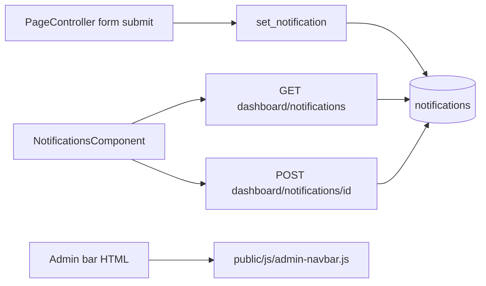
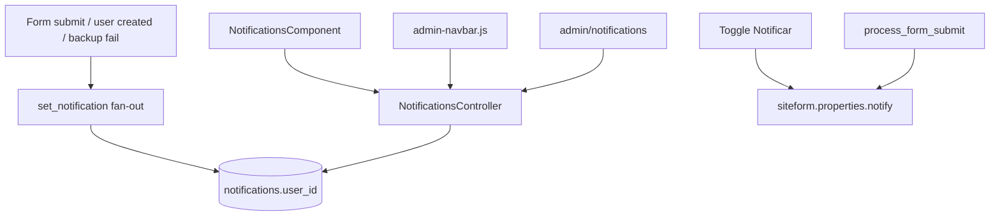

# Inbox de notificaciones integrado al CMS

Arreglar el inbox roto (API, Vue, form_submit, admin bar) y convertirlo en un sistema por usuario: API propia, página “Ver todas”, marcar leído sin borrar, polling ligero, y emisores reales del CMS (formularios, usuarios, backups).

**Rama:** `feat/notifications-inbox`  
**Worktree:** `/home/gervis/.cursor/worktrees/startCodeIgniter-CSM/notifications-inbox`  
**Checkout principal:** `/home/gervis/personal/startCodeIgniter-CSM` (Docker `ci_php56`, puerto 8081)

PHP 7.4 + CodeIgniter 3.1. No uses PHP 8+ (`match`, union types, named arguments, nullsafe `?->`, enums). Lee `AGENTS.md` y `.cursor/rules/` antes de editar.

## Alcance (acordado)

Inbox usable + API propia + campana en admin bar del sitio + página “Ver todas” + marcar leído sin borrar + polling ligero + emitir desde eventos reales del CMS. **No** notificar CRUD diario de páginas, notas o vídeos.

## Cómo está hoy



- Productor único: `application/controllers/PageController.php` (`process_form_submit`).
- Lectura/archivo: `application/controllers/api/v1/DashboardController.php` (`notifications_get` / `notifications_post`).
- UI admin: `application/views/admin/shared/navbar.blade.php` + `resources/components/NotificationsComponent.js`.
- Admin bar del sitio: `application/views/shared/admin_navbar.blade.php` carga `public/js/admin-navbar.js` (existe en `public/js/`, **no** hay fuente en `resources/js/`). Campana, badge, “Ver todas” y toggle “Notificar” están a medias: `loadNotifications()` es placeholder; el toggle no persiste.

## Bugs a corregir (prioridad)

1. **Inbox compartido.** `set_notification` no setea `user_id`. El GET lista todo `status = 1`. Si un admin marca leído, el resto pierde la alerta. Semántica: **una fila por destinatario** (fan-out a usuarios `status = 1`).
2. **`notifications_post` siempre “encuentra”.** `new NotificationsModel()` es truthy; `find()` se ignora. Si el id no existe, `save()` **inserta** una fila vacía con `status = 2`.
3. **GET vacío = `data: false`.** `MY_Model::where()` devuelve `false`. Vue asigna eso a `notifications` y el `v-for` / `.length` se rompe. Debe ser `[]`.
4. **Form submit pierde el nombre.** En `process_form_submit` se hace `unset($_POST['form_reference'])` **antes** de `set_notification(..., $this->input->post('form_reference'), ...)`. El texto queda sin formulario.
5. **Click = navegar + archivar a la vez.** `@click="setArchive"` en el `<a href>`: el POST no termina y no se distingue “abrir” vs “marcar leída”.
6. **`setArchive` catch usa `self` sin definir.**
7. **Dropdown Materialize.** `M.AutoInit` está comentado; este Vue **no** llama `initPlugins()`. La campana depende de que otra isla Vue inicialice todos los `.dropdown-trigger`. Init local del trigger + `constrainWidth: false`, después de pintar la lista.
8. **N+1 inútil.** `NotificationsModel::filter_results` carga un `UserModel` por fila; la UI no muestra usuario.
9. **Orden y tope.** `where()` ordena por PK ASC (viejas primero), sin límite. El dropdown debe ser `date_create DESC` y tope (~20).
10. **Admin bar incompleta.** Toggle “Notificar” no existe en `siteform.properties`. “Ver todas” apunta a `/admin` en vez de `/admin/notifications`.
11. **Copy hardcodeado** (EN/ES mezclado) y `console.log`. Usar `lang()`.
12. **`date_delete NOT NULL DEFAULT CURRENT_TIMESTAMP`** en `application/database/start.sql`. No rompe el GET actual (filtra `status`), pero es inconsistente con soft delete. Migración: `DEFAULT NULL`.

Status de notificaciones (excepción documentada, no es contenido): `0` borrada · `1` no leída · `2` leída. Marcar leída **no** borra; el dropdown solo muestra `1`; la página “Ver todas” muestra `1` y `2`.

## Arquitectura objetivo



Helper en `application/helpers/general_helper.php`:

```php
function set_notification($title, $description, $type = 'info', $url = null, $user_ids = null)
```

Si `$user_ids` es `null`, insertar una fila por cada usuario activo. URL relativa **sin** slash inicial (`admin/siteforms/submit/`) para que el mixin `base_url()` no duplique.

No emitir en CRUD diario (páginas, notas, vídeos). Solo eventos que un admin **no** acaba de hacer él mismo.

## Implementación

### 1. Modelo + helper + migración

- `application/models/Admin/NotificationsModel.php`: quitar N+1; método `inbox($userId, $status, $limit)` con `(user_id = $userId)` y `status != 0`.
- Ampliar `set_notification` con fan-out.
- Migración `application/database/migrations/005_notifications_inbox.sql`: `date_delete` nullable + índice `(user_id, status, date_create)`.
- En `start.sql`, ajustar solo el `CREATE TABLE notifications` (no reescribir dumps). Aplicar la migración a mano contra MySQL de esta máquina (CI3 migrations no es el flujo principal).

### 2. API propia

Nuevo `application/controllers/api/v1/NotificationsController.php` + rutas en `application/config/routes.php`:

- `GET /api/v1/notifications` — inbox del usuario (`?status=1|2|all`, default `1`). Siempre `data: []`.
- `GET /api/v1/notifications/count` — `{ unread: N }`.
- `POST /api/v1/notifications/read/{id}` — `status = 2` solo si es del usuario.
- `POST /api/v1/notifications/read-all`.

Auth: `verify_request()` como el resto. Dejar los métodos de `DashboardController` como alias delgados al mismo modelo (o redirigir internamente) para no romper clientes viejos.

### 3. Campana del admin

`resources/components/NotificationsComponent.js` + `application/views/admin/shared/navbar.blade.php`:

- `$.ajax` + `response.code == 200` + array.
- Click ítem: marcar leída, luego `window.location`. Check: solo marcar, `@click.stop`.
- Init Materialize del trigger en `mounted` / tras fetch.
- Polling 45s (pausar con `document.hidden`).
- `aria-label`, empty state y toasts vía `lang()`.
- Link “Ver todas” → `/admin/notifications`.

### 4. Página “Ver todas”

Vertical corta al estilo notas/páginas:

- Admin: `application/controllers/admin/NotificationsController.php` (inbox personal: no hace falta permiso extra, como el menú de usuario).
- Vista `application/views/admin/notifications/list.blade.php` + `resources/components/NotificationsLists.js`.
- Filtros no leídas / leídas / todas, marcar todas, empty state. Sin FAB.
- Rutas `admin/notifications`.
- Strings EN + ES en `application/language/english/admin/common_lang.php` y `spanish`.
- No añadir sección pesada al sidenav; entrada desde la campana. Opcional: hoja bajo Dashboard si queda limpio.

### 5. Admin bar del sitio

Crear `resources/js/admin-navbar.js` (fuente). Portar/mejorar lo que ya hay en `public/js/admin-navbar.js`. `npm run build` / `npm run copy-js` copia a `public/js/`.

- `scmsAdminBar.loadNotifications()` contra la misma API; pintar lista + badge.
- Implementar también los `onclick` ya referenciados (`copyPageUrl`, `duplicatePage`, `archivePage`, `exportFormData`) de forma mínima para no dejar la barra más rota.
- Toggle **Notificar**: persistir `notify` en `siteform.properties` (JSON existente). Endpoint corto en `application/controllers/api/v1/SiteformsController.php` o update del form. Default `true`.
- “Ver todas” → `admin/notifications`.

### 6. Emisores CMS

| Evento | Dónde | Condición |
|---|---|---|
| Envío de formulario | `PageController::process_form_submit` | `properties.notify !== false`; capturar `form_reference` **antes** del unset; título/desc con `lang()` |
| Usuario creado | `UsersController::index_post` (solo alta, no update) | Fan-out a los demás admins, no al creador |
| Backup fallido | `Cron` + `ConfigController` backup | Error de escritura/excepción |

No notificar backup OK en cron (spam). No notificar edición de páginas/notas.

## Convenciones que no “corregir”

`permisions`, `categorie`, `albumes`, `fragmentos`, `patern`. No editar `vendor/`, `public/vendors/`, `graphify-out/`. No “arreglar” CSS minificado: SCSS en `resources/scss/admin/`. JS admin: `resources/` (no `public/js/` salvo la copia de build).

## Qué no hacer

- No `docker compose up` / `down` / `restart` en este worktree.
- No `composer install` en el host.
- No Cloud Agents, `/in-cloud`, ni `/best-of-n`.
- No commitear `.env`.
- No editar `master` ni el checkout principal.

## Verificación

Stack del checkout principal: `http://localhost:8081`. Login `gerber` / `admin123`.

- Enviar un siteform público → campana admin + admin bar incrementan; el texto incluye el form; cada admin ve su copia.
- Marcar leída: desaparece del dropdown, sigue en “Ver todas”.
- “Marcar todas” y polling (nueva fila aparece sin recargar).
- Toggle Notificar off → el siguiente submit no crea filas.
- Usuario nuevo → otros admins reciben aviso; el que lo creó no.
- Backup fail (o simular write error) → tipo `system_error`.
- Tras cambiar JS de `resources/js/`: `npm run build` (o `copy-js`).

## Checklist

- [ ] Fan-out en `set_notification`, `inbox()` en el modelo, migración `date_delete` + índice
- [ ] `NotificationsController` REST (list/count/read/read-all) + alias dashboard
- [ ] Campana Vue: ajax, dropdown, mark-read vs navigate, polling, i18n
- [ ] Página `admin/notifications`
- [ ] `resources/js/admin-navbar.js`: campana, badge, toggle notify
- [ ] Emisores: form_submit, user created, backup fail
- [ ] Verificar UI en `http://localhost:8081`
