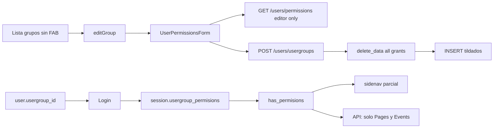
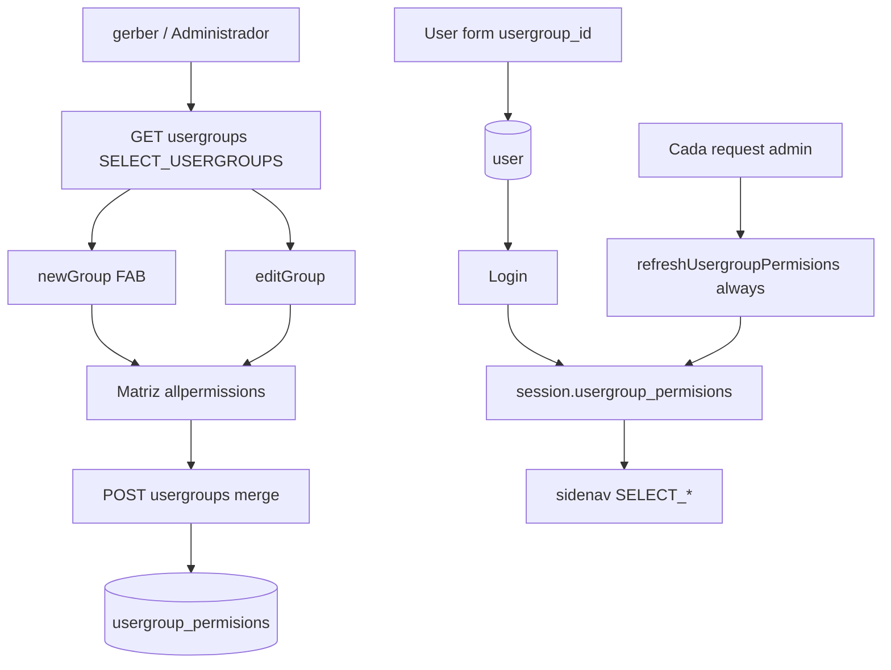

# Usergroups access (fase UX)

> **Estado:** spec para implementar en el worktree `feat/usergroups-access`. No está en `master`. Un agente debe ejecutar este archivo de punta a punta.

PHP 7.4 + CodeIgniter 3.1. No uses PHP 8+ (`match`, union types, named arguments, nullsafe `?->`, enums). Lee `AGENTS.md`, `docs/DESIGN.md` y `.cursor/rules/` antes de editar.

Este archivo es el spec del corte. No ampliar alcance sin un corte nuevo.

**Decisiones ya tomadas (no reabrir):**

- Acceso **solo por grupo**. Un usuario = un `usergroup_id`. Sin tabla de overrides por usuario.
- Esta entrega es **UX de administración** + menús que se ocultan. No endurecer las APIs de contenido (Pages/Events ya chequean; el resto no se toca).
- No “corregir” typos históricos: `permisions`, `categorie`, `albumes`, `fragmentos`, `patern`.

---

## 0. Prompt para el agente ejecutor

Pegá esto en un chat **nuevo, ya abierto en este worktree** (`feat/usergroups-access`):

```
Implementa docs/USERGROUPS_ACCESS_PLAN.md en este worktree. Lee el archivo entero, AGENTS.md y docs/DESIGN.md antes de tocar código.

Stack: PHP 7.4 + CodeIgniter 3.1. Sin sintaxis PHP 8+. No docker compose, no composer install en el host, no Cloud Agents, no editar master ni el checkout principal. No verificar en :8081 (ahí corre otro árbol). Preview: .cursor/rules/worktree-preview.mdc (docker run, puerto 8082–8099, misma start_cms_db).

Objetivo: que un administrador cree/edite/borre grupos, asigne permisos por módulo en una matriz, y al destildar SELECT_* el módulo desaparezca del sidenav sin re-login.

Aplicá application/database/migrations/009_usergroups_access.sql a mano contra MySQL (credenciales del .env). No reformatees dumps de start.sql.

No implementes enforcement de API en Pages/Menus/Files/Config/etc. No inventes CREATE_GALLERY ni permisos por usuario. No renombres permisions/patern.
```

---

## 1. Objetivo (job mínimo)

Un administrador (grupos seed `root` id 1 y `Administrador` id 2) puede:

1. Crear, editar y borrar grupos (nunca borrar `usergroup_id = 1`; nunca borrar un grupo que todavía tiene usuarios).
2. Ver una **matriz de permisos agrupada por `permisions.module`**, con el `label` visible (no la clave cruda), y guardar **sin perder** permisos que el editor no puede cambiar.
3. Seguir asignando usuarios a un grupo (el select “User type” en el form de usuario **se queda**; no rehacer Users).
4. Al destildar el `SELECT_*` de un módulo, **ese ítem desaparece del sidenav** (y vuelve al tildarlo) **sin cerrar sesión**.

Si un paso no aporta a ese loop, no va en este corte.

---

## 2. Fuera de alcance

- Overrides por usuario (`user_permisions` o similar).
- `has_permisions` en APIs de Menus, Files, Users (CRUD de usuarios), Config, Siteforms, Categories, Fragments, Gallery, Videos, Collections. **Excepción:** los endpoints `api/v1/users/usergroups*` y `allpermissions` **sí** se gatean (son el feature).
- Arreglar `$routes_permisions` de Pages/Categories/Menus/Configuration (patrones ES vs URLs EN). Solo se anclan los patrones de **UsersController** admin, porque si no el gate de grupos no funciona (§8.1).
- `Setup_backup_config` sin `MY_Controller`.
- Convertir `shared_user_group_id` de files en ACL.
- CRUD nuevo `CREATE_GALLERY` / `UPDATE_VIDEO` / etc. Solo `SELECT_*` para módulos hoy sueltos.
- Jerarquía real por `usergroup.level` en el listado de **usuarios** (`UserModel` compara `usergroup_id` numérico). No tocar ese filtro en este corte.
- Página huérfana `UsersController::permissions` + `PermissionsDataComponent.js` (catálogo CRUD). No borrar ni “arreglar”; no linkearla.
- Ghost `CREATE_BLOG` / `UPDATE_BLOG` en Cache y navbar. No crear esas claves. Navbar: solo cambiar `SELECT_MENU` → `SELECT_MENUS`.
- Cloud Agents, `/in-cloud`, `/best-of-n`, `docker compose up|down|restart`, `composer install` en el host.

---

## 3. Cómo está hoy



| Pieza | Hecho | Problema |
|---|---|---|
| Tablas | `permisions`, `usergroup`, `usergroup_permisions` | `user_id`/`parent_id` son `tinyint` (máx. 127). Sin unique `(usergroup_id, permision_id)`. |
| Grupos seed | root 1, Administrador 2, Estandar 3, Publisher 4, Editor 5 | `parent_id = 1` en todos. Publisher y Administrador comparten `level = 2`. |
| Lista grupos | GET `api/v1/users/usergroups` | Sin FAB. Delete llama `deletePage()` (undefined) y hay un `deleteConfiguration` que pega a `/api/v1/configuration/`. Empty: `<h4>` solo. Copy hardcodeado. |
| Alta grupo | `UsersController::newGroup($id)` | Exige un grupo existente, pone `usergroup_id = null`. No hay link. |
| Form permisos | Checkboxes + “All CREATE/UPDATE/…” | Carga `permissions_get` (solo grants del **editor**). Labels = `permision_name`. Mix ES/EN. |
| Save | POST `usergroups_post` | Wipe total + insert. Pisa `parent_id`/`user_id`/`date_create` en cada edit. |
| Listar grupos API | root o `level == 1` → `all()` | Cualquier otro: `parent_id = mi usergroup_id` → Administrador (id 2) **lista vacía**. |
| Sesión | Login guarda names; `has_permisions` es `in_array` | `UsergroupModel::get_permisions` mergea `CREATE/UPDATE/DELETE/SELECT` genéricos. `refreshUsergroupPermisions` sale temprano si ya hay `SELECT_SITEFORMS`. |
| API users | `verify_request()` | Cualquier logueado muta grupos. |
| Sidenav | Algunos `SELECT_*` | Ungated: Groups, Calendar, Fragments, Gallery, Videos, Events, header Users, header Categories, header Collections. |
| Catálogo | ~47 claves seed + migraciones 003/008 | Sin SELECT de fragments/gallery/videos/calendar. Sin permisos de gestionar grupos. `PUBLISH_FORM_CUSTOM` (id 32) nunca se asignó. Ghosts UI: `SELECT_MENU`, `SELECT_GALLERY`, `CREATE_BLOG`. |

Status de contenido (grupos usan el mismo entero): `0` deleted · `1` activo/publicado · `2` borrador/inactivo. El form actual manda `status ? 1 : 2`.

---

## 4. Arquitectura objetivo



Contrato: el menú refleja la sesión; la sesión se recarga **en cada request** admin desde la DB. Así el admin que se edita su propio grupo (o prueba con otro user del mismo grupo) ve el sidenav al refrescar la página, sin logout.

---

## 5. Schema + migración

Archivo **nuevo:** `application/database/migrations/009_usergroups_access.sql`.

Si al mergear ya existiera un `009_*` de otra rama, renumerar al siguiente libre. No reescribir dumps de `start.sql`; **sí** añadir INSERTs de `permisions` / `usergroup_permisions` y el `MODIFY` de columnas en el `CREATE TABLE usergroup` canónico (cambiar `tinyint` → `int` en `user_id` y `parent_id`).

### 5.1 ALTER

```sql
ALTER TABLE `usergroup`
  MODIFY `user_id` int(11) NOT NULL DEFAULT 0,
  MODIFY `parent_id` int(11) NOT NULL DEFAULT 0;

-- Dedupe por si acaso, luego unique
ALTER TABLE `usergroup_permisions`
  ADD UNIQUE KEY `uq_usergroup_permision` (`usergroup_id`, `permision_id`);
```

Si el unique falla por duplicados, borrar duplicados dejando el `usergroup_permisions_id` mínimo por par `(usergroup_id, permision_id)` y reintentar. No dejar la migración a medias.

### 5.2 Nuevas claves

Idempotente, **mismo patrón** que `008_siteforms_permissions.sql` (`INSERT … SELECT … WHERE NOT EXISTS`). No inventar PKs en la migración.

| permision_name | label | module |
|---|---|---|
| `SELECT_USERGROUPS` | View groups | `users` |
| `CREATE_USERGROUP` | Add group | `users` |
| `UPDATE_USERGROUP` | Update group | `users` |
| `DELETE_USERGROUP` | Delete group | `users` |
| `SELECT_FRAGMENTS` | View fragments | `fragments` |
| `SELECT_GALLERY` | View gallery | `gallery` |
| `SELECT_VIDEOS` | View videos | `videos` |
| `SELECT_CALENDAR` | View calendar | `calendar` |

Asignar **todas** esas claves a `usergroup_id IN (1, 2)` si aún no existen en `usergroup_permisions`.

También asignar `PUBLISH_FORM_CUSTOM` (ya está en `permisions`, id seed 32) a grupos 1 y 2 si falta.

**No** asignar las nuevas `SELECT_*` a grupos 3/4/5. Van a perder Calendar/Fragments/Gallery/Videos/Events en el menú hasta que un admin se los tildé. Eso es el feature. Events ya tenía `SELECT_EVENTS` solo en 1 y 2; el menú estaba ungated.

En `start.sql` (installs nuevas):

- Añadir las 8 filas al `INSERT INTO permisions` (siguientes ids libres: hoy `AUTO_INCREMENT=45`, último id 44).
- Añadir grants a grupos 1 y 2 + `PUBLISH_FORM_CUSTOM` en un `INSERT INTO usergroup_permisions` extra (como el bloque de events 553–560). No reindentar el dump gigante.
- En el `CREATE TABLE usergroup`, `user_id` y `parent_id` como `int(11)`.

### 5.3 Aplicar

CI3 migrations **no** es el flujo. A mano, credenciales de `.env` (no commitear `.env`):

```bash
# desde la raíz del worktree; host/user/pass/db salen del .env
# ejemplo: docker exec -i ci_php56 mysql -h host.docker.internal -u ... -p... start_cms_db < application/database/migrations/009_usergroups_access.sql
```

La DB `start_cms_db` es **compartida** con `:8081`. Estos INSERT/ALTER se ven también en el principal. No hagas `DROP TABLE`. No clones otra DB.

---

## 6. Modelos

### 6.1 `UsergroupModel::get_permisions`

Hoy:

```php
$result = array_merge($this->permisions, $result->toArray());
```

`$this->permisions` viene de `MY_Model` (`CREATE`, `UPDATE`, `DELETE`, `SELECT`) y ensucia la sesión.

Devolver **solo** el array de `permision_name` (strings) del N:N con `status = 1`. Si no hay filas, `[]`.

No cambiar `MY_Model::$permisions`.

### 6.2 `UsergroupPermissionsModel`

- `$softDelete = true` pero la tabla **no** tiene `date_delete`. No “arreglar” eso de paso.
- El save de grupos debe seguir usando `delete_data($where)` (DELETE real) + INSERT del set final, no `delete()` por fila.
- Tras el unique, un INSERT duplicado debe fallar: el replace debe ser wipe+insert del set **ya mergeado**, no upsert ciego.

### 6.3 `PermissionsModel`

Sin cambios de esquema. `all()` ya filtra `status = 1`. `allpermissions_get` lo usa.

---

## 7. Sesión

`application/core/MY_Controller.php` → `refreshUsergroupPermisions()`:

- **Quitar** el early-out `if (in_array('SELECT_SITEFORMS', $perms)) return;`.
- Si hay `logged_in` y `usergroup_id`, recargar siempre:

```php
$this->session->set_userdata('usergroup_permisions', $usergroup->usergroup_permisions());
```

Un SELECT extra por request admin es aceptable (tabla chica). No caches por timestamp en este corte.

Login (`api/v1/LoginController`) ya setea la sesión; dejarlo. El refresh cubre sesiones viejas y cambios de grupo.

---

## 8. API (`application/controllers/api/v1/UsersController.php`)

Auth existente: `verify_request()` se mantiene.

Añadir helper privado al estilo `EventsController::require_event_permision`:

```php
protected function require_user_permision($permision)
{
    if (!function_exists('has_permisions') || !has_permisions($permision)) {
        $this->response_error(
            lang('not_have_permissions'),
            array(),
            REST_Controller::HTTP_FORBIDDEN,
            REST_Controller::HTTP_FORBIDDEN
        );
        return false;
    }
    return true;
}
```

Si `not_have_permissions` no existe en `rest_lang.php`, usar la clave de `admin/admin_lang.php` o añadir `rest_lang` EN+ES. Vue espera `code` + `error_message`.

### 8.1 Gates (solo estos métodos)

| Método | Permiso |
|---|---|
| `usergroups_get` | `SELECT_USERGROUPS` |
| `usergroups_post` sin `usergroup_id` | `CREATE_USERGROUP` |
| `usergroups_post` con `usergroup_id` | `UPDATE_USERGROUP` |
| `usergroups_delete` (nuevo) | `DELETE_USERGROUP` |
| `allpermissions_get` | `SELECT_USERGROUPS` |
| `permissions_get` | logueado alcanza (devuelve grants del **editor**; lo usa el form para saber qué puede tildar). Opcional: también `SELECT_USERGROUPS`. |

**No** gatear `index_get/post/delete` de usuarios en este corte.

### 8.2 `usergroups_get`

- Con id: `find` + `usergroup_permisions()` (names). 404 si no.
- Sin id: si `has_permisions('SELECT_USERGROUPS')` → `all()` (no deleted). **Dejar de filtrar por `parent_id` y de special-casear `username == 'root'` / `level == 1`.**
- Respuesta lista: cada grupo puede incluir `user` como hoy (`filter_results`). No hace falta mandar el array enorme de permisos en el listado; el form de edit los pide por id.

### 8.3 `usergroups_post` — merge (obligatorio)

Entrada: `name`, `description`, `status` (1 o 2), `level` opcional, `usergroup_id` opcional, `permissions` = array de objetos con `permisions_id` (como hoy el Vue).

Validación: igual (`name`/`description` required).

**Alta:**

- `level` = POST o `userdata('level') + 1`.
- `parent_id` = `userdata('usergroup_id')` solo en alta.
- `user_id` = `userdata('user_id')` solo en alta.
- `date_create` solo en alta. En edit **no** pisar `date_create`, `parent_id`, `user_id`.

**Edit:**

- 403 si `usergroup_id == 1` y `userdata('usergroup_id') != 1`.
- Cargar grupo; 404 si no.

**Permisos (alta y edit):** el cliente no es fuente de verdad.

```
editor_names = session usergroup_permisions (array de strings)
posted_ids   = permisions_id tildados en el POST (enteros)
catalog      = permisions status=1, indexado por permisions_id

# ids que el editor puede cambiar: posted ∩ (catalog.permision_name ∈ editor_names)
editable_posted = [ id in posted_ids if catalog[id].permision_name is in editor_names ]

# grants actuales del grupo (edit; en alta = [])
current_ids = usergroup_permisions del grupo, permision_id

# conservar lo que el editor NO puede ver/cambiar
untouchable = [ id in current_ids if catalog[id].permision_name NOT IN editor_names ]

final_ids = unique(untouchable ∪ editable_posted)
```

Luego `delete_data(['usergroup_id' => $id])` e INSERT de `final_ids` con `status = 1`.

Rechazar `permisions_id` que no existan. Ignorar (no 400) ids que el editor no posee: no fiarse del cliente, no filtrar en silencio de forma que el editor crea que tildó SELECT_CONFIG.

Tras save: `system_logger('usergroups', $id, 'created'|'updated', '...')`.

### 8.4 `usergroups_delete($usergroup_id)` **nuevo**

- 403 si id 1.
- 400 si `COUNT(*)` de `user` con ese `usergroup_id` y `status != 0` > 0. Mensaje `lang('usergroups_cannot_delete_has_users')`.
- Soft delete del grupo (`UsergroupModel::$softDelete = true` → `status = 0` / `date_delete` según `MY_Model::delete()`).
- Logger `deleted`.
- Vue: `DELETE api/v1/users/usergroups/{id}`.

Confirmar en `routes.php` que `api/v1/users/(.+)` llega a `usergroups_delete`. El catch-all REST de CI3 suele mapear `users/usergroups/5` + DELETE a `usergroups_delete(5)`. Verificar; si no, añadir ruta explícita.

---

## 9. Admin HTML

`application/controllers/admin/UsersController.php`.

### 9.1 `$routes_permisions` anclados

Hoy `patern` `/admin\/users/` matchea **todas** las URLs hijas y `check_permisions` exige **todos** los matches. Por eso Groups no puede vivir solo con `SELECT_USERGROUPS`.

Anclar con `^` `$` (delimitadores `/` o `#`). URLs **EN** reales:

| key | patern | required_permissions |
|---|---|---|
| `index` | `/^admin\/users\/?$/` | `SELECT_USERS` |
| `ver` | `/^admin\/users\/ver\/(\d+)/` | `SELECT_USERS` |
| `edit` | `/^admin\/users\/edit\/(\d+)/` | `UPDATE_USER` |
| `changePassword` | `/^admin\/users\/changePassword\/(\d+)/` | `UPDATE_USER` |
| `agregar` | `/^admin\/users\/add\/?$/` | `CREATE_USER` |
| `usergroups` | `/^admin\/users\/usergroups\/?$/` | `SELECT_USERGROUPS` |
| `editGroup` | `/^admin\/users\/editGroup\/(\d+)/` | `UPDATE_USERGROUP` |
| `newGroup` | `/^admin\/users\/newGroup\/?$/` | `CREATE_USERGROUP` |

`conditions` / `check_self_permissions` se declaran pero **no se ejecutan**. No implementarlas en este corte.

`patern` se queda escrito `patern` (typo histórico).

### 9.2 `newGroup()`

Sin argumento. No hacer `find($usergroup_id)`. Renderizar `admin.user.user_groups_permissions` con `editMode = 'new'` y `usergroup_id = false`. Usar `renderAdminView` si encaja; si no, el mismo patrón Blade que `editGroup` pero sin lookup.

La ruta catch-all `admin/users/(.+)` ya dispara el método. FAB → `admin/users/newGroup`.

### 9.3 `editGroup`

403/error de permisos lo cubre `check_permisions`. 404 si el grupo no existe (como hoy).

---

## 10. UI lista de grupos

Archivos: `application/views/admin/user/user_groups.blade.php`, `resources/components/UserGroupsComponent.js`.

Patrón lista (`docs/DESIGN.md`):

1. Loader `<preloader />`.
2. `page_navbar` (ya está). `initPlugins` en `$nextTick`, **no** `setTimeout(3000)`. Dropdowns: mixin / `$nextTick`.
3. Tabla **o** vacío. Un `v-for`.
4. Vacío total: título `lang('usergroups_empty')` + una línea + botón a `newGroup` (`CREATE_USERGROUP` en Blade).
5. Búsqueda sin hits: distinto del vacío (`lang('usergroups_no_results')` + limpiar).
6. FAB `btn-floating btn-large` posición `bottom: 45px; right: 24px`, tooltip `lang('usergroups_new')`, href `admin/users/newGroup`. Copiar markup de otras listas; no introducir un cuarto color. `@if(has_permisions('CREATE_USERGROUP'))`.
7. `confirm-modal` para borrar. **Borrar** `v-on:click="deletePage"` y el método `deleteConfiguration` (pega a configuration).

Opciones por fila (`more_vert`):

- Edit → `admin/users/editGroup/{id}` si `UPDATE_USERGROUP`.
- Delete → modal si `DELETE_USERGROUP`. Root (id 1): no mostrar Delete. Si el API responde “has users”, toast con ese mensaje.

Copy **todo** por `lang()`. Un idioma por pantalla. Columnas: Name, Description, Status (chips `status-published` / draft), Options. **Level** se puede dejar como columna secundaria o quitar del thead si estorba; no es la palanca de esta pantalla.

Toasts: `this.toast('toast_saved')` / `lang()` vía `ADMIN_LANG` si el mixin lo tiene; si no, `M.toast({ html: lang('...') })` con claves inyectadas como en otras vistas.

---

## 11. UI matriz de permisos

Archivos: `application/views/admin/user/user_groups_permissions.blade.php`, `resources/components/UserPermissionsForm.js`.

### 11.1 Datos

1. Catálogo: `GET api/v1/users/allpermissions` → cada fila tiene `permisions_id`, `permision_name`, `label`, `module`.
2. Grants del grupo (edit): `GET api/v1/users/usergroups/{id}` → `usergroup_permisions` (array de names).
3. Grants del **editor**: `GET api/v1/users/permissions/` **o** inyectar en el Blade:

```php
const editorPermisions = <?= json_encode(userdata('usergroup_permisions') ?: []); ?>;
```

Preferir inject PHP (cero round-trip, coincide con la sesión recién refrescada) **y** no depender de `permissions_get` para armar el catálogo.

### 11.2 Pintado

- Agrupar por `module` (columna DB, **no** parsear el name).
- Título de sección: `lang('perm_module_' . $module)` si existe; si no, el `module` humanizado. Añadir claves para: `users`, `pages`, `form_custom`, `menu`, `file`, `categories`, `content_data`, `config`, `events`, `analytics`, `siteforms`, `fragments`, `gallery`, `videos`, `calendar`.
- Cada permiso: checkbox + **`label`** (no `permision_name`). `aria` / `for` con id único.
- `enabled` si el name está en grants del grupo.
- `disabled` (y no editable) si el name **no** está en `editorPermisions`. Visual: checkbox Materialize disabled + tooltip `lang('usergroups_perm_locked')`.
- Check-all **por módulo** (no “All CREATE” global). El check-all solo mueve los checkboxes **no** disabled de esa sección.

No inventar celdas CRUD vacías. Si un módulo solo tiene `SELECT_GALLERY`, esa sección tiene un checkbox.

### 11.3 Save

`getData().permissions` = objetos `{ permisions_id }` **solo de los tildados y no disabled**. El backend rehace el merge (§8.3); si el Vue mandara disabled tildados, el server los ignoraría igual, pero no los mande.

Alta: no enviar `usergroup_id` vacío de forma que `find()` rompa. Hoy manda `usergroup_id: this.usergroup_id || ""` — el PHP `post('usergroup_id') ? find : false` trata `""` como falsy. Dejarlo así o no enviar la key.

Tras save OK: toast `lang('toast_saved')`; en alta, o bien redirect a `editGroup/{id}` o setear `editMode` + id (como hoy). Preferir redirect a edit para que la URL sea compartible.

Quitar autoguardado `autoSave` si sigue disparándose con `status` falsy (peligroso). Save **solo** con el botón.

Barra de acciones: Cancelar flat → `admin/users/usergroups`; primaria Guardar. `.page-header` para el título, no `h3` display de Materialize.

Copy 100% `lang()`. Hoy hay “Datos básicos”, “Check all permissions by type”, “Activar Grupo”, “Guardar”, “Cancelar” pegados.

Switch de status: Activo = 1, No activo = 2. Labels `lang('usergroups_active')`.

No editar `level` en la UI en este corte (se reenvía el valor cargado; en alta lo calcula el API).

---

## 12. Sidenav y navbar contextual

### 12.1 `application/views/admin/shared/sidenav.blade.php`

Envolver **la sección entera** (`<li class="{{ isSectionActive(...) }}">` …) no solo el hijo:

| Sección | Gate |
|---|---|
| Users (header) | `SELECT_USERS \|\| SELECT_USERGROUPS \|\| CREATE_USER` |
| Users → All | `SELECT_USERS` (igual) |
| Users → Groups | `SELECT_USERGROUPS` (hoy **sin** if) |
| Users → New | `CREATE_USER` (igual) |
| Calendar | `SELECT_CALENDAR` |
| Fragments (header + hijos) | `SELECT_FRAGMENTS` |
| Events (header + hijos) | `SELECT_EVENTS` (la clave ya existe) |
| Gallery / Albums | `SELECT_GALLERY` |
| Videos | `SELECT_VIDEOS` |
| Categories (header) | `SELECT_CATEGORIES \|\| CREATE_CATEGORIE` (hijos ya gateados) |
| Collections (header) | `SELECT_FORM_CUSTOMS \|\| CREATE_FORM_CUSTOM` |

No tocar Files / Menus / Analytics / Siteforms / Settings / Pages (ya gateados).

### 12.2 `application/views/shared/admin_navbar.blade.php`

Reemplazar `has_permisions('SELECT_MENU')` por `has_permisions('SELECT_MENUS')` (todas las ocurrencias). `SELECT_GALLERY` **se queda**: a partir de la migración la clave existe y el gate empieza a funcionar. No crear `CREATE_BLOG`.

---

## 13. i18n

Añadir claves en:

- `application/language/english/admin/users_lang.php`
- `application/language/spanish/admin/users_lang.php`

Y módulos de menú si hace falta en `admin/admin_lang.php` (EN+ES). `MY_Controller` carga `admin/admin`; las vistas de users deben `lang->load('admin/users')` si aún no (el admin controller hoy no carga `users_lang` — cargar en `UsersController::__construct` o en las vistas). Verificar que `lang('usergroups_*')` resuelva.

Claves mínimas (EN → ES):

| key | EN | ES |
|---|---|---|
| `usergroups_new` | New group | Nuevo grupo |
| `usergroups_edit` | Edit group | Editar grupo |
| `usergroups_empty` | No groups yet | Aún no hay grupos |
| `usergroups_empty_hint` | Create a group to assign module access. | Creá un grupo para asignar acceso a módulos. |
| `usergroups_no_results` | No groups match this search | Ningún grupo coincide con la búsqueda |
| `usergroups_confirm_delete` | Delete this group? | ¿Borrar este grupo? |
| `usergroups_cannot_delete_root` | The root group cannot be deleted | El grupo root no se puede borrar |
| `usergroups_cannot_delete_has_users` | Reassign users before deleting this group | Reasigná los usuarios antes de borrar este grupo |
| `usergroups_perm_locked` | You cannot grant a permission you do not have | No podés conceder un permiso que no tenés |
| `usergroups_active` | Active | Activo |
| `usergroups_inactive` | Inactive | Inactivo |
| `usergroups_permissions` | Permissions | Permisos |
| `usergroups_saved` | Group saved | Grupo guardado |
| `perm_module_users` | Users | Usuarios |
| `perm_module_pages` | Pages | Páginas |
| `perm_module_form_custom` | Collections | Colecciones |
| `perm_module_menu` | Menus | Menús |
| `perm_module_file` | Files | Archivos |
| `perm_module_categories` | Categories | Categorías |
| `perm_module_content_data` | Collection items | Ítems de colección |
| `perm_module_config` | Settings | Configuración |
| `perm_module_events` | Events | Eventos |
| `perm_module_analytics` | Analytics | Analítica |
| `perm_module_siteforms` | Public forms | Formularios públicos |
| `perm_module_fragments` | Fragments | Fragmentos |
| `perm_module_gallery` | Gallery | Galería |
| `perm_module_videos` | Videos | Videos |
| `perm_module_calendar` | Calendar | Calendario |

Toasts de error de API: no hardcodear “Ocurrió un error inesperado” en JS nuevo; usar `lang('usergroups_unexpected_error')` o la clave común si existe.

Cargar las claves que el Vue necesite en `window.ADMIN_LANG` (footer o un `@include` parcial de la vista), igual que siteforms i18n.

---

## 14. Orden de implementación

Cada paso deja el anterior usable:

1. Migración 009 + INSERTs en `start.sql` + ALTER canónico. Aplicar SQL a `start_cms_db`.
2. `UsergroupModel::get_permisions` limpio + `refreshUsergroupPermisions` siempre.
3. API: gates, list all, merge POST, DELETE, logger.
4. Admin `$routes_permisions` anclados + `newGroup` sin id.
5. Lista grupos (FAB, empty, delete+modal, lang).
6. Matriz (allpermissions, disabled, merge client, lang).
7. Sidenav + navbar `SELECT_MENUS`.
8. Preview worktree (§16) y ajustar.

No gatear el sidenav **antes** de aplicar el SQL: gerber perdería Groups hasta que existan las filas.

---

## 15. Archivos a tocar (lista cerrada)

| Archivo | Cambio |
|---|---|
| `application/database/migrations/009_usergroups_access.sql` | **Nuevo** |
| `application/database/start.sql` | INSERTs permisos + `CREATE TABLE usergroup` int columns. No reformatear dumps |
| `docs/README.md` | Indexar este plan en “En implementación”; añadir `009` a la lista de migraciones |
| `application/models/Admin/UsergroupModel.php` | `get_permisions` sin merge genérico |
| `application/core/MY_Controller.php` | refresh siempre |
| `application/controllers/api/v1/UsersController.php` | gates, merge, delete, list |
| `application/controllers/admin/UsersController.php` | patterns anclados, newGroup, load lang |
| `application/config/routes.php` | solo si DELETE `usergroups/:id` no rutea |
| `application/views/admin/user/user_groups.blade.php` | FAB, empty, modal, lang |
| `application/views/admin/user/user_groups_permissions.blade.php` | matriz, lang, inject editor perms |
| `resources/components/UserGroupsComponent.js` | fetch, delete real, initPlugins |
| `resources/components/UserPermissionsForm.js` | allpermissions, group by module, merge payload |
| `application/views/admin/shared/sidenav.blade.php` | gates §12.1 |
| `application/views/shared/admin_navbar.blade.php` | `SELECT_MENUS` |
| `application/language/english/admin/users_lang.php` | claves |
| `application/language/spanish/admin/users_lang.php` | claves |
| `application/language/english/admin/admin_lang.php` | solo si hace falta |
| `application/language/spanish/admin/admin_lang.php` | solo si hace falta |
| `application/language/english/rest_lang.php` | 403 groups si se usa |
| `application/language/spanish/rest_lang.php` | idem |

No editar: `vendor/`, `public/vendors/`, `public/js/` (el admin carga `resources/components/` directo), `public/css/admin/*.min.css`, `graphify-out/`, `PermissionsDataComponent.js`, APIs de contenido, `UserModel` filtro de listado.

SCSS: no `<style>` en Blade. Si la matriz necesita grilla, clase en `resources/scss/admin/` + `npm run build` **en el worktree**.

---

## 16. Verificación

**No** uses `http://localhost:8081` para este código (volume = checkout principal). Seguí `.cursor/rules/worktree-preview.mdc`:

1. Si `ci_php56` no corre, pedí al usuario que levante el principal (`docker compose up -d` **en el checkout principal**). No construyas la imagen desde el worktree.
2. `docker run` con la imagen de `ci_php56`, volume = raíz **de este worktree**, puerto **8082–8099**, `.env` del worktree con `APP_BASE_URL` y `SESS_COOKIE_NAME=ci_session_usergroups_access` (o el slug de la rama). No cambies `DATABASE_*`.
3. Login `gerber` / `admin123` en `http://localhost:<PORT>/admin/login`.
4. Si tocaste SCSS: `npm run build` en el worktree.

Checklist:

1. **SQL:** `SELECT permision_name FROM permisions` incluye `SELECT_USERGROUPS` y `SELECT_GALLERY`. Grupos 1 y 2 tienen esas filas en `usergroup_permisions`. `PUBLISH_FORM_CUSTOM` asignado a 1 y 2. `SHOW COLUMNS FROM usergroup` → `user_id`/`parent_id` int.
2. **Lista:** `/admin/users/usergroups` muestra los 5 grupos seed (no vacía para gerber). FAB visible.
3. **Alta:** crear grupo “Editor junior”, tildar solo `SELECT_PAGES` + `SELECT_FILES`. Guardar. Recargar edit: esos dos siguen tildados; el resto de lo que gerber tiene **no** se borra de un grupo nuevo (grupo nuevo no tenía untouchables).
4. **Merge:** con gerber, editar grupo 3 (Estandar). Destildar `SELECT_PAGES` (si lo tiene). Guardar. Recargar: el cambio persistió; permisos que gerber no tiene (si hubiera) siguen.
5. **Lock:** loguear un usuario del grupo Editor (si no hay, crear uno, grupo 5). No debe ver Groups en sidenav. Si se le da `SELECT_USERGROUPS` a mano en SQL y se refresca, ve Groups pero en la matriz los checkboxes de Settings (`SELECT_CONFIG`) están disabled.
6. **Root:** no hay Delete en grupo 1. POST/DELETE a id 1 con un user grupo 2 → 403.
7. **Delete:** grupo sin usuarios se borra (confirm-modal). Grupo con usuarios → error, no desaparece.
8. **Menú:** destildar `SELECT_EVENTS` en Administrador (grupo 2) **no lo hagas en gerber/root si te dejás afuera**. Mejor: grupo de prueba. Login con un user de ese grupo, refresh: Events no está. Volver a tildar, refresh: vuelve. **Sin logout.**
9. **Calendar/Gallery/Videos/Fragments:** user grupo 5 (Editor) **no** los ve (no tiene las nuevas SELECT). gerber sí.
10. **Navbar front:** ítem Menús respeta `SELECT_MENUS` (antes nunca se mostraba por el ghost `SELECT_MENU`).
11. **i18n:** pantallas Groups/matriz sin mix ES/EN ni claves crudas.
12. **API abierta:** un JWT de Editor **no** puede POST `api/v1/users/usergroups` (403). Sigue pudiendo GET pages si tiene `SELECT_PAGES` (no endurecimos Pages de más).

Si no hay browser tools: `curl -I` a `http://localhost:<PORT>/` y a `/admin/login`; documentá qué no se clicó.

Al cerrar la feature o si el usuario pide parar: `docker rm -f ci_php_<slug>`. No `compose down`. No borres `start_cms_db`.

---

## 17. Criterio de hecho

Este corte está hecho cuando:

- Un admin crea un grupo, tilda módulos, asigna un usuario a ese grupo, y ese usuario ve **solo** esos módulos en el sidenav.
- Guardar la matriz no borra permisos invisibles para el editor.
- No se puede borrar root ni un grupo con usuarios.
- No hay enforcement nuevo en APIs de contenido.
- El spec se cumplió en el worktree, verificado en un Apache aislado (no en `:8081`).

---

## 18. Fase 2 (no implementar ahora)

Documento de deuda para un corte futuro, no para este PR:

- `require_*_permision` en Menus, Files, Categories, Siteforms, Config, Users CRUD, Fragments, Gallery, Videos.
- `$routes_permisions` EN + `check_permisions()` en PagesController (hoy patrones `admin/paginas` y ni llama check).
- `CREATE/UPDATE/DELETE` de gallery, videos, fragments, calendar.
- Jerarquía de usuarios por `level` (no por `usergroup_id >=`).
- ACL real de files (`shared_user_group_id`).
- `Setup_backup_config` → `MY_Controller`.
- Página de catálogo de `permisions` (CRUD de claves).
