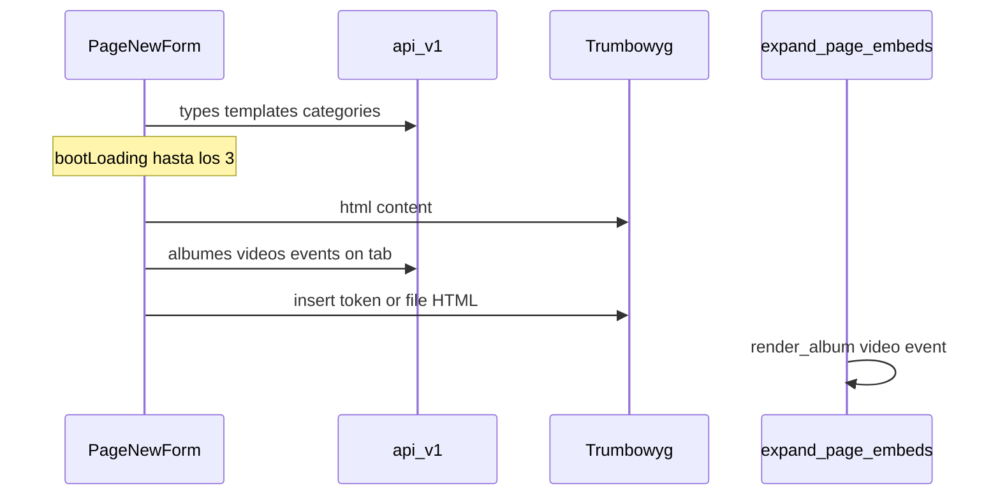

# PAGE_NEW_UX — spec de implementación

Agente: leé este archivo entero **y** las reglas del worktree **antes** de tocar código.

- [`AGENTS.md`](../../AGENTS.md)
- [`.cursor/rules/worktrees.mdc`](../../.cursor/rules/worktrees.mdc)
- [`.cursor/rules/worktree-preview.mdc`](../../.cursor/rules/worktree-preview.mdc)
- [`.cursor/rules/project.mdc`](../../.cursor/rules/project.mdc)
- [`docs/DESIGN.md`](../DESIGN.md)
- [`docs/PAGE_EMBEDS.md`](../PAGE_EMBEDS.md) (contexto del picker; este spec lo extiende)

**Worktree:** `/home/gervis/.cursor/worktrees/startCodeIgniter-CSM/page-new-ux`  
**Rama:** `feat/page-new-ux`  
**Stack:** PHP 7.4, CodeIgniter 3.1, BladeOne, Vue 2 global, Materialize. Sin PHP 8+ (`match`, `?->`, union types, named arguments).

Trabajá **solo** en este checkout. No edites `master` ni el checkout principal. No Cloud Agents. No `docker compose up|down|restart`. No pares `ci_php56`. No uses `:8081` para verificar (ese volume es otro árbol). Preview: Apache propio puerto `8082–8099`, misma `start_cms_db`, cookie `SESS_COOKIE_NAME=ci_session_<slug>`. Receta en `worktree-preview.mdc`.

Tras JS/Blade recargar basta. Tras SCSS: `npm run build` **en este worktree**.

---

## Objetivo

Mejorar `/admin/pages/new/` (y edit, misma vista):

1. Skeleton de carga mientras terminan **todos** los GET iniciales del formulario.
2. UX del form (tabs semánticos, ids únicos, sticky save, copy por `lang()`, botón de insertar bajo el editor).
3. Arreglar insertar contenido de **álbum, video y evento** (picker + inserción en el cursor + render público).
4. Agregar insertar **archivo** (HTML `` / `<a>`, no token).

No es page builder. No Gutenberg. No `json_content`. El contenido sigue siendo HTML de Trumbowyg más tokens `{{helper(nombre)}}`.



---

## Archivos a tocar

- [`application/views/admin/pages/new.blade.php`](../../application/views/admin/pages/new.blade.php)
- [`resources/components/PageNewForm.js`](../../resources/components/PageNewForm.js)
- [`resources/scss/admin/form.scss`](../../resources/scss/admin/form.scss) (o `_form-skeleton.scss` importado desde ahí)
- [`application/helpers/general_helper.php`](../../application/helpers/general_helper.php) — `render_album` (items + `file_front_path`)
- [`application/language/english/admin/common_lang.php`](../../application/language/english/admin/common_lang.php)
- [`application/language/spanish/admin/common_lang.php`](../../application/language/spanish/admin/common_lang.php)
- Duplicar claves nuevas en `admin_lang.php` EN/ES si el admin las carga desde ahí

**No editar:** `resources/scss/admin/page-new.scss` (dump Bootstrap), `vendor/`, `public/vendors/`, `graphify-out/`, `public/css/admin/*.min.css` (se compila), typos históricos (`permisions`, `categorie`, `albumes`, `nam`).

---

## Diagnóstico ya confirmado en código

### Loader (el spinner actual no cubre el boot)

- `loader: true` se apaga en el **primer** GET que termina (`getCategories`, `getPageTypes`, `getTemplates` o `editpageinfo`). El form aparece con selects vacíos.
- Al guardar, `loader = true` **esconde todo el formulario** 1.5s extra (`setTimeout` en `runSaveData`). Mal UX.
- Las tabs `#test1`/`#test2` se ven durante la carga; el `<preloader />` es un spinner suelto, no un skeleton del layout.

### Insertar álbum / video / evento (roto o frágil)

Causas a verificar y corregir **todas**:

- El botón "Insertar contenido" está en el **aside** de publicación, no bajo el editor (`docs/PAGE_EMBEDS.md` pedía debajo del editor).
- Las 6 tabs Materialize dentro de `modal-fixed-footer` dependen de `onShow`. Formulario se precarga; álbum/video/evento **solo** si `onShow` dispara. Si las tabs no caben o no se re-init al abrir el modal, esas listas quedan en vacío.
- `insertEmbedToken` usa `document.execCommand('insertText')` con el modal robando el foco. Las imágenes ya usan `trumbowygInstance.range.insertNode` — hay que unificar.
- Video: el Blade usa `item.nam` (columna histórica). La lista de videos ya hace `video.nam || video.nombre || video.video_id`. El picker debe usar el mismo fallback; si `nam` viene vacío el click no-op (`if (!name) return`).
- GET `/api/v1/albumes` pasa por `AlbumModel::filter_results` (items + files de **todos** los álbumes). Puede tardar o fallar; el error silencia la lista (`embedLists[key] = []`).
- `render_album`: tras `find_embed_record` hay que asegurar items con `file_front_path`. La vista `application/views/site/templates/albums/default.blade.php` no pinta si falta `$item->file->file_front_path`.
- Eventos: `EventsController` exige `SELECT_EVENTS`. Si 403, mostrar error, no vacío genérico.
- No hay tab Archivo. Insertar imagen al editor ya existe (`editorModal`, filter `images`); falta PDF/docs/cualquier file como `<a>` (no token; no hay `render_file`).

### Deuda UX del form ([`docs/DESIGN.md`](../DESIGN.md) P0/P1)

- Tabs ambos `.active`; ids `#test1` / `#test2` → `#basic` / `#seo`.
- `id="title"` duplicado (campo título vs `page_data.title`).
- Submit al final, no sticky. Copy mezclado: "Guardar Borrador", "Preview", "Template", "Layout" sin `lang()`.
- Autoguardado silencioso en borrador (`debouncedAutoSave`); no hay dirty/saving visible.

---

## Implementación

### 1. Boot: skeleton hasta que TODOS los GET iniciales terminen

En `PageNewForm.js`:

- Separar `bootLoading` (carga inicial) de `saving` (submit).
- Contador o `Promise`/`$.when` de: new = `getPageTypes` + `getTemplates` + `getCategories`; edit = `editpageinfo` (y categories si sigue aparte).
- `bootLoading = false` solo cuando el último termina (éxito o error). Toast `lang('toast_error')` si alguno falla; no dejar selects eternos.
- `save()` pone `saving`, **no** `bootLoading`. Quitar el `setTimeout` 1500ms. Botón disabled + texto `lang('pages_saving')`.

En `new.blade.php`:

- Mientras `bootLoading`: skeleton del layout (columna principal: 3 barras de input + bloque editor; aside: 4 bloques). `v-cloak`. `aria-busy="true"` en el form.
- Ocultar tabs de contenido y campos hasta que el boot termine (el skeleton los sustituye).
- Estilos en `form.scss` (o importar un `_form-skeleton.scss` desde ahí). Tokens `var(--st-canvas)` / `var(--st-border)`, shine 2s. Dark mode vía las mismas vars. No hex sueltos. No Bootstrap de `page-new.scss`.

Patrón de referencia: `resources/scss/admin/skeleton-loader.scss` (dashboard). Adaptar al form, no copiar el skeleton de lista.

### 2. UX del formulario (full)

En Blade + `form.scss` + langs EN/ES:

- Tabs: `#basic` / `#seo`; un solo `.active`; copy `lang()`.
- Ids únicos: `page_title`, `page_subtitle`, `page_path`, `page_document_title` (el textarea de Additional).
- Mover **Insertar contenido** a un toolbar **bajo el textarea `#editor`**. No full width. Este botón es **secundario**: `btn` teal / `--st-interactive` o outlined. La primaria de la vista es Guardar/Publicar (coral/accent). No otro FAB coral.
- Barra sticky inferior: Cancelar flat + primaria "Guardar borrador" / "Publicar" según `status`. Preview / ver en sitio como texto/flat, no segundo filled.
- Extraer "Preview", "Template", "Layout", "Guardar Borrador" a `lang()`.
- `aria-label` en icon-only que se toquen.

No “corregir” `permisions`, `categorie`, `albumes`, `nam`.

### 3. Arreglar picker + inserción de embeds

`PageNewForm.js` + modal en Blade + `form.scss`:

- Guardar el range de Trumbowyg en `tbwblur` **y** justo antes de `openEmbedModal`.
- Insertar tokens como **nodo de texto** en `trumbowygInstance.range` (mismo patrón que `onSelectImageCallcack`). Fallback: append al HTML del editor. Después sync `this.content`. No pelear con `v-model` del textarea: dejar de usar `v-model` en `#editor` (Trumbowyg ya escribe HTML; Vue lee `content` en `tbwchange`).
- Cargar listas: no depender solo de `onShow`. Al abrir el modal, `M.Tabs.init` + `updateTabIndicator`. Bind `@click` en cada tab `<a>` → `loadEmbedTab`. Tabs con `overflow-x: auto` (van a ser 7).
- Nombre a insertar: helper `embedItemName(item, listKey)` — video: `nam || nombre || name`; resto: `name`.
- Error de API: toast + empty state distinto de “no hay publicados”. Empty publicado: CTA a crear (`/admin/gallery/new`, `/admin/videos/new`, `/admin/events/add`).
- Si un GET 403 (eventos), no fingir lista vacía.

Backend mínimo para que el front **pinte** lo insertado:

- `render_album` en `general_helper.php`: si `$album->items` está vacío o los items no tienen `file_front_path`, cargar `AlbumItemsModel::where(['album_id' => ...])` (ya pasa por `loadFilesRelation`).
- Confirmar `render_video` por `nam` y `render_event` por `name` (ya están). No cambiar typos de columnas.
- Opcional y preferible: alistar álbumes/videos para el picker **sin** hidratar items (query param o lista liviana). Si se toca el index GET, no romper el admin de galería. Si el riesgo es alto, dejar el GET actual y solo toast + timeout; no rediseñar `AlbumModel::filter_results`.

### 4. Insertar archivo

No token, no whitelist nueva.

- Tercer `file-explorer-selector`: modal `editorFileModal`, `mode="files"`, **sin** `filter="images"` (todos los tipos).
- Tab "Archivo" en el modal de insertar (`lang('pages_embed_file')`). Preferir tab en el mismo modal para un solo flujo.
- Callback: imagen → `` (reusar `onSelectImageCallcack`); otro → `<a href="full path" target="_blank" rel="noopener">filename.ext</a>`. Insertar en el range, cerrar ambos modales.
- Copy EN/ES. Empty del explorer: el componente ya existe.

### 5. i18n (mínimo de claves nuevas)

EN + ES en `common_lang.php` (y `admin_lang.php` si el admin carga ese file para estas claves):

- `pages_saving`, `pages_preview`, `pages_template`, `pages_layout`, `pages_save_draft`, `pages_publish`, `pages_embed_file`, `pages_embed_load_error`, `pages_embed_create`, `pages_form_loading` (sr-only del skeleton).

Un idioma por pantalla. Toasts por `this.toast(...)` / `lang()`.

---

## Verificación

Cuando el usuario pida probar UI, seguí `.cursor/rules/worktree-preview.mdc`:

```bash
# cwd = raíz de ESTE worktree
SLUG=$(git branch --show-current | tr '[:upper:]' '[:lower:]' | sed 's/[^a-z0-9]/_/g' | cut -c1-24 | sed 's/_$//')
NAME="ci_php_${SLUG}"
IMAGE=$(docker inspect -f '{{.Config.Image}}' ci_php56)
```

Si `ci_php56` no existe, pedí al usuario que levante el principal (`docker compose up -d` **en el checkout principal**). No construyas la imagen desde el worktree. Puerto: primero libre en **8082–8099**. Nunca 8081. En el `.env` **del worktree**: `APP_BASE_URL=http://localhost:<PORT>/` y `SESS_COOKIE_NAME=ci_session_<SLUG>`. No cambies `DATABASE_*`.

Login: `gerber` / `admin123`. Admin: `/admin/login`.

Checklist:

1. `/admin/pages/new/`: skeleton hasta types+templates+categories; no flash de tabs vacías.
2. Abrir Insertar contenido: las 7 pestañas cargan; click en álbum/video/evento inserta `{{render_*(nombre)}}` en el cursor (o al final si no hay range). Video con `nam`.
3. Tab Archivo: PDF o imagen desde el explorer; queda `<a>` o `` en el HTML.
4. Guardar borrador: el form no desaparece; botón "Guardando…"; toast; preview.
5. Página pública + `admin/pages/preview?page_id=`: álbum con fotos, video iframe, evento card; no el token crudo. `{{phpinfo()}}` no se ejecuta.
6. Edit de una página existente: skeleton, luego datos; ids de tabs/campos no duplicados; sticky save.
7. Dark mode: skeleton y modal usan `var(--st-*)`.
8. Si no hay browser MCP: `curl -I` a la preview + decir qué no se pudo clicar.

Al cerrar la feature o si el usuario pide parar: `docker rm -f "$NAME"`. No `compose down`. No borres `start_cms_db`.

Writes (páginas, `site_config`) se ven también en `:8081` (DB compartida). No corras migraciones destructivas.

---

## Fuera de alcance

- Page builder / Gutenberg / `json_content`.
- Custom models / `get_collection` extra.
- Helper `render_file`.
- Corregir typos históricos de schema.
- Editar `vendor/`, `public/vendors/`, `graphify-out/`, `public/css/admin/*.min.css` (SCSS se compila).
- `docker compose`, Cloud Agents, migraciones `DROP`/`ALTER`.
- Commit/PR salvo que el usuario lo pida.
